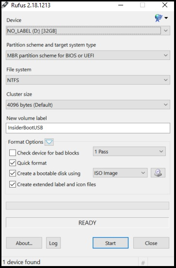

# Using ISOs

If your device is hard to use because of an issue, or if you want to switch out of the Dev Channel or stop receiving preview builds, you might need to use an ISO for a clean installation or in-place upgrade. ISOs are available for both Windows 10 Insider Preview Builds and for Windows.

> [!div class="nextstepaction"]
> [Download Windows Insider ISOs](https://aka.ms/WIPISO)

## In-place upgrade with a Windows Insider Preview ISO 

1. [Download your chosen ISO from the Windows Insider ISO page](https://aka.ms/WIPISO) by saving it to a location on your device or creating a bootable USB.

2. Open File Explorer and go to where you saved the ISO. Select the ISO file to open it, which lets Windows mount the image so you can access it.

3. Select the setup.exe file to launch the install process.

4. During setup, select the **Keep Windows settings, personal files, and apps** option.

5. Once it's finished installing, go to **[Settings > Update & Security > Windows Insider Program](https://aka.ms/WIPSettings)** to make sure your Windows Insider settings are correct.

## Clean installation with a Windows Insider Preview ISO 

1. Back up all your files and applications. A clean install with a Windows Insider ISO will erase all of your files, settings, and applications.

2. [Download your chosen ISO from the Windows Insider ISO page](https://aka.ms/WIPISO) by saving it to a location on your device or creating a bootable USB.

3. Open File Explorer and go to where you saved the ISO. Select the ISO file to open it, which lets Windows mount the image so you can access it.

4. Select the setup.exe file to launch the install process.

5. During setup, select the **Change what to keep** option, and then choose **Nothing** on the next screen to complete a clean intall.

6. Once it's finished installing, go to **[Settings > Update & Security > Windows Insider Program](https://aka.ms/WIPSettings)** to make sure your Windows Insider settings are correct.

## Creating a bootable USB for Windows Insider ISOs

If you're having certain issues that prevent you from downloading an ISO to your device, or you need to quickly set up a new device in the Windows Insider Program, a bootable USB made from a Windows Insider ISO file can help.

> [!NOTE] 
> There are many third-party software applications that are capable of converting a USB drive into a bootable format. We're using [Rufus](https://rufus.akeo.ie/) in this example since it's free and lightweight on system resources. You can use any software that can format the USB into a bootable format and convert the ISO into the decompiled installation files.

1. [Download your chosen ISO from the Windows Insider ISO page](https://aka.ms/WIPISO) by saving it to a location on your device you can easily remember.

2. Connect a USB drive that's at least 8GB. **Back up any data on the drive you want to save, because any data on it will erased.**

3. Launch [Rufus](https://rufus.akeo.ie/) or your preferred software.

4. Configure the Rufus menu options:

- If you have multiple drives connected via USB (external hard drive, thumb drive, etc.), make sure you select the right device from the dropdown.

- **Partition scheme and target system type** should be set to **MBR partition scheme for BIOS or UEFI**. 

- **File system** should be set to **NTFS**. If for some reason this doesn't work on your device, you can re-create it using FAT32.

- **Cluster size** can stay on **4096 bytes (Default)**

- For **New volume label**, enter a name of your choosing.

- Under **Format Options**, **1 Pass** should be selected from the first dropdown. Select the checkboxes beside **Quick format**, **Create a bootable disk using**, and **Create extended label and icon files**. Beside **Create a bootable disk using**, choose **ISO Image** from the dropdown, then select the disk icon next to the dropdown and navigate to the ISO file you downloaded.

5. Select **Start**, and Rufus will format your USB and decompile the ISO.

6. Once it's finished, you're all set. Now you can use it on a device.

- If you use this drive to upgrade a device that already has Windows on it, connect it to the device, open File Explorer, locate the drive, and launch setup.exe to get started.

- If you use this drive to do a clean Windows install, connect it to the device and reboot. You may also need to adjust your BIOS or UEFI settings to allow it to boot from a USB-based drive.

## Clean installation with a Windows 10 ISO

1. Back up all your files and applications. A clean install with a Windows 10 ISO will erase all of your files, settings, and applications.

2. [Download the latest Windows 10 ISO](https://www.microsoft.com/software-download/windows10) by saving it to a location on your PC or creating a bootable USB.

3. Open File Explorer and go to where you saved the ISO. Select the ISO file to open it, which lets Windows mount the image so you can access it.

4. Select the setup.exe file to launch the install process.

5. During setup, select the **Change what to keep** option, and then choose **Nothing** on the next screen to complete a clean intall.

6. Once it's finished installing, go to **[Settings > Update & Security > Windows Insider Program](https://aka.ms/WIPSettings)** if you'd like to set up Insider Preview builds again. [Get more help setting up Insider Preview builds.](https://docs.microsoft.com/windows-insider/get-started)
