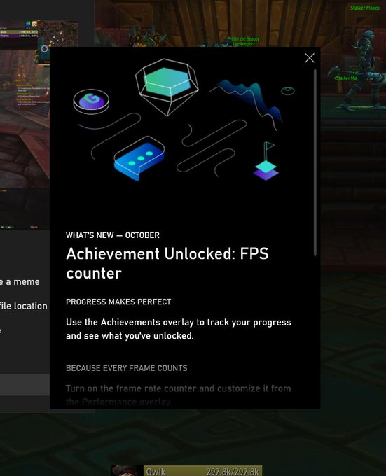

# Game Bar

The latest major updates and features for the Xbox Game Bar.

## September 24, 2019

### Track achievements and frame rate 
In case you hadn’t seen, we’ve rolled out an FPS counter in the Performance overlay and added a new achievements overlay. Use the achievements overlay to track your progress and see what you've unlocked. View the frame rate of the game you're playing with the FPS counter. 

Thanks to everyone who shared feedback so far. The update will come via the Microsoft Store. Just set focus to your favorite game and press **WIN + G** to get started.

> [!NOTE]
> You’ll find the new achievement overlay and frame rate counter in version V3.33.26001.0 or higher of the Xbox Game Bar. To check that you have the correct version of the Game Bar installed, open its settings from the gear icon in the upper right. If you do not have the Xbox Game Bar or need to download the latest version, first download the Xbox Insider Hub from the Microsoft Store, then go to **Insider Content**, and select **Game Bar (Windows Gaming)**. 

## December 10, 2018

### Check out the new Gallery experience in Game Bar! 
Without ever leaving your game, you can now view screenshots and videos taken through Game Bar and even share your favorite screenshots directly to Twitter. 

## July 25, 2018

In RS5, we’re making it easier to access the Game Bar. In this flight, you can now discover Game Bar from the Start menu or bring up Game Bar by using the **Win + G** shortcut at any time.

