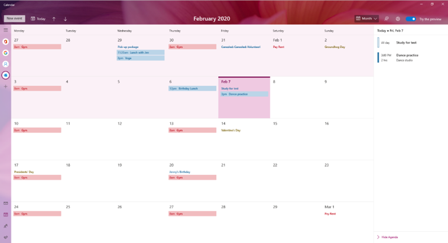
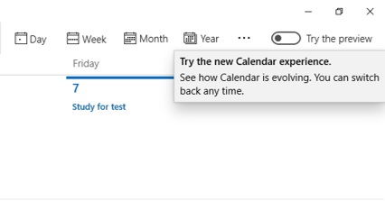
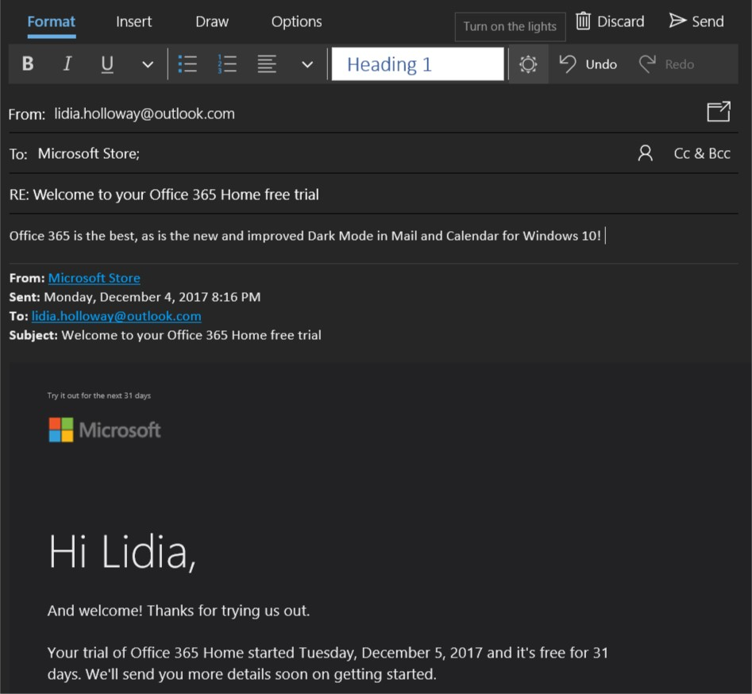
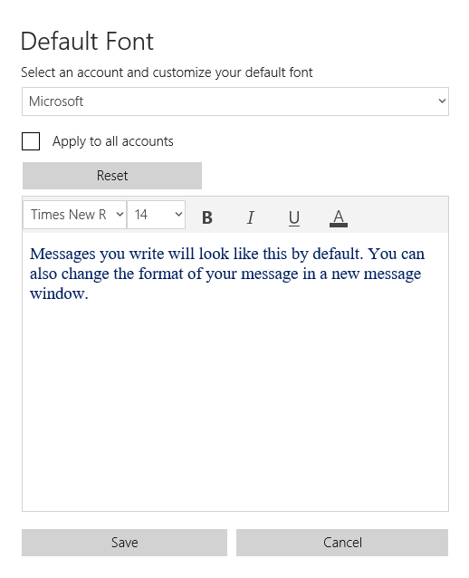

# Mail & Calendar 

The latest major updates and features for the Mail & Calendar apps. Let us know what you think in the [Feedback Hub](https://aka.ms/WIPFeedbackHub) by choosing **Apps** > **Mail** or **Calendar** under **Category** when filing feeback.

## February 12, 2020

### Preview the new Calendar app on Windows 10

We’ve been working on an improved version of the Calendar app for Windows 10 and the preview is now available to Windows Insiders! Here is a sneak peek of what’s new in the preview:

**New themes** 

Choose from over 30 different themes!

**Improved month view** 

Month view now includes an agenda pane that lets you see your day’s events at a glance.

**Simplified event creation** 

We’ve made it even easier to add an event to your calendar.

**Redesigned account navigation** 

We’ve collapsed the account navigation pane, leaving more space for your day’s events. All of your syncing calendar accounts are now represented as icons on the left.

You can try the preview by going to the Calendar app and selecting the toggle to try the new experience. Don’t worry, you can always switch back at any time! We are excited to hear what you think of the new experience.

[Learn more about the Calendar preview here!](https://support.office.com/article/learn-more-about-the-calendar-preview-on-windows-10-db80d66d-8704-454b-a4ff-dd334e08abdf?ui=en-US&rs=en-SG&ad=SG)

## July 10, 2019

### Quick Event Create from the taskbar

Do you ever open the clock and calendar flyout to help organize your thoughts while making plans? We’ve been working on making it easier to create new events and reminders, and are happy to announce that as of today, all Windows Insiders in the Fast ring should see this when you select the date in the taskbar:

Pick your desired date and start typing. You’ll now see inline options to set a time and location. We’re looking forward to you trying it out! Let us know if you have any feedback.

## February 1, 2019

Currently rolling out to Insiders in Fast, this Mail & Calendar version 16.0.11231.20082 brings you:

**Dark mode now extended to Mail & Calendar items**

Building on our previous release of dark mode in Mail & Calendar, we have extended our dark UI to more parts of our app. With this update, dark mode now works when composing a new message, updating a calendar item, or reading your email. This helps provide a calmer reading experience for people that work in a low-light environment or just prefer screens that are less bright, and helps to reduce eye strain.

To turn on dark mode, go to Settings, select **Personalization**, and choose **Dark mode**. For those who already have dark mode turned on, you'll see it expand to cover your email reading and compose experiences after receiving the update.

If you prefer to view a particular email in light mode, look for the sunshine icon in the command bar to view the email with a white background. This can help if a particular email is not formatted well for dark mode.

**Default font**

We're also introducing the top customer requested feature, default font. Now you can customize how new messages will look. If you create a new mail or reply to an existing mail, the text you type will be in the font face, size, color, and emphasis you have selected.  

To change your default font, go into Settings and select **Default font**. Default font applies per-account and does not sync to other devices. These updates are the latest in a [series of updates](https://support.office.com/article/what-s-new-in-mail-and-calendar-for-windows-10-9822b33c-b9ad-48bc-ac53-c1b6136e405b) we’ve made based on your feedback, and we’re looking forward to hearing what you’d like to see improved next!

## November 28, 2018

With Mail & Calendar version 11001.20106, it's now easier to keep track of your tasks in Microsoft To-Do! With the latest Mail & Calendar update from the Store, we’ve added the ability to switch directly to To-Do in our app navigation. This update is rolling out to both Windows Insiders and retail users as we speak.

