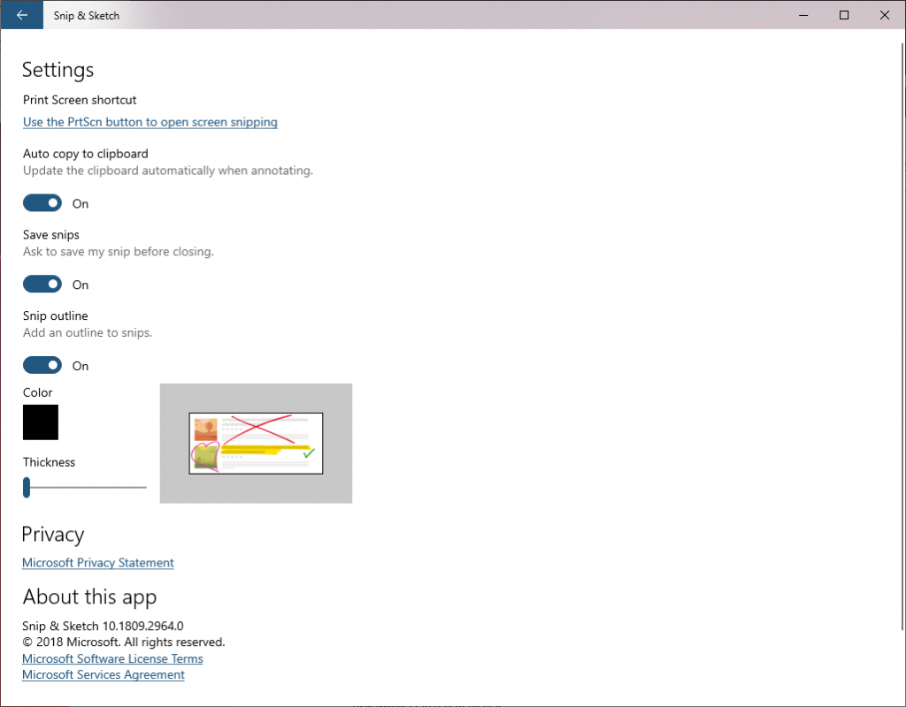

# Snip & Sketch 

The latest major updates and features for Snip & Sketch. What snipping improvement would you like us to work on next? Let us know by selecting the **…** menu in Snip & Sketch and choosing **Send feedback**.

## September 19, 2019

After spending time in both the Fast and Slow rings, we’re starting to roll out [Snip & Sketch version 10.1907](https://blogs.windows.com/windowsexperience/2019/07/31/announcing-windows-10-insider-preview-build-18950/) to 100 percent of Windows Insiders in the Release Preview ring. We will also be rolling this update out to a small percentage of those using retail builds. 

As a reminder, this update includes single window mode and zoom support.

## July 31,2019

Thanks everyone who’s shared feedback so far for our updated snipping experience! We really appreciate it and are starting to roll out some more improvements based on what you’ve told us:

**Single window mode** 

Do you tend to retake snips multiple times in order to get the perfect screenshot? We’re updating the **New** button to now open new snips in your current app window, so you don’t end up with a ton of open snips (that you then need to close.) If you’d rather keep all snips open in separate windows. the option is now a toggle in settings, so you can decide which mode you prefer.

 
**Zoom** 

You can now zoom in on your screenshots if they’re a bit too small for you to annotate on. And yes, touch, **CTRL + Plus**, **CTRL + Minus**, and **Ctrl + Mouse wheel** are supported! 

If you prefer keeping a small Snip & Sketch window, we’ll also zoom out to ensure the whole snip fits in the Snip & Sketch window. If you want to see the snip at its original size, select the zoom button and then **View actual size**.

**Improving WIN+Shift+S discoverability** 

You mentioned you loved learning about using **WIN + Shift + S** to take new snips any time, and we thought others would too! If you haven’t taken a snip yet, we’ll now use the canvas space in Snip & Sketch to help you learn how to start a snip without needing to open the app first. 

These changes are currently available for a portion of Insiders in the Fast ring as we evaluate the quality before continuing the rollout. Note the rollout for each change mentioned above is being handled separately, with separate random populations in the initial rollout, so seeing one of the changes with app version 10.1907.2064.0 doesn’t necessarily mean you’ll see all three.

## March 6, 20193/6/2019

We’re in the process of rolling out a new app update to Snip & Sketch. It includes a number of fixes based on your feedback, including:

* We fixed an issue that could result in snips being a bit blurry after saving or copying to clipboard.
* We fixed an issue where copying to clipboard would fail if you switched out of the app while the copy operation was in progress.
* We fixed an issue where the suggested file name was unexpectedly a GUID for snips opened from **Win + Shift + S** toast notification.
* We’ve added Narrator (screen reader) confirmations when a snip is copied to clipboard.
* We’ve updated the default save format to be png. You can still use the dropdown when saving to pick your desired format if it’s not png.
* We fixed an issue where auto-copy changes to clipboard wasn’t working on return from Snip & Sketch settings.
* We fixed an issue where the app might crash if you closed two app windows one after another.
* We fixed an issue where the default save file location was documents rather than pictures. In fixing this we also fixed an issue where, when saving, the save dialog wouldn’t remember where you last saved a snip.

## December 10, 2018

### Bring window snip to your modern snipping experience

 Start your snip via your preferred entry point—**WIN + Shift + S**, **Print Screen** (if you’ve enabled it), directly from within Snip & Sketch—and select the window snip option at the top, and snip away! That selection will be remembered the next time you start a snip.

## October 31,2018

This update brings several improvements, including:

**Adding some emphasis**

Planning to paste your screenshot somewhere? Does that place have the same color background as the background of your screenshot? When you update to the latest app version you’ll find a new option to add a border to your screenshots, giving them that little bit extra needed to stand out.

**Printing** 

Sometimes you want to keep a physical copy of your screenshots—we hear you that it took too many steps before, and have added a button in the toolbar, so you can print directly from the app. (You can also print to PDF.)  

**Refining our save options**

* If you have unsaved changes and go to close a window or open a file that will now pop a confirmation.
* The default proposed file name will now include a timestamp.
* Saving now also supports jpg and gif file types.
* There's a new settings page! We’re replacing the old **About** flyout with a full Settings page, where you’ll find the option to add a border, an option for updates made to your snip to copy automatically to your clipboard, and more.
  

## September 6, 2018

### Delay Snip 
We flighted version 10.1807.2286.0 of Snip & Sketch, which included the highly requested delay snip feature. There was a bug in Build 18219 blocking the **New** button from working, so please try it out once you upgrade! 

Just select the arrow next to the New button in the app, and you’ll now find options to **Snip now**, **Snip in 3 seconds**, and **Snip in 10 seconds**. If you have the app open or pinned to your Taskbar, you can also just right-click the icon in the taskbar to get these options, since we’ve added them to the jump list.

