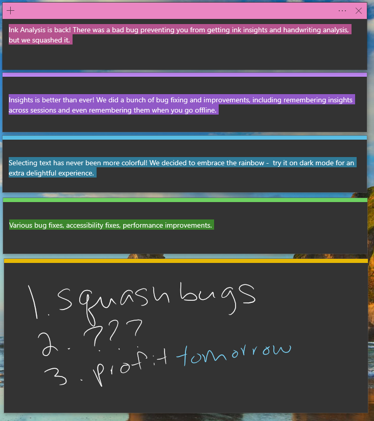
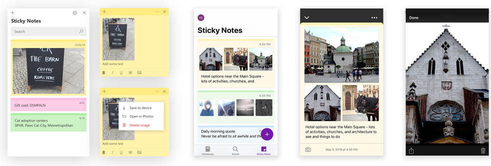
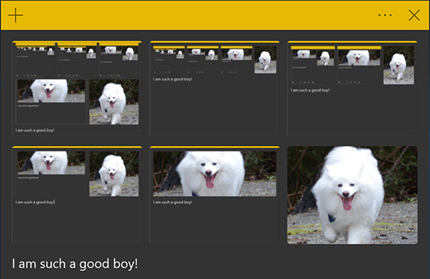
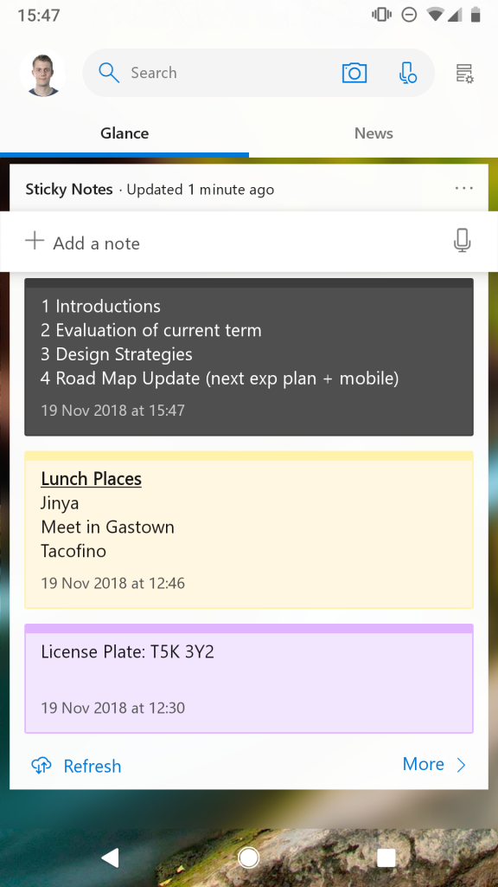
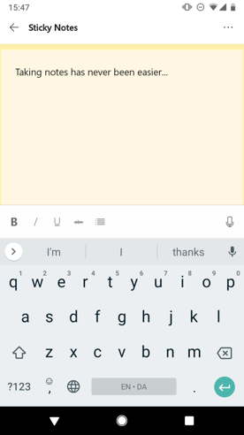

# Sticky Notes 

The latest major updates and features for Sticky Notes. Let us know what you think in the [Feedback Hub](https://aka.ms/WIPFeedbackHub) by choosing **Apps > Sticky Notes** under **Category** when filing feeback.

## August 7, 2019

We’re very pleased to announce that today, Sticky Notes 3.7 is now available to everyone on Windows 10 version 1803 and higher!

## June 6, 2019

Sticky Notes v3.7 is rolling out to those of you in the Fast ring! Sticky Notes v3.7 includes these changes:

* Ink Analysis is back! There was a bad bug preventing you from getting ink insights and handwriting analysis, but we squashed it.
* Insights is better than ever! We did a bunch of bug fixing and improvements, including remembering insights across sessions, and even remembering them when you go offline.
* Selecting text has never been more colorful! We decided to embrace the rainbow. Try it on dark mode for an extra delightful experience.
* We’ve made various bug fixes, accessibility fixes, and performance improvements.

## May 13, 2019

We’re very pleased to announce that today, Sticky Notes 3.6 is now available to everyone on Windows 10 version 1803 and higher! Sticky Notes 3.6 introduces images in notes and multi-desktop support.

## March 27, 2019

Sticky Notes v3.6 has been released to the Windows App Preview Program.

## March 18, 2019

Sticky Notes v3.6 is rolling out to those of you in Skip Ahead and on Builds 18855+! Changes in this version include:

* You can now add images to your Sticky Notes. After all, a picture is worth a thousand words!

* We improved speed and added icons to the context menu when you’re selecting text.
* Multi-desktop support is finally here. Stick your notes wherever your work takes you.
* Select specific notes with the taskbar or with **Alt + Tab** and **Win + Tab**. But don’t worry, Ctrl + Tab is still there for you to switch between your Sticky Notes.
* We’ve made many bug fixes and improvements.

## November 30, 2018

Over the past few weeks, we’ve been testing an update to Sticky Notes in Skip Ahead. Today, we’re excited to announce that we’re rolling out that major update to everyone on Windows version 1803 and higher!

A few highlights in this version include:

* We tested the waters with the Charcoal Note, and you all seemed excited to go even darker! Introducing full dark mode support in Sticky Notes. We support Windows dark mode, as well as the ability to set your color mode in Sticky Notes to suit your mood, independent of your system settings.

* Everyone seemed excited about Sticky Notes syncing, so we spent some time making it even faster and more reliable! Check it out and let us know how it feels.

### On your Android devices

It has never been easier to access Sticky Notes and Microsoft To-Do on your Android devices. Thanks to some help from our friends on the Launcher team, your Sticky Notes are now available on Microsoft Launcher Beta.

### Your notes everywhere

Want to get to your notes from anywhere? How about on the web on [OneNote](https://www.onenote.com/stickynotes))? Take a look and let us know what you think.

## October 24, 2018

Sticky Notes 3.1 in Skip Ahead only includes:

* Full-on dark mode.
* Sync is even faster now, including to your phone via iOS and Android OneNote, rolling out now!

## August 28, 2018

Sticky Notes 3.0 brings you these amazing new features and capabilities:

* Sync and backup your notes across your Windows devices.
* If you have a lot of notes, your desktop can get a bit crowded. We're introducing a new home for all your notes. You can choose which notes to stick to your desktop or tuck them away and find them again easily with search.
* We channeled our dark energy into a dark-themed note—Charcoal Note.
* Crossing tasks off feels better than deleting them! Now you can style your note with the new formatting bar.
* You may notice that Sticky Notes is performing a lot faster—that's completely on purpose.
* Drastic improvements on being more inclusive, including: 
    * Using assistive technologies and Narrator.
    * Keyboard navigation.
    * Using mouse, touch, and pen.
    * High contrast.

[Read all about Sticky Notes 3.0.](https://insider.windows.com/articles/sticky-notes-3-0-now-available-to-insiders-who-opted-into-skip-ahead/)
