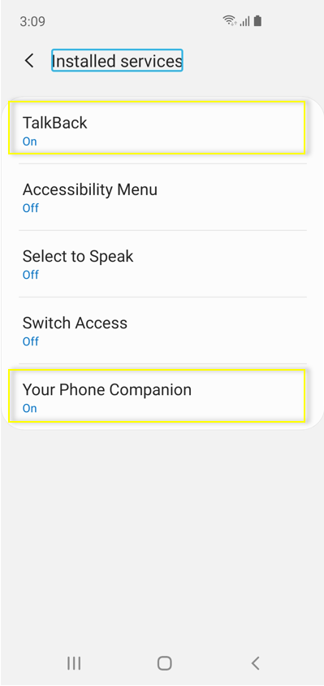

# Your Phone

The latest major updates and features for Your Phone.

## 12/16/2019

### Photos has evolved. View and interact with your most recent 2000 photos!
We take a lot of photos on our smartphones. We heard our avid Your Phone app users when you when you said you wanted the ability to access more than 25 of your recent photos. Today, we’re happy to announce that we’ve addressed this by letting you view and interact with your most recent 2,000 photos from your Android smartphone’s camera roll on your PC!

With the Your Phone Photos feature, you don’t have to email photos to yourself. Simply take a pic and see it instantly on your PC. When you need to add a recent image to your email, paper, or presentation, just drag and drop. You can also conveniently share it with family or friends or save it directly to your PC by simply right clicking on the image.

Try out this newly enhanced capability and share your experience.

**Photos requirements**

* Any Android phones running version 7.0 or higher
* PC running Windows 10 April 2018 Update (1803) or higher

**Known issues**
* If the Photo selector in Messages appears blank, navigate to Photos on the left and hit refresh. Your photos should now appear in the Photo selector.

This feature will gradually roll out to Windows Insiders on the Windows 10 May 2019 Update or newer, so it may take a few days to be available inside the Your Phone app. Please make sure you have the latest versions of Your Phone Companion and the Your Phone app to experience this feature.

### Phone screen now supports pen input
The Phone screen feature is getting a boost. In addition to keyboard, mouse, and touch support, you can now use your digital pen with a compatible stylus to input on any touch screen enabled Windows 10 PC to interact with your mobile apps while in Phone screen session. Leverage your pen’s pressure sensitivity for drawing and writing like you would with your phone’s stylus with apps that support pressure sensitivity. You will also be able to hover over buttons, and it differentiates between the pen and finger touch.

This feature is available to all Windows Insiders on Windows 10 October 2018 Update or newer and requires Phone screen compatible devices.

We value your feedback, so give it a try and let us know what you think. You can report any issues under Your Phone > Settings > Send feedback or directly through Feedback Hub.

**Pen input requirements**
* Your Phone App version 1.19102.500.0 or newer
* Phone screen compatible devices

## 10/29/2019

### Elevating the Phone screen feature by removing its dependency on Bluetooth connection

Windows Insiders, we heard your feedback about the Phone screen feature’s dependency on Bluetooth Low Energy connectivity. To address your feedback, we partnered closely with Samsung to bring you a more streamlined experience across all Windows 10 PCs by removing the peripheral role dependency for Phone screen, which will expand the overall reach of this feature.

Samsung Galaxy Note 10 was the first device to introduce this feature in August. After a positive response, we’ve recently enabled this feature across Samsung Galaxy Fold, S10, S10+, and S10e smartphones. You’ll need to update your supported Samsung devices with the recent software update that enables the ‘Link to Windows’ feature. To continue offering this experience to other smartphones, we’re expanding this feature support to Samsung Galaxy A30s, A50s, and A90 smartphones, and we’ll continue to add additional devices in the coming months.

With the new experience rolling out, we’ll be removing the Bluetooth connectivity option, effective immediately. If you were previously enjoying Phone screen over Bluetooth and you have a phone model that doesn’t yet support Link to Windows, the Phone screen node will disappear automatically within the Your Phone app. We recommend that you unpair your devices by going to the Bluetooth settings on both your PC and your Android phone, so that you don’t have a connection that is no longer in use.

Thank you for helping us refine the Phone screen experience so far!

**Phone screen requirements**

* Select Android phones running Android 9.0 or greater
* PC running Windows 10 October 2018 Update (version 1809) or later
* Android phone must be on and connected to the same network as the PC
* You will need a supported device to use this feature: 
    * Samsung Galaxy Fold
    * Samsung Galaxy Note 10/ Note 10+
    * Samsung Galaxy S10/S10+/S10e
    * Samsung Galaxy A30s/A50s/A90
* Refer to the [Your Phone FAQs](https://support.microsoft.com/help/4459358/windows-10-your-phone-app-help) for additional information.

## 10/8/2019

### Unveiling Calls, now even more ways to stay connected to what matters 
No need to dig for your Android phone to answer your personal or work calls. You can now stay connected by simply answering (or not) your phone calls on your PC. Tap into your PC’s speakers, microphone, and large screen for a richer calling experience.

With the Calls feature you can:

* Answer incoming phone calls on your PC.
* Initiate phone calls from your PC using in-app dialer or contact list.
* Decline incoming phone calls on your PC with custom text or send directly to your phone’s voicemail.
* Access your recent call history on your PC. Clicking on a specific call will auto populate the number within the dialer screen.
* Seamlessly transfer calls between your PC and phone.

**Calls requirements**

* Android Phones running Android 7.0 or higher
* Windows 10 PC with Bluetooth radio
* Windows 10 Version 1903 (OS build) 18362.356 or newer

**Note**

* This feature will gradually roll out to Insiders so it may take a few days to be available inside the Your Phone app.
* To enable the Calls feature, sign into the Your Phone app using the Microsoft account that you used to register as a Windows Insider. 
* For set-up instructions and other details, see [Calls Feature for the Your phone app](https://answers.microsoft.com/en-us/insider/forum/all/calls-feature-for-the-your-phone-app/8266e234-ba16-42be-8b11-af2e33ba93ed).

**Known issue**

* In certain instances, Calls feature may require you to pair your mobile phone & PC again. If you have previously paired your devices, unpair your devices and go through the Calls setup flow again.

We value your feedback, so give it a try and let us know what you think. You can report any issues under the Your Phone > Settings > Send feedback.

## 10/3/2019

### Link to Windows on more devices
We’re pleased to announce that Link to Windows feature, which seamlessly connects your phone to your Windows 10 PC, is rolling out to Samsung Galaxy S10, S10+, S10e, S10 5G, and Fold devices in select global markets. With Link to Windows natively integrated into your device, it’s simple and convenient to send messages, manage notifications, sync photos, and mirror your phone on your PC.

### Phone screen on more devices
Phone screen which allows you to access your Android phone’s apps right from your PC while using your keyboard and mouse or touch screen) is also rolling out to Samsung Galaxy S10, S10+, S10e, S10 5G, and Fold devices in select global markets. You can try out multi-touch gestures such as pinch to zoom, rotate, or swipe from your PC’s touchscreen while using Phone screen. If you have one of these devices, give it a try. This is a gradual rollout, so stay tuned for more to come on additional markets and devices.

### Battery level indicator & phone’s home screen wallpaper
In addition to Phone screen and Link to Windows expansion, two additional features are rolling out to all users–battery indicator, which will provide quick access to your phone’s battery levels right in the app without needing to check your device, and Your Phone icon within the app, which will show your current static home screen wallpaper for a personal touch.

All of these features are gradually rolling out to users, so they may take a few days to be available inside the Your Phone app. Please make sure you have the latest versions of Your Phone Companion and the Your Phone app.

We value your feedback, so give it a try and let us know what you think. You can report any issues under Your Phone > Settings > Send feedback.

## 7/10/2019

### Phone screen now available on more Surface devices
As promised, we’re excited to expand the availability of the phone screen feature to more PCs. With the latest driver update in the Windows insider rings (Marvell 15.68.17013.110), the following Surface devices will preview the phone screen feature – Surface Laptop, Surface Laptop 2, Surface Pro 4, Surface Pro 5, Surface Pro 6, Surface Book, and Surface Book 2. If you have one of these devices, give it a try and let us know what you think!

## 7/3/2019

### Enabling touch functionality
You will now be able to interact with your phone screen using one-touch tap and long press. This handy feature will allow you to conveniently open apps, select items, click on links, and more, directly on your touch-enabled PC.

### Notifications integration with Phone screen
We’re pleased to launch Notifications integration with Phone screen for Insiders with the May 2019 update or newer. If Phone screen is set up, your notifications will open in Phone screen allowing you to interact with your keyboard and mouse. If Phone screen is not supported or set up, clicking on notifications will take you to your notifications feed instead.
Note that your text message notifications (SMS, MMS) will continue to be available within the messaging node.

 
### Your Phone Notifications available to all users
Thank you to everyone who gave us feedback over the last few weeks to help us improve the Notifications feature in the Your Phone app. We’re happy to announce that this feature is now gradually rolling out to all Windows 10 users with the April 2018 update and newer. It may take a few days to show up within Your Phone app, so keep a look out!

**Phone screen requirements**

* Select Android phones running Android 7.0 or greater 
* Samsung Galaxy S10e, S10, S10+, S9, S9+, S8, S8+
* Samsung Galaxy A8, A8+
* Samsung Galaxy Note 9, Note 8
* OnePlus 6, 6T
* Windows 10 PCs with Bluetooth radio that support low-energy peripheral role
* Minimum Windows Insiders Build 18338 and above
* Android phone must be on, within Bluetooth range of the PC and connected to the same network as the PC

## 5/29/2019

### Phone screen accessibility features, keyboard language and layout, new phone models
We’re pleased to preview two new accessibility features – screen reading and focus tracking – as well as the ability to easily switch your Android phone’s keyboard language or layout while in phone screen.

**Screen reading**

For users of TalkBack, you can now enable the Your Phone Companion accessibility service, found under your Android phone’s accessibility settings, for smoother cross-device reading. Once both TalkBack and the Your Phone Companion accessibility services are turned on, Narrator will play from your PC, describing what you select and activate on your phone screen as you interact using your PC’s keyboard or mouse.

**Focus tracking**

You will now be able to interact with your Android phone’s apps at your preferred magnification while in phone screen. Focus tracking will seamlessly follow your keyboard focus and mouse pointer input.

To enable the focus tracking accessibility feature, you must first turn on the Your Phone Companion accessibility service and TalkBack on your Android phone. Once these services are enabled, you can turn on Magnifier on your PC using the shortcut: Windows Key and the Plus sign (+) or open the app from your Windows menu.

**Keyboard language and layout** 

You will notice a new icon on your phone screen toolbar. Selecting this icon will take you to the phone settings page, where you can change your keyboard language or layout. This setting is specific to physical keyboards, so it only applies when you’re typing into your phone from your PC and will not change your phone’s language or keyboard configuration. If you type in different languages or like to switch your keyboard layout, give it a try.

**Phone screen now supports additional Samsung phone models**

The supported phone model list keeps expanding, we have now enabled support for the Samsung Galaxy A8 and Galaxy A8+. We will continue to expand the list of devices over time.

**Phone screen requirements**

* Certain Android phones running Android 7.0 or greater: Samsung Galaxy S10e, S10, S10+, S9, S9+, S8, S8+; Samsung Galaxy Note 9, Note 8; Samsung Galaxy A8, A8+; OnePlus 6, 6T
* Windows 10 PC with Bluetooth radio that supports low-energy peripheral role
* Minimum Build 18338 and above
* Android phone must be on, within Bluetooth range of the PC, and connected to the same network as the PC

### New messaging features

**Send and receive MMS messages** 

You can now send and receive images and GIFs, including Giphy, right from the Your Phone app.

**Unread message indicator (badge)**

* Nav pane – A visual indicator on the Messages node, indicating you have unread messages
* PC Taskbar – A visual indicator on the Your Phone app icon on your PC taskbar, indicating you have unread messages
* Unread conversations – Visual indicator within threads that have unread messages

**Contact images** 

Your Phone app will now sync contact thumbnails for all your contacts that contain profile images, so you can easily identify who you’re messaging with.

**In-line reply** 

You can quickly reply to text messages from toast notifications without having to open the Your Phone app.

**Emoji picker**

Smileys, people, food, and more. You can easily add emojis to your text messages right from within the app.

### Your Phone can now sync over mobile data

This much-requested feature is now available. You can sync your photos, messages, and notifications over mobile data without having to connect your Android phone to the Wi-Fi network.
Enable “Sync over mobile data” under the Your Phone Companion app settings
When enabled, you should see the ‘Connected to your PC’ toast on your phone. 

### Colorful new icons
We’re also introducing a new look for both Your Phone and Your Phone Companion, to make them truly feel like part of the Windows family. The Your Phone Companion icon has started to hit phones already, and the Your Phone icon will arrive on Windows PCs in the coming days.

## 4/26/2019

### Never miss your Android phone’s notifications

We are excited to provide a preview into the newest feature for the Your Phone app – __Notifications__.
Stop reaching for your phone to check your notifications. Boost your focus and productivity by seeing your phone’s notifications on your PC. You are in control and manage which apps you want to receive notifications from. Dismiss a notification on one device and it goes away on the other.

 
With this preview, you can:

* See incoming phone notifications in real-time
* View all of your phone notifications in one place
* Customize which notifications you want to receive
* Clear notifications individually or all at once

This feature will gradually roll out to Insiders on 19H1 builds. It may take a few days for this feature to show up inside the Your Phone app.

We look forward to your feedback as we continue to test, learn, and improve the overall experience.

**Notifications requirements**

* PC: The Notifications feature will gradually roll out to the Your Phone app running on Windows 10 Insider Preview Builds for 19H1 (versions 18204+). Not yet supported on version 18836+ (20H1) builds. 
* Phone: The Notification feature is supported on Android devices version 7.0 and greater with at least 1GB of RAM. Not supported on devices that have Notification Access disabled by work or other policy.

**How set up Your Phone and notifications** 

1.	In the Your Phone app on your PC (Start>Your Phone), sign in to your Microsoft account. 
2.	Enter your mobile phone number so we can send you a link to install the Your Phone Companion app for Android on your phone. 
3.	When you receive the text message from Microsoft, tap the link to install the companion app on your phone.
4.	Open the companion app on your phone and follow the setup instructions.
5.	If you're prompted to sign in to the companion app, be sure to use the same Microsoft account that you're using on your PC. 
6.	Accept the notifications on your phone that requests access to your photos and other related permissions.

After you’ve completed the setup process on your Android phone and PC, you’ll be able to use the Your Phone app on your PC to see notifications and photos from your phone and send text messages from your PC. 

For more information on setting up other Your Phone app features, see [Your Phone app help](https://support.microsoft.com/help/4459358/windows-10-your-phone-app-help).

### Phone screen now supports additional Android devices

As promised, we have expanded [phone screen support](https://aka.ms/wip18356) to additional phone models, **OnePlus 6, OnePlus 6T, Samsung Galaxy S10e, S10, S10+, Note 8, Note 9**. Try out phone screen and send us your feedback. We will continue to expand the list of supported devices over time.

## 3/12/2019
 
### Take your phone’s screen to the big screen  

We are excited to provide an early preview into the newest feature for the Your Phone app – phone screen. You can now mirror your Android phone’s screen directly on your PC without having to dig for your phone.

The new phone screen feature gives you easy access to your phone apps on your PC. Whether scheduling a ride to the airport or checking your social updates, do it with ease from the comfort of your PC without having to take your phone out of your bag or go back and forth between devices. Go ahead, give your thumbs a break, and get things done faster with your keyboard and mouse.

This feature will gradually roll out to Insiders on 19H1 builds. It may take a few days for this feature to show up inside the Your Phone app (version 1.0.20701.0 and above).
You can use the Your Phone app on any Windows 10 PC running Windows builds 1803 (RS4) or newer and any Android phone running Android version 7.0 or newer. But the new phone screen feature is initially only compatible with a limited set of devices. Surface Go will be the first device in the Surface lineup to preview this feature. We will continue to expand the list of devices over time for both the PC and phone.

We look forward to your feedback as we continue to test, learn, and improve the overall experience.

**Phone screen requirements**

* Samsung Galaxy S8/S8+/S9/S9+ running Android 7.0 or greater.
* Windows 10 PC with a Bluetooth radio that supports low energy peripheral role. [How to check if your PC supports this](https://go.microsoft.com/fwlink/?linkid=2066643).
* Latest 19H1 preview build (18342+ recommended).
* Android phone must be on, within Bluetooth range of the PC, and connected to the same network as the PC.
