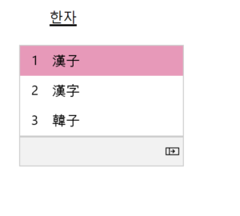

# What's new for Windows 10 Insider Preview Builds 

This topic lists new Windows 10 features for you to try in our active development branch. This branch (called “RS_PRERELEASE”) is where the teams check in all their latest code changes into the OS. While features in the active development branch may be slated for a future Windows 10 release, they are no longer matched to a specific Windows 10 release. Moving forward, the Fast ring will receive builds directly from this active development branch and new features will show up in these builds first. For features available in the Slow ring, see [What's new for Windows Insider Preview (20H1)](https://docs.microsoft.com/windows-insider/at-home/Whats-new-wip-at-home-20h1).

## Optional Drivers (Build 19536)
We are still working on making it easier for you to see all optional updates (including drivers, feature updates, and monthly non-security quality updates) in one place. When optional updates are detected, they will be listed under Settings > Update & Security > Windows Update > View optional updates.
For drivers, you no longer need to browse Device Manager for a specific device to update. Windows Update will automatically keep your drivers up to date, but if you’re having a problem, one of those optional drivers might help.

## Re-releasing the updated Korean IME
During 19H1 development, we’d started work on an updated version of the Korean IME as part of our ongoing efforts to modernize and improve your typing experience in Windows. Based on feedback, we decided not to ship this with 19H1, and instead worked on further improving the experience first. With Build 19536, we’re re-releasing the updated IME, along with some improvements that help it work better with various apps.
To recap the most noticeable changes included as part of this IME work:
* For those who’re familiar with typing in Korean when writing in Hanja, we have a new candidate selection window that uses modern controls and clearer typography:

* The new IME version also comes with an updated algorithm used for text prediction when writing Korean using the touch keyboard. Text suggestions should now be more accurate and relevant to what you are writing.

## Family group setup (Build 19536)
Microsoft has [family features that span across multiple platforms](https://account.microsoft.com/family/about), like Windows, Xbox, and Android. On Windows, you can set things up for your family, like screen time limits, content filters, have kids ask before they buy things, or even stay organized with a shared family calendar, OneNote, and Office 365 Home subscription. If you share a device with family, it’s easy to get their account set up in a family group to take advantage of all these features.

In this build, we want to help customers set up their device to be used by multiple people in their family. While we’re not releasing an ISO for this build, some Insiders who choose to reset their PC may see a screen during setup that asks who’ll be using the device. If they select __People in my family__, we’ll help them get set up in a family group once they get to their desktop, so that they’re ready to get started with all the features.

If you see this new page, let us know what you think by going to __Security and Privacy > Child accounts__ and family settings in the Feedback Hub.

