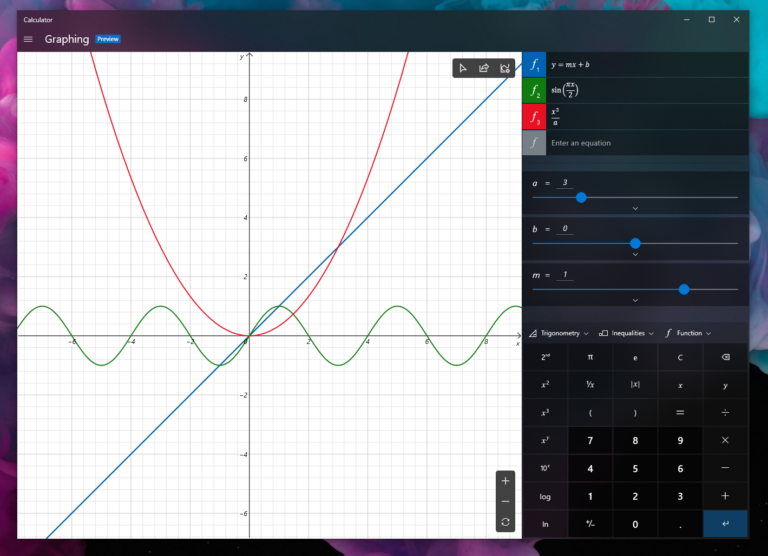

# What's new for Windows 10 Insider Preview Builds 

This topic lists new Windows 10 features for you to try in the Fast ring. The Fast ring will receive builds directly from our Active Development Branch and new features will show up in these builds first. NOTE: While features in the Active Development Branch may be slated for a future Windows 10 release, they are no longer matched to a specific Windows 10 release.

For new features available in the Slow ring, see [What's new for Windows 10 Insider Preview (20H1)](https://docs.microsoft.com/windows-insider/at-home/Whats-new-wip-at-home-20h1). 

For new features in Windows 10 apps, see [Windows 10 app updates](https://docs.microsoft.com/windows-insider/at-home/whats-new-apps). 

## Introducing Graphing Mode in Windows Calculator (Build 19546)
Adding support for graphing is one of our top feature requests in Feedback Hub, and we’re excited to bring this feature to our users. Graphing capabilities are also essential for students who are beginning to explore linear algebra. With this feature, we hope to empower students to learn mathematics by improving their conceptual understanding and attitudes towards math.

Here are a few things you can try out with this new feature:
* __Plot one or more equations on the graph.__ Enter multiple equations so that you can compare plots against each other and see interactions between the lines. You can also customize the line style and graph viewing window to suit your needs.
* __Add equations with variables.__ If you enter an equation with a secondary variable (e.g., “y = mx + b”), you’ll be able to easily manipulate those variables so that you can quickly understand how changes to the equation affect the graph.

* __Analyze the graph.__ Trace plots with your mouse or keyboard to better understand the relationship between variables in the equation on the graph. You can also analyze equations to help identify key graph features, like the x- and y- intercepts.

We’re looking for feedback! Tell us what you want to see next via the Feedback Hub under [Apps > Calculator](https://aka.ms/calcfeedback) or select the Send feedback button on the About page in the app. If you’re a developer, check out the project on [GitHub](https://github.com/Microsoft/calculator) — we are always accepting contributions! 

## Introducing the Indexer Diagnostics app (Build 19546)
Available now in beta via the [Microsoft Store](https://www.microsoft.com/store/productId/9N25LZCZWGS4), the Indexer Diagnostics app was created to help enhance your understanding of the capabilities of search, as well as increase the troubleshooting ability and support for general Windows Search issues.

The tool will continue to be improved with more functionality added over time—as always, appreciate your feedback! The app is available for anyone running Windows 10 version 1809 or higher.

## Location in-use icon update (Build 19541)
As some keen eyed Insiders have noticed, we’ve updated the notification area icon for when an app is using your location. The new icon looks like this:

## Showing architecture in Task Manager (Build 19541)
When you’re using the Details tab in Task Manager, we’ve added a new option to show the architecture of each process. If you’re interested, you can add it by right-clicking on a column header, choosing Select Columns, and selecting Architecture from the list.

## Optional Drivers (Build 19536)
We are still working on making it easier for you to see all optional updates (including drivers, feature updates, and monthly non-security quality updates) in one place. When optional updates are detected, they will be listed under Settings > Update & Security > Windows Update > View optional updates.
For drivers, you no longer need to browse Device Manager for a specific device to update. Windows Update will automatically keep your drivers up to date, but if you’re having a problem, one of those optional drivers might help.

## Re-releasing the updated Korean IME (Build 19536)
During 19H1 development, we’d started work on an updated version of the Korean IME as part of our ongoing efforts to modernize and improve your typing experience in Windows. Based on feedback, we decided not to ship this with 19H1, and instead worked on further improving the experience first. With Build 19536, we’re re-releasing the updated IME, along with some improvements that help it work better with various apps.
To recap the most noticeable changes included as part of this IME work:
* For those who’re familiar with typing in Korean when writing in Hanja, we have a new candidate selection window that uses modern controls and clearer typography:

* The new IME version also comes with an updated algorithm used for text prediction when writing Korean using the touch keyboard. Text suggestions should now be more accurate and relevant to what you are writing.

## Family group setup (Build 19536)
Microsoft has [family features that span across multiple platforms](https://account.microsoft.com/family/about), like Windows, Xbox, and Android. On Windows, you can set things up for your family, like screen time limits, content filters, have kids ask before they buy things, or even stay organized with a shared family calendar, OneNote, and Office 365 Home subscription. If you share a device with family, it’s easy to get their account set up in a family group to take advantage of all these features.

In this build, we want to help customers set up their device to be used by multiple people in their family. While we’re not releasing an ISO for this build, some Insiders who choose to reset their PC may see a screen during setup that asks who’ll be using the device. If they select __People in my family__, we’ll help them get set up in a family group once they get to their desktop, so that they’re ready to get started with all the features.

If you see this new page, let us know what you think by going to __Security and Privacy > Child accounts__ and family settings in the Feedback Hub.

