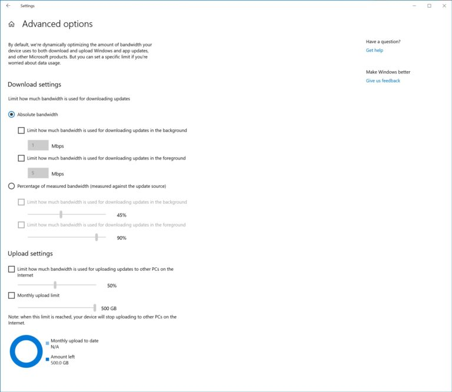

# What's new for Windows 10 Insider Preview Builds (20H1)
The [Windows Insider Program](https://insider.windows.com/en-us/) lets you preview builds of the upcoming 20H1 release of Windows 10. This topic lists all new Windows 10 features for you to try. 

## New download throttling options for Delivery Optimization (Build 18917)
We’ve heard from our users with very low connection speeds that setting download throttling as a percentage of available bandwidth isn’t providing enough relief in reducing the impact on their network. That’s why we’ve added a new option to throttle the bandwidth used by Delivery Optimization as an absolute value. You can set this separately for Foreground downloads (downloads that you initiate from Windows Store for example) or background downloads. This option already exists for IT Pros who use Group Policies or MDM policies to configure Delivery Optimization. In this build, we’ve made it easier to set via the settings page. You can access this option via Settings > Update & Security > Delivery Optimization > Advanced Options

'

## Narrator Data Table Reading improvements (Build 18917)
We’ve optimized the information you hear with Narrator when navigating a table using table navigation commands. Narrator now reads the header data first, followed by the cell data, followed by the row/column position for that cell. Additionally, Narrator only reads the headers when the headers have changed, so you can focus on the content of the cell.

## Windows Subsystem for Linux 2 (Build 18917)
WSL 2 is a new version of the architecture that powers the Windows Subsystem for Linux to run ELF64 Linux binaries on Windows. This new architecture, which uses a real Linux kernel, changes how these Linux binaries interact with Windows and your computer’s hardware, but still provides the same user experience as in WSL 1 (the current widely available version). WSL 2 delivers a much faster file system performance and full system call compatibility, which lets you run more applications like Docker!
[Read more about the release of WSL 2](https://devblogs.microsoft.com/commandline/wsl-2-is-now-available-in-windows-insiders/).

'

## Windows Ink Workspace Updates (Build 18917)
As we mentioned last week, you may notice that Windows Ink Workspace has changed on your PC. That’s because we’re updating the Windows Ink Workspace experience and starting to roll it out to some Insiders.

As part of this, Windows Ink Workspace now takes up less screen real estate, and we’re converging our whiteboarding experiences with a new direct link to our [Microsoft Whiteboard app](https://products.office.com/en-us/microsoft-whiteboard/digital-whiteboard-app). Microsoft Whiteboard is a freeform digital canvas where ideas, content, and people can come together. It includes an infinite canvas, optional backgrounds (including graph paper and solid dark grey) to choose from, rainbow ink support, multiple pages, and generally addresses much of the feedback you shared with us about Sketchpad. If you used Sketchpad, don’t worry – we saved the sketch you were working on in your Pictures folder.

'

We heard your feedback, and we’ve streamlined the Windows Ink Workspace for you. Stay tuned as we continue to evolve! Once the new experience arrives on your PC, please take a moment to try it out and share feedback via Feedback Hub under Desktop Environment > Windows Ink Workspace. If the Windows Ink Workspace icon isn’t visible in your taskbar, you can show it by right-clicking the taskbar and selecting “Show Windows Workspace Icon.”

## Narrator “Click me” link solution (Build 18912) 
Do you get frustrated tabbing through “Click me” links? Narrator can now tell you the title of the page that’s linked to—just press Caps + Ctrl + D, and Narrator will take the URL of the hyperlink you are on and send it to an online service that will provide the page title to Narrator. If you would like to disable all online service usage by Narrator, you can turn this off in Narrator Settings. If you find links that don’t give you a meaningful page title, please send us feedback. Thanks!

## Disk type now visible in Task Manager Performance tab (Build 18898)
A small, but perhaps convenient change — you’ll now be able to see the disk type (e.g. SSD) for each disk listed in Task Manager’s performance tab. This is particularly helpful in cases where you have multiple disks listed, so you can differentiate between them.

## File Explorer improvements (Build 18894)
We’ve heard your feedback asking for increased consistency, and to make it easier to find your files. Over the next few days we’ll be starting to roll out a new File Explorer search experience – now powered by Windows Search. This change will help integrate your OneDrive content online with the traditional indexed results. This rollout will start with a small percent, and then we’ll increase the rollout to more Insiders as we validate the quality of the experience.

What does that mean for you? Once you have the new experience, as you type in File Explorer’s search box, you’ll now see a dropdown populated with suggested files at your fingertips that you can pick from.

These improved results can be launched directly by clicking the entry in the new suggestions box, or if you want to open the file location, just right-click the entry and there’ll be an option to do so. If you need to use commands or dig deeper into non-indexed locations, you can still press enter and populate the view with the traditional search results.

We’ve also updated the design, so now as soon as you click the search box in File Explorer (or press CTRL+E to set focus to it), you’ll see the dropdown list with your search history.

If you encounter any issues, or have any feedback, file them under “Files, Folders, and Online Storage” > “File Explorer” in the Feedback Hub.

NOTES: You may notice in the screenshot, we’ve made the File Explorer search box wider so the suggestions dropdown has a bit more room to show results – that’s not a new option, but we figured you might want to know how to do it: just move your mouse to the starting border of the search box, and your mouse should turn into a resizing double arrow cursor. Just click down and drag the search box to be a bit wider.

## Accessibility improvements (Build 18894)
* __Table reading improvements:__ Narrator is now more efficient when reading tables. Header information is not repeated when navigating within the same row or column. Entering and exiting tables is also less verbose.
* __Narrator web page summary:__ There’s a new command in Narrator to give a webpage summary! (Narrator + S). Currently this command will give information about hyperlinks, landmarks and headings.
* __Magnifier text cursor setting:__ Windows Magnifier has a new ability to keep the text cursor in the center of the screen making it easier and smoother to type. Centered on the screen is on by default and can be changed in the Magnifier settings.

## Expanding dictation support to more languages (Build 18885)
Ever had a word that you just can’t figure out how to spell? Or like to think out loud and wanna automatically jot it all down? In addition to English (United States), we now support dictation when using English (Canada), English (UK), English (Australia), English (India), French (France), French (Canada), German (Germany), Italian (Italy), Spanish (Spain), Spanish (Mexico), Portuguese (Brazil), and Chinese (Simplified, China)

How to try it? Set focus to a text field and press WIN+H! Or you can tap the little microphone button at the top of the touch keyboard. Say what you wanna say, then press WIN+H a second time or tap the mic button to stop the dictation, or let the dictation session time out on its own. 

We’d love to hear your feedback – you can report issues or make feature requests under Input & Language > Speech Input in the Feedback Hub.

Notes:
* Speech resources will need to be downloaded for dictation to work. To check that they’re available, go to Language Settings, click on the desired language, and then click on Options. If speech resources are available but haven’t been downloaded, there should be a download button.
* Dictation is based on the language of your active keyboard. To switch between preferred languages, press WIN + Space.

## Cross-language support in Feedback Hub 
Based on your feedback, with Feedback Hub version 1.1903, Insiders with Windows set to a language other than English now have the option of browsing English feedback within the Feedback Hub, as well as submitting feedback in English on the New Feedback form.

## East Asian Microsoft Input Method Editor (IME) Improvements (Build 18875)
__The New Japanese IME is now available to all Insiders in Fast.__ During 19H1, we announced we were working on [a new Japanese IME](https://blogs.windows.com/windowsexperience/2018/11/07/announcing-windows-10-insider-preview-build-18277/#jJxpLldDZEsihHJv.97). We got a lot of great feedback, and the IME was taken offline for a time while we worked on improving the experience based on what you’d told us. Today the IME – now more secure, more stable, with improved game compatibility, and more – is once again available for all Insiders starting with this build. If you speak Japanese, please take some time to evaluate how it feels to use the IME (with all the improvements) for daily usage, and let us know what you think! If you already were using the Japanese IME, you’ll automatically have the new one when you install this build – if you weren’t already using the Japanese IME, you can add it by going to Languages Settings and adding Japanese to the list.

__New IMEs are available for Simplified and Traditional Chinese.__ Just like the Japanese IME above, we’ve been working on refining your Chinese typing experience, and are happy to share that we have new versions of the Chinese Simplified IMEs (Pinyin and Wubi), as well as the Chinese Traditional IMEs (Bopomofo, ChangJie and Quick). We’ve improved the security and reliability by redesigning how they work with applications. You’ll also notice we’ve added a cleaner interface for the candidate window and settings pages. Improved and renewed settings of the IMEs are available in the Settings app. If you’re using one of the IMEs and you’d like to check it out, the fastest way there is to right-click the IME mode indicator in the taskbar and select Settings (you can get there from the Language Settings page by clicking the language, and going into options). Looking forward to hearing [what you think about it](https://aka.ms/inputfeedback)! 

## Bringing SwiftKey’s Typing Intelligence to Even More Languages (Build 18860)
As many of you know, we’ve been working on bringing SwiftKey’s typing intelligence to Windows. We’re excited to announce that we’re expanding support to these 39 languages:

Afrikaans (South Africa),  Albanian (Albania),  Arabic (Saudi Arabia),  Armenian (Armenia), Azerbaijani (Azerbaijan), Basque (Spain), Bulgarian (Bulgaria), Catalan (Spain), Croatian (Croatia), Czech (Czech Republic), Danish (Denmark), Dutch (Netherlands), Estonian (Estonia), Finnish (Finland), Galician (Spain), Georgian (Georgia), Greek (Greece), Hausa (Nigeria), Hebrew (Israel), Hindi (India), Hungarian (Hungary), Indonesian (Indonesia), Kazakh (Kazakhstan), Latvian (Latvia), Lithuanian (Lithuania), Macedonian (Macedonia), Malay (Malaysia), Norwegian (Bokmal, Norway), Persian (Iran), Polish (Poland), Romanian (Romania), Serbian (Serbia), Serbian (Serbia), Slovak (Slovakia),  Slovenian (Slovenia), Swedish (Sweden), Turkish (Turkey), Ukrainian (Ukraine), Uzbek (Uzbek)

What does this mean for you? Basically, we’re updating the underlying language model when typing in each of these languages, to improve the accuracy of the autocorrections, shapewriting, and predictions. You’d notice this when using the touch keyboard, or the hardware keyboard text predictions (if enabled). If you use these languages above to type, help us make your typing experience even better by sharing feedback! ([being as specific as possible](https://insider.windows.com/en-us/how-to-feedback/), if you can). We’ll be posting a Quest about this improvement in the Feedback Hub soon.

## Improved Windows Sandbox accessibility (Build 18855)
We have made several updates to improve Windows Sandbox accessibility scenarios. This includes: 
* Microphone support
* Added functionality to configure the audio input device via the Windows Sandbox config file
* A Shift + Alt + PrintScreen key sequence in Windows Sandbox which activates the ease of access dialog for enabling high contrast mode.
* A ctrl + alt + break key sequence in Windows Sandbox which allows entering/exiting fullscreen mode

## Snip & Sketch version 10.1901.10521.0 (Build 18850)
As some of you may have already noticed, we’re in the process of rollout out a new app update to Skip Ahead. It includes a number of fixes based on your feedback, among which are:
* We fixed an issue that could result in snips being a bit blurry after saving or copying to clipboard.
* We fixed an issue where copying to clipboard would fail if you switched out of the app while the copy operation was in progress.
* We fixed an issue where the suggested file name was unexpectedly a GUID for snips opened from Win + Shift + S toast.
* We’ve added Narrator (screen reader) confirmations when a snip is copied to clipboard.
* We’ve updated the default save format to be png. You can still use the dropdown when saving to pick your desired format if it’s not png.
* We fixed an issue where auto-copy changes to clipboard wasn’t working on return from Snip & Sketch settings.
* We fixed an issue where the app might crash if you closed two app windows one after another.
* We fixed an issue where the default save file location was documents rather than pictures. In fixing this we also fixed an issue where when saving the save dialog wouldn’t remember where you last saved a snip.

The rollout of this app is not tied to the upgrade, so you may see it outside the bounds of this flight.

## Windows Sandbox configuration file support (Build 18841)
Windows Sandbox now supports configuration files! These files allow users to configure some aspects of the sandbox, such as vGPU, networking and shared folders. [Check out the blog post explaining this new feature](https://aka.ms/WindowsSandbox_ConfigFile).