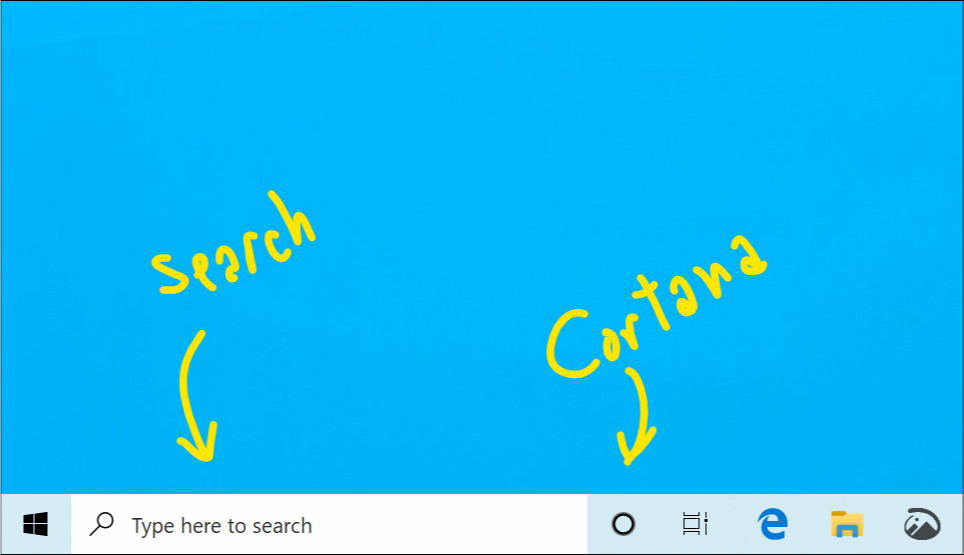
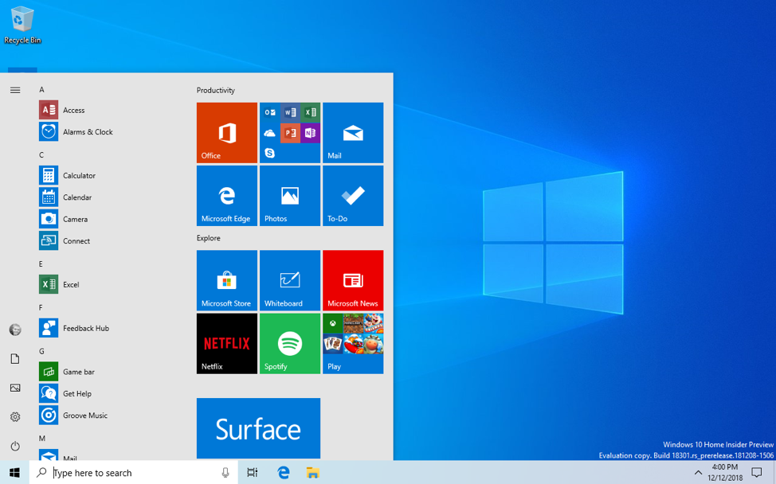
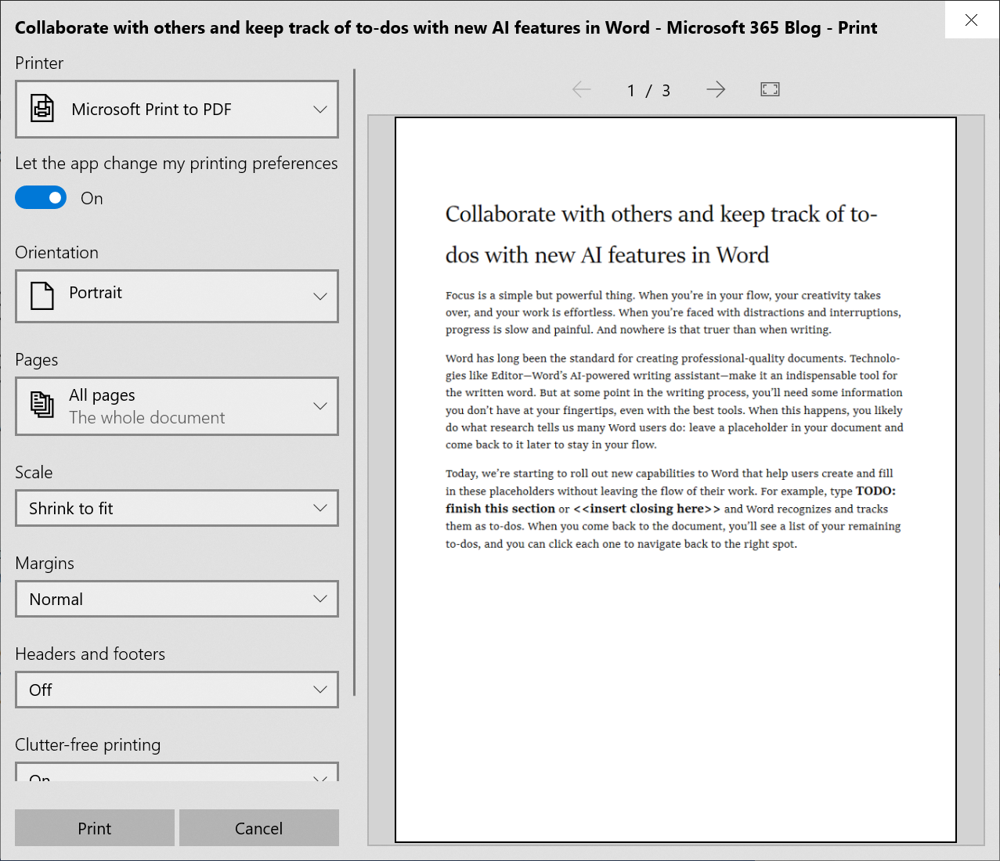
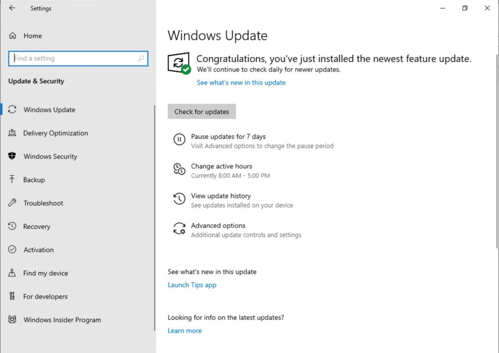
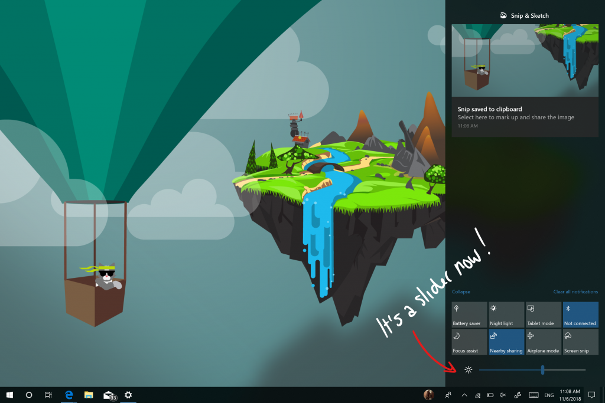
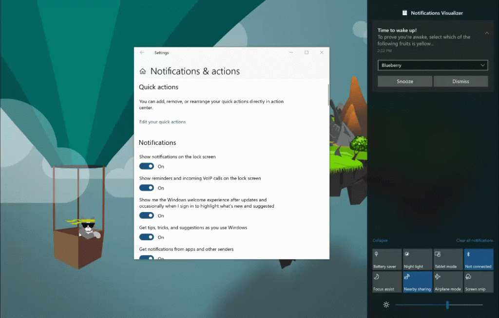
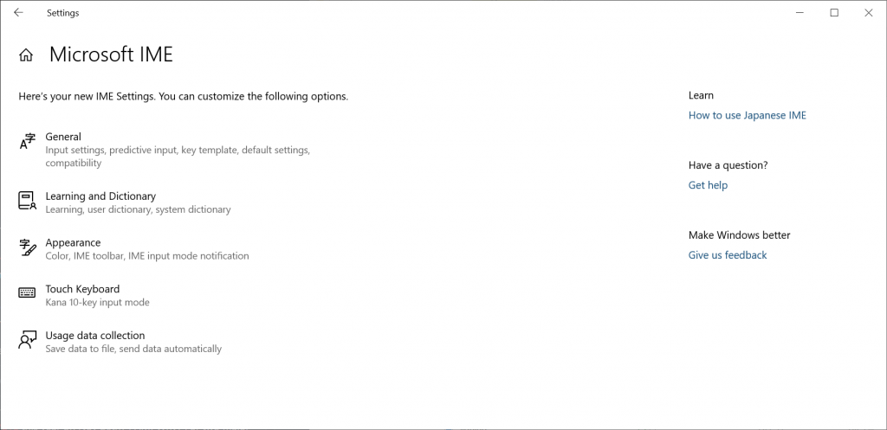
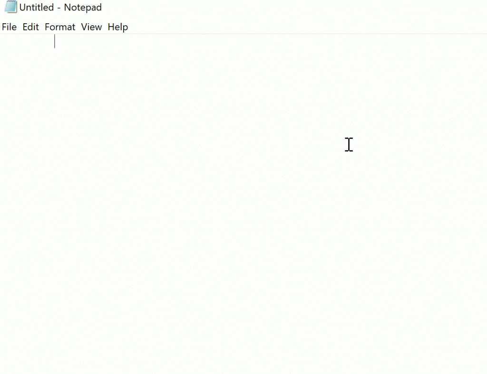
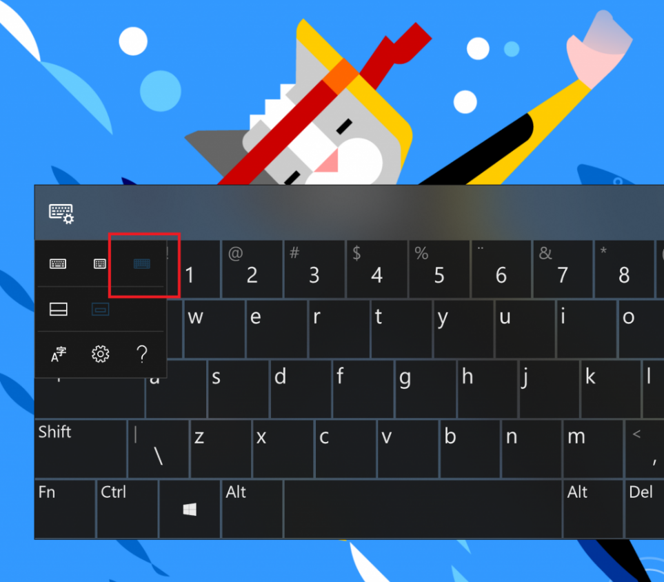
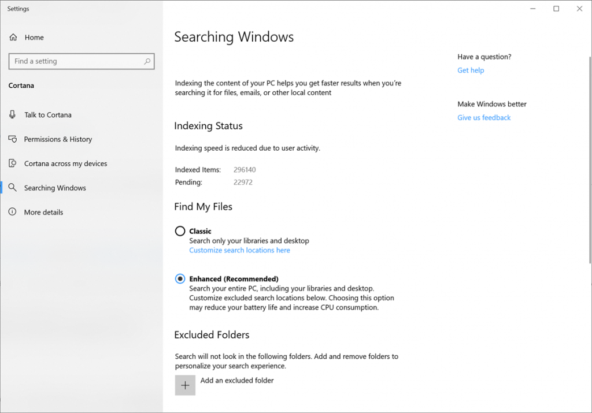

# What's new in the Windows 10 Insider preview builds (19H1)
The [Windows Insider Program](https://insider.windows.com/en-us/) lets you preview builds of the upcoming release of Windows 10. This topic lists all new Windows 10 features for you to try. 

## Separating Search and Cortana (Build 18317)
Going forward, we’ll be decoupling Search and Cortana in the taskbar. This will enable each experience to innovate independently to best serve their target audiences and use cases. Some Insiders have had this update for a few weeks now, and we appreciate all the feedback we’ve received about it so far! For those new to this update, when it rolls out to you, you’ll find clicking the search box in the taskbar now launches our experience focused on giving you the best in house search experience and clicking the Cortana icon will launch you straight into our voice-first digital assistant experience.

Other available Search and Cortana settings have also now been split between the two, along with the familiar group policies. This change is one of several we’ve made throughout this release to improve your experience in this space, including updating the search landing page design, enhancing your search results, and integrating Microsoft To-Do with Cortana. If you have any further feedback, please don’t hesitate to share it with us here.

Note: Cortana is currently only available in supported markets.

## The next step in improving Start reliability (Build 18317)
As some of you may already know, up until now Start in Windows 10 has been hosted by something called ShellExperienceHost.exe. In order to provide you the best possible Start experience, we’re separating it into its own process, called StartMenuExperienceHost.exe. This has a number of benefits, including simplifying debugging and insulating Start from potential issues impacting other surfaces. This has been running as an experiment for a few weeks now and we’ve seen measurable improvements in the reliability amongst those that have the change, so we’re rolling it out to everyone. We’re also making a change so that Start no longer suspends, which improves launch time.

## A Better Font management experience in Settings (Build 18317)
Insiders today can now drag and drop font files from File Explorer into the modern Settings > Fonts page to install them. After installation, click on the font in the Font page, to view the different font faces associated with the font and all the details of the font. You can also uninstall the font from this font details page. Drag and drop font installation by default is installed as a per-user font which does not require elevation, hence it will not be available for other users. To install the font for all users in the device, use the “Install for all Users” option by right clicking the font on file explorer.

## A simpler Windows Insider Program Settings page (Build 18317)
We are introducing a simplified Windows Insider Program Settings page via Settings > Update & Security > Windows Insider Program with Build 18317. The goal is to make the end-to-end experience of signing up for the Windows Insider Program and setting up your PC to take new builds much easier by simplifying the experience and removing some of the clutter. You’ll find that all the same functionality is still there. Under “Pick your Insider settings” is where you can change your Insider ring on your PC.

## Reserving disk space to keep Windows 10 up to date (Build 18312) 
In 19H1, we’re making a few changes to how Windows 10 manages disk space. Through reserved storage, some disk space will be set aside to be used by updates, apps, temporary files, and system caches. Our goal is to improve the day-to-day function of your PC by ensuring critical OS functions always have access to disk space. With reserved storage, updates, apps, temporary files, and caches are less likely to take away from valuable free space and should continue to operate as expected. Reserved storage will be introduced automatically on PCs that come with 19H1 pre-installed or on PCs where 19H1 was clean installed. For Windows Insiders who want to try this feature out right now – just run through this quest. After completing the quest, reserved storage will kick off with the next flight. (If you do the quest before installing Build 18312 – reserved storage should kick off for this flight.) For more details on reserved storage coming in 19H1, [read this blog post here](https://blogs.technet.microsoft.com/filecab/2019/01/07/windows-10-and-reserved-storage/).

## FLS Slot Limit Increase (Build 18312) 
As PCs get more powerful, musicians have created increasingly complex projects with more tracks, more instruments, and deeper effects chains. As a result, some of those musicians were running up against a FLS (Fiber Local Storage) slot allocation ceiling that prevented them from loading into their DAWs (Digital Audio Workstations) as many unique plugins as they’d like. This build greatly raises that per-process FLS slot allocation ceiling, allowing loading potentially thousands of unique plugins. Beyond musicians, this change will positively impact any application that dynamically loads hundreds or thousands of unique DLLs that have statically-linked Visual C++ runtimes, or otherwise allocate FLS slots.

## Reset this PC UI Improvements (Build 18312) 
We added new UI for Reset this PC as part of Settings > Update & Security > Recovery. The new UI provides a more consistent experience across devices with different configurations and requires fewer clicks to complete.

## Windows Subsystem for Linux Command Line Tool Improvements (Build 18312) 
We added new command line options to the WSL command line tool (wsl.exe) for easier WSL management and added functionality based on your feedback. Below is a summary of changes. You can read about more details in [our release notes](https://docs.microsoft.com/en-us/windows/wsl/release-notes) and on our [command line blog](https://blogs.msdn.microsoft.com/commandline/).
* Consolidated command line options – The wsl command line tool now includes options to manage your WSL distros that are included in the wslconfig command line tool. We intend to only update the wsl tool with the latest management options moving forward.
* Import a distro for easy sideloading including to non-system drives – Use the “–import” option to imports a tar file as a new distribution. You can specify the distribution registry to the location of your choice including non-system drives.
* Export your WSL distribution for simpler environment management – Use the “—export” option to export a distribution to a tar file. Your distro will export to your default downloads location.

## Streamlined Windows Hello PIN reset experience (Build 18309)
We know remembering a PIN can be tricky, so we wanted to provide our Microsoft account users with a revamped Windows Hello PIN reset experience with the same look and feel as signing in on the web. Check it out in today’s build by clicking the ‘I forgot my PIN’ link when signing in to Windows with a PIN. Insiders can try it out on all Windows 10 editions.

## Signing in to Windows with password-less Microsoft accounts (Build 18309) 
We’re pushing forward on eliminating passwords and keeping your accounts safe with another cool feature. With Build 18305, we announced support for setting up and signing in to Windows 10 with a phone number account, without having to create, or deal with the hassle of a password for Insiders using the Windows 10 Home edition. Today, that support is extending to all Windows 10 editions!
If you have a Microsoft account with your phone number, you can use an SMS code to sign in, and set up your account on Windows 10. Once you’ve setup your account, you can use Windows Hello Face, Fingerprint, or a PIN (depending on your device capabilities) to sign in to Windows 10. No password needed anywhere!

### Creating a password-less phone number account
If you don’t already have a password-less phone number account, you can create one in a mobile app like Word on your iOS or Android device to try it out. Simply go to Word and sign up with your phone number by entering your phone number under “Sign in or sign up for free”.
### Add your password-less phone number account to Windows 
Now that you’ve created a password-less phone number account, you can use it to sign in to Windows with the following steps:
1. Add your account to Windows from Settings > Accounts > Family & other Users > “Add someone else to this PC”.
2. Lock your device and select your phone number account from the Windows sign-in screen.
3. Since your account doesn’t have a password, select ‘Sign in options’, click the alternative ‘PIN’ tile, and click ‘Sign in’.
4. Go through web sign in and Windows Hello set up (this is what you’ll use to sign in to your account on subsequent sign ins). 

You can now enjoy the benefits of signing in to Windows with your password-less phone number account.

## Narrator Improvements (Build 18309)
__Add more voices:__ Users can download additional voices in other languages without having to download language packs.  To do that, go to Narrator Settings and select the “Add more voices” link.

__Narrator Home navigation:__ The main actions on Narrator Home, such as QuickStart and Settings, are now buttons and not Listview items. You are now able to tab between all of them.
__Read Current character phonetics:__ Added Narrator + 5 twice Narrator command to render current character phonetics.

__Other improvements:__ 
- Improved reading of controls while navigating and editing
- Improved table reading in PowerPoint
- Improved reading and navigating experiences with Chrome and Narrator
- Improved interacting with Chrome menu’s with Narrator

## Ease of Access Improvements (Build 18309)
Cursor and Pointers: Building on our mouse work announced with 18298, we’ve added 11 additional mouse pointer sizes in the Cursor and Pointers settings.  There are now 15 sizes.

## A simplified Start layout (Build 18305)
Based on your feedback, we’re introducing a simplified default Start layout for new devices, new user accounts, and clean installs. The new layout has been simplified into a sleek one column design with reduced top-level tiles. For the IT admins out there, don’t worry, commercial and education customers will also see a simplified layout tailored to these scenarios.

Coupled with earlier changes providing the ability to [uninstall additional inbox apps](https://blogs.windows.com/windowsexperience/2018/10/17/announcing-windows-10-insider-preview-build-18262/#LeXKDBThmFW8iQbK.97), and a new way to [easily unpin a folder or group of tiles](https://blogs.windows.com/windowsexperience/2018/10/31/announcing-windows-10-insider-preview-build-18272/#q6fgjW1JapokMzJW.97), the simplified Start layout is part of an ongoing effort designed to enhance your Start experience in the upcoming release of Windows.

Note: When you update to this build, your Start layout won’t automatically change to the new layout because we want everything to be exactly as you left it before you did the update.

## Introducing Windows Sandbox! (Build 18305)

Windows Sandbox is a new lightweight desktop environment tailored for safely running applications in isolation.
How many times have you downloaded an executable file, but were afraid to run it? Have you ever been in a situation which required a clean installation of Windows, but didn’t want to set up a virtual machine?

At Microsoft, we regularly encounter these situations, so we developed Windows Sandbox: an isolated desktop environment where you can run untrusted software without the fear of lasting impact to your device. Any software installed in Windows Sandbox stays only in the sandbox and cannot affect your host. Once Windows Sandbox is closed, all the software with all of its files and state are permanently deleted.

Windows Sandbox has the following properties:

* __Part of Windows__ – everything required for this feature ships with Windows 10 Pro and Enterprise. No need to download a VHD! 
* __Pristine__ – every time Windows Sandbox runs, it’s as clean as a brand-new installation of Windows. 
* __Disposable__ – nothing persists on the device; everything is discarded after you close the application. 
* __Secure__ – uses hardware-based virtualization for kernel isolation, which relies on the Microsoft Hypervisor to run a separate kernel which isolates Windows Sandbox from the host.
* __Efficient__ – uses integrated kernel scheduler, smart memory management, and virtual GPU.

To install Windows Sandbox, go to __Settings > Apps > Apps & Features > Programs and Features > Turn Windows Features on or off__, and then select __Enable Windows Sandbox__.
To start Windows Sandbox, open the __Start__ menu, enter Windows Sandbox and then select it.

Windows Sandbox respects the host diagnostic data settings. All other privacy settings are set to their default values.
For more information, please visit [Windows Sandbox](https://techcommunity.microsoft.com/t5/Windows-Kernel-Internals/Windows-Sandbox/ba-p/301849) at Windows Kernel Internals.

We are excited to learn how you use Windows Sandbox! As we continue to add new functionality, your feedback is crucial in shaping the direction of this feature, so share your thoughts with us at [Feedback Hub](https://aka.ms/windowssandbox-fb).

## Windows Security app improvements (Build 18305)

__New Protection History experience:__ We have had great feedback on our history experience from users, and we’ve listened!  Based on the suggestions and feedback we’ve received, the Protection history experience in Windows Security has been completely revamped. The new Protection History experience still shows you detections by Windows Defender Antivirus, but it’s now updated to also give more detailed and easier to understand information about threats and available actions. We have also added Controlled folder access blocks to history, along with any blocks which are made through organizational configuration of Attack Surface Reduction Rules. If you use the Windows Defender Offline scanning tool, any detections it makes will now also show in your history.  Additionally, you will see any pending recommendations (red or yellow states from throughout the app) in the history list. We hope you like the changes we’ve made!

__Introducing Tamper Protection!__ Tamper Protection is a new setting from Windows Defender Antivirus, available in the Windows Security app, which when on, provides additional protections against changes to key security features, including limiting changes which are not made directly through the Windows Security app. You can find this setting under Windows Security > Virus & Threat Protection > Virus & Threat Protection Settings.

## Symbols and Kaomoji are now just a hotkey away! (Build 18305)
Ever tried to type an em dash, and couldn’t remember the Alt key code? Wanted to post “flipping the table” in social media, but couldn’t remember the sequence of characters? When you press WIN+(period) or WIN+(semicolon), in addition to emoji the picker that appears will now include symbols and kaomoji too!

You may ask, [what is kaomoji](https://en.wikipedia.org/wiki/Emoticon#Japanese_style_kaomoji)? Translated literally from Japanese, it means “face characters” – basically, it’s a way to create faces using only text. You may already use them, for example the one mentioned above [is relatively popular](https://knowyourmeme.com/memes/flipping-tables-%E2%95%AF%E2%96%A1%E2%95%AF%EF%B8%B5-%E2%94%BB%E2%94%81%E2%94%BB): (╯°□°)╯︵ ┻━┻

Diving more into the symbols side, you’ll find we’ve included sections for punctuation, currency, geometric, math, Latin, and language symbols. As you pick your most commonly used symbols, the most recently used tab will populate with them, so it will be even easier to select them next time.
Currently only the emoji section supports type to search.

This experience, originally introduced for Chinese (Simplified) during RS5 development, started rolling out to Insiders across all languages with [Build 18252](https://blogs.windows.com/windowsexperience/2018/10/03/announcing-windows-10-insider-preview-build-18252/) – as of today’s it’s now available to all Insiders in Fast! We’d love for you to try it out and share feedback. Tried it out already? With this build, we’ve updated the available kaomoji a bit based on your feedback, including adding ¯\_(ツ)_/¯ and ᓚᘏᗢ.

## Clipboard history gets a new look (Build 18305)

Have you already tried using clipboard history? If enabled, it allows you to save multiple clipboard items to use later. Introduced during [RS5 development](https://blogs.windows.com/windowsexperience/2018/05/09/announcing-windows-10-insider-preview-build-17666/#QTs2bQCzsFd2D0d1.97), we’ve been getting great feedback from everyone on this experience, and one of the things we heard most is that the UI wasn’t compact enough – a large space was used for each entry even if it was just a small text fragment. We originally opted to show bigger entries so there was space to show an image preview nicely, but when we looked at our data, we found 90% of items in the clipboard history were text. Based on that and your feedback, we now optimizing the design for text snippets – shrinking the height of each entry and thus giving you access to more entries without needing to scroll the view. Hope you like the change we made! Copy some text and press __Windows logo key + V__ to check out the updated design.

## Signing in to Windows with password-less Microsoft accounts (Build 18305) 

We’re pushing forward on eliminating passwords and keeping your accounts safe with another cool feature. Today, we’re announcing support for setting up and signing in to Windows with a phone number account, without having to create, or deal with the hassle of a password!  If you have a Microsoft account with your phone number, you can use an SMS code to sign in, and set up your account on Windows 10. Once you’ve setup your account, you can use Windows Hello Face, Fingerprint, or a PIN (depending on your device capabilities) to sign in to Windows 10. No password needed anywhere!

__Creating a password-less phone number account:__ If you don’t already have a password-less phone number account, you can create one in a mobile app like Word to try it out. Simply go to Word and sign up with your phone number by entering your phone number under “Sign in or sign up for free”.

__Add your password-less phone number account to Windows:__ Now that you’ve created a password-less phone number account, you can use it to sign in to Windows with the following steps:
1. Add your account to Windows from Settings > Accounts > Family & other Users > “Add someone else to this PC”.
2. Lock your device and select your phone number account from the Windows sign-in screen.
3. Since your account doesn’t have a password, select ‘Sign in options’, click the alternative ‘PIN’ tile, and click ‘Sign in’.
4. Go through web sign in and Windows Hello set up (this is what you’ll use to sign in to your account on subsequent sign ins)
5. You can now enjoy the benefits of signing in to Windows with your password-less phone number account.

Note: This experience is currently only available for Insiders on Home edition. We’ll let you know when it expands to more editions

## Streamlined Windows Hello PIN reset experience (Build 18305)

We know remembering a PIN can be tricky, so we wanted to provide our Microsoft account users with a revamped Windows Hello PIN reset experience with the same look and feel as signing in on the web. Check it out in today’s build by clicking the ‘I forgot my PIN’ link when signing in to Windows with a PIN.

Note: This experience is currently only available for Insiders on Home edition. We’ll let you know when it expands to more editions.

## Keep your device running smoothly with recommended troubleshooting (Build 18305)

Microsoft can automatically fix certain critical problems on your Windows device to keep it running smoothly. For example, we may automatically restore default settings for critical services, adjust feature settings to match your hardware configuration, or make other specific changes required for Windows to operate normally. Critical troubleshooting happens automatically and can’t be turned off.

We’ll also recommend troubleshooting for other problems that aren’t critical to normal Windows operation but might be impacting your experience. For example, we may recommend turning off a setting that sometimes causes an app or feature to crash unexpectedly until an update is available. We’ll let you know when we can help, and you can choose to run the troubleshooter or ignore it. You can also change how recommended troubleshooting is run on your device by opening __Start > Settings > Privacy > Diagnostics & Feedback__.

You may have noticed that this feature has been [visible for a while](https://blogs.windows.com/windowsexperience/2018/10/17/announcing-windows-10-insider-preview-build-18262/#55235pw4SoBiWckd.97), but now it is fully functional. You may see recommended troubleshooting from us while we test the feature. These tests, marked as “sample recommended troubleshooter”, are safe to run and will not make any changes to your device. The tests help to ensure that the feature is working as designed and give you an opportunity to give feedback, so we can help keep your device working at its best. You will see this notification when there is a recommended troubleshooter available for your device:

After clicking the notification, you’ll see this screen, where you can choose whether or not to run the recommended troubleshooter.

## Set a default Task Manager tab (Build 18305)

Do you have a preferred tab in Task Manager – one that you always immediately switch to? We’re happy to share you can now choose your own default tab! When you launch Task Manager, it will now to jump directly to your preferred tab.
You can set your preferred tab via __Options > Set default tab__.

## Updated Settings Homepage (Build 18305)

In this build, we’re introducing a new way to help users finish their Windows setup and quickly access some of the most frequently used settings. Inspired by the Microsoft account homepage, the Settings home page now has a header at the top allowing you to take quick action for things like signing in and managing your Microsoft account, making the Windows and Microsoft experience better. It also gives you an easy to glance at system status, such as when updates are available. Some of you may have already seen this in previous builds, but don’t worry if not, we’re continuing to roll this out slowly and you will see it in an upcoming build.

## Friendly Dates in File Explorer (Build 18305)

With [Build 18272](https://blogs.windows.com/windowsexperience/2018/11/07/announcing-windows-10-insider-preview-build-18277/), we mentioned some Insiders may notice a few small changes to File Explorer. We promised details, and sharing the updated default [downloads folder sorting](https://blogs.windows.com/windowsexperience/2018/12/10/announcing-windows-10-insider-preview-build-18298/) was the first part of that. The second part of it is this: we’re trying out a new default date format in File Explorer! Called friendly dates, you can see an example of how it looks in the image below.
Why make the change? The new format simplifies the date modified column, and provides consistency with other views that you see throughout the OS, apps, and on the web.
We appreciate everyone who’s taken the time to share their feedback so far. Based on your comments, in Build 18305, we’re making it a bit easier to turn off if it’s not your thing – you no longer have to dig through settings, you can now just right-click on the date modified column and toggle friendly dates on and off from there.
Friendly dates isn’t yet available for everyone, so don’t worry if you don’t see it just yet – we’ll let you know when it’s live for all.

## Shadows are back! (Build 18305)

As some keen-eyed Insiders have noticed, we recently started re-rolling out the shadows work we originally introduced with [Build 17711](https://blogs.windows.com/windowsexperience/2018/07/06/announcing-windows-10-insider-preview-build-17711/). Shadows are part of our long-term vision of the [evolution of Fluent Design](https://developer.microsoft.com/en-us/events/build/content/fluent-design-system-evolution?playlist=41f18bdd-6d5a-44b9-8586-0fa36ed91c45), and we’re excited to bring them back to you today after addressing some of the feedback you shared with us following the initial rollout.

## Re-releasing the new Japanese IME (Build 18305)

Thank you for your valuable feedback on our [new Japanese IME](https://blogs.windows.com/windowsexperience/2018/11/07/announcing-windows-10-insider-preview-build-18277/). A few weeks ago, we took the IME offline in order to address some of the feedback shared with us, and we’re now ready to start rolling out the IME again to Insiders. The latest version of the IME has enhanced key customization options and improved candidate window reliability (fixing an issue where it wouldn’t show), and we’re looking forward to you trying it out. Because we want to ensure the best possible typing experience, this will be a staggered rollout – some Insiders will get it today, and we will carefully review both metrics and your comments before pushing the IME out to everyone. Looking forward to you trying it out and sharing feedback!

Note: We are aware of compatibility issues with some game applications and the team is working on them – we’ll let you know when this has been addressed.

## Introducing the Office app for Windows 10 (Build 18305)

This month, Windows Insiders get their first look at the new Office app, a simple experience designed to help users get the most out of Office and get back into their work quickly. This app is based on the redesigned [Office.com](https://office.com/) experience, which has had great user feedback and has changed how many of our web users engage with Office on a daily basis.

The app is a great starting point for Office that helps you easily find all your files in one place or easily access any Office solution available to you. It knows to connect you to the Office rich clients if they are installed on your computer or it will send you to the web version of Office if they’re not. IT will also appreciate the ability to customize the app by integrating other line of business applications that use Azure Active Directory into the experience and apply corporate branding to the app.

Please see the [Microsoft 365 Blog post](https://nam06.safelinks.protection.outlook.com/?url=https%3A%2F%2Fwww.microsoft.com%2Fen-us%2Fmicrosoft-365%2Fblog%2F2018%2F12%2F19%2Fintroducing-the-office-app-for-windows-10%2F&data=02%7C01%7Cwdoll%40microsoft.com%7C2756d006866e46081e4808d66510813f%7C72f988bf86f141af91ab2d7cd011db47%7C1%7C0%7C636807518894476742&sdata=KFMvdWe34hQwH0mkTQ4ybUzPXgxlNurT%2FIZFbPyE9QY%3D&reserved=0) for more information on the Office app. Start using the app to get the most out of Office, and please let us know what you think via the feedback link under “Settings.”

Note: You may notice the [new Office icons](https://medium.com/microsoft-design/redesigning-the-office-app-icons-to-embrace-a-new-world-of-work-91d72608ee8f) in the screenshot above! They aren’t live for Insiders yet, but we wanted you to get a taste of what it will look like once they are.

## Get more done with Cortana and Microsoft To-Do (Build 18305)

Want just one to-do list that works twice as hard for you? Save time and stay organized – Cortana helps by adding your reminders and tasks to your lists in Microsoft To-Do with this feature preview, so you can stay on top of what matters most. Use your voice, your PC, your phone – your choice.
Streamline your tasks – your lists and reminders from across Microsoft To-Do, Cortana, and tasks in Outlook can now become one, centrally located in your Microsoft To-Do app. Use Microsoft To-Do anywhere: on your Android or iPhone, with Cortana, or on your Windows 10 PC. You can also access it from the web. It’s automatically synced so you never miss a beat. When you ask Cortana to add milk to your grocery list, it’ll show up on one of your Microsoft To-Do lists.

Or, ask Cortana to remind you to call a friend and see the reminder appear in your Microsoft To-Do planned list.

With this integration, we are furthering efforts to seamlessly sync your to-do lists across Microsoft To-Do, Cortana, and your tasks in Outlook. To start syncing, your Windows 10 PC must be running Build 18267+ and tied to either the Australia, India, US, or UK region. [Learn more about the Microsoft To-Do and Cortana integration](https://techcommunity.microsoft.com/t5/Microsoft-To-Do-Blog/What-s-new-for-Microsoft-To-Do-in-October-2018/ba-p/279462). To share feedback, [join the cohort](https://insider.windows.com/en-us/signup/cortana-cohort/?utm_source=email&utm_medium=email&utm_campaign=CortanaWithMSToDo&utm_content=WIP_Header_Body_CortanaCohortSignUp) or use the Windows Feedback Hub. 

## Consolidating your sign-in options (Build 18298)
With [Build 18272](#sign-in-options-redesigned-for-windows-hello-build-18272), we set out to simplify sign-in settings, to increase visual clarity, and improve ease of use. Our goal is to give you a one-stop shop for all your sign-in settings, and today we’re adding one more to the list: You can now set up a security key straight from Settings.

## File Explorer improvements (Build 18298)
**Updated File Explorer icon**: We’re updating the File Explorer icon, so it looks better with the new light theme. Thanks everyone who shared feedback about this! Here’s what it looks like now:

**Updating the default downloads folder sorting**: More often than not, when you download a file, you don’t change the name before downloading it. Because of that, the names aren’t always very memorable (cake_134_small_red.jpg anyone?). This makes sorting by name less optimal since it’s hard to find the file you’re looking for, so we’re updating the default sorting to show the most recently downloaded file at the top of the list instead.

>[!NOTE]
>If you’ve already altered the current sorting from the default in any way, we will not change it – this is only for people who haven’t changed it. If at any point you want to switch sortings, you can do so from the View tab in File Explorer. Some Insiders have had this change for a little bit now, and based on positive feedback we’re now rolling it out to 100% of Fast.

## Start menu improvements (Bu8ild 18298)
**Quick unpin for groups and folders**: Sometimes you just wanna quickly start fresh – over the last few weeks we’ve been rolling out the ability to unpin groups and folders in Start via a new context menu entry. As of today, that option is now available to all Insiders in the Fast ring! Thanks, as always, to everyone who’s shared their feedback so far!

## Touch keyboard improvements (Build 18298)
We’ve heard your feedback, and with today’s build we’re rolling out some updates to the touch keyboard to improve your experience:

- Type faster with more accuracy: When you’re typing quickly, sometimes your fingers miss the actual key you’re trying to hit by a small margin. This is totally normal, but can impact the text prediction accuracy (if you ending up pressing a different letter than expected). To address this, as you type, under the covers we will now dynamically adjust the hit target of each key, based on prediction of what letter most likely will be typed next. The keys will look no different to the eye, but here’s an example of the what’s going on underneath if you’re curious:
   
- We’re making some improvements to reduce the number of times in tablet mode where the touch keyboard ends up occluding the text field when docked.

If you’re a touch keyboard user, we’d love it if you spent some time typing on today’s build, and [let us know](http://aka.ms/tkbfeedback) how it feels for you now.

## Console updates (Build 18298)

As of Windows 10 build 18298, when you open the properties page of any Console window, you'll notice an additional "Terminal" tab containing several new settings for some experimental features we’re working on for future OS releases. [Read the Console team’s detailed blog post for more details.](https://blogs.msdn.microsoft.com/commandline/2018/12/10/new-experimental-console-features/)

## Notepad updates (Build 18298)
**UTF-8 encoding**: We’ve made significant improvements to the way Notepad handles encoding. Starting with this build, we are adding the option to save files in UTF-8 without a Byte Order Mark and making this the default for new files. UTF-8 without a Byte Order Mark is backwards-compatible with ASCII and will provide better interoperability with the web, where UTF-8 has become the default encoding. Additionally, we added a column to the status bar that displays the encoding of the document.

**Modified indicator**: Notepad will now show an asterisk (*) in the title bar before the title of a document to indicate that a document has unsaved changes.

**Send Feedback**: You can now send feedback directly from Notepad! Click Help > Send Feedback to open the Feedback Hub with [the Notepad category selected](https://blogs.windows.com/windowsexperience/2018/12/10/announcing-windows-10-insider-preview-build-18298/aka.ms/notepadfeedback) and get your feedback directly to the product team.

**Other improvements include:**

- We’ve added support for some additional shortcuts: 
   - Ctrl+Shift+N will open a new Notepad window.
   - Ctrl+Shift+S will open the Save as… dialog.
   - Ctrl+W will close the current Notepad window.
- Notepad can now open and save files with a path that is longer than 260 characters, also known as MAX_PATH.
- We’ve fixed a bug where Notepad would count lines incorrectly for documents with very long lines.
- We’ve fixed a bug where, when you select a placeholder file from OneDrive in the File Open dialog, we would download the file to determine its encoding.
- We’ve fixed a recent regression where Notepad would no longer create a new file when launched with a file path that didn’t exist.

## Narrator improvements (Build 18298)
- **Introducing Narrator Home**: Every time you turn on Narrator, you’ll be taken to Narrator Home, which gives you one place where you can access everything you need for Narrator—whether you want to change your settings or learn Narrator basics with QuickStart.
- In settings, you can remove Narrator Home from the **Alt + Tab** list, and instead minimize it to the system tray. You can access your settings through Narrator Home or by pressing **Windows logo key + Ctrl + N**.
   

- **Verbosity improvements**: In settings, there are five new verbosity levels that control the amount of information you hear about text, controls, and other document attributes. Press **Narrator + V** to cycle through verbosity levels.
When you don’t want to hear advanced information, you can turn off “Hear advanced information about controls when navigating.” You can also get the tooltip of the focused item by pressing **Narrator + 0**.

- **Read URLs with a new command**: Narrator will tell you when you’ve navigated to links, but it doesn’t read the entire URL aloud by default. If you want to hear the entire URL, press **Narrator + 0**. 

   >[!NOTE] 
   > If the Narrator setting for “Hear advanced detail, like help text, on buttons and other controls” is checked, you will continue to hear URLs read out automatically.
- **Easier table-reading**: In Edge, Narrator no longer announces “non-selected” when you navigate between cells in a table if the aria-selected property hasn’t been set. Narrator also won’t announce when you exit and re-enter a table when you’re reading a single table continuously. Narrator will also not announce parent table information when you navigate to a nested table.

   In Excel, Narrator now prioritizes reading the data in a column header before announcing whether a filter is on. Narrator also now correctly reads out column headers in a grid formatted as a table when you use the “Read current column header” command.

- **Updated capitalization reading**: Capitalization reading is now available in all reading modes. You can turn it on and off quickly by pressing **Narrator key + 4** when you need extra detail while reading or writing. You can also press **Windows logo key + Ctrl + N** to access your settings, then choose Increase pitch or **Say cap** under **Change how capitalized text is read**. 

   If you choose Increase pitch, Narrator will accentuate capitalized, mixed-case, and upper-case words with increasing levels of voice pitch. If you choose **Say cap**, Narrator will say “cap” to identify capitalized words, “mix cap” for mixed-case words, and “all cap” for uppercase words.
- **Stay focused when you’re reading content**: It’s now easier to stay focused when you’re reading content on the web: Reading and navigation commands stay within webpage content areas when you’re using most web browsers, like Microsoft Edge. This also works when you’re reading email in Outlook or the Mail app. You can still move out of content areas using **Tab** or shortcut keys.
- **Move your cursor as Narrator reads**: When you’re reading text, your cursor doesn’t move from where you placed it. Now, you can choose to have it follow the Narrator cursor by checking the box next to the setting **Move my cursor as Narrator reads text**.
- **More consistent reading experience**: You can now use Narrator text-reading commands (previous/next for character, word, line, sentence, paragraph, or page) to read a full window from top to bottom. Views options are consistent whether or not you’re reading text. For example, you can use views to search for a link anywhere within an active window. You’ll also notice a smoother reading experience, with more natural-sounding pauses and phrasing.
- **Hear when you’re pressing certain keys**: Narrator settings offers new groups of keyboard keys you can choose to have spoken when pressed. You can independently select **Hear letters, numbers, and punctuation as you type, Hear function keys as you type, Hear arrow, Tab, and other navigation keys as you type, Hear when toggle keys like Caps lock and Num lock are turned on or off**, and **Hear Shift, Alt, and other modifier keys as you type**.
- **Combo edit support**: Narrator now recognizes combo edit controls and will speak them as "combo edit" instead of just "edit."
- **Narrator stays on while you reset your PIN or password or password**: If you forget your PIN or password for your Microsoft account, Narrator will stay on the whole time while you reset it.

## Ease of Access improvements (Build 18298)

**Bigger and brighter cursors**: We’ve introduced new cursor sizes and colors to make Windows easier to see.   Go to Ease of Access Settings (**Windows + U**), under the **Vision** category, select **Cursor & pointer** to see the list of options. We are still working on a couple issues where some cursor sizes may not work correctly on DPI’s larger than 100%.

## Updating the Windows 10 Setup experience (Build 18298)
We’re making some adjustments to the design of Windows 10 Setup! This is the experience you see when running setup.exe from an ISO – it will look like this now:

>[!NOTE]
>Windows 10 Setup for this build will not include the Microsoft logo, [Support](https://go.microsoft.com/fwlink/?LinkId=530045) link, or [Legal](https://go.microsoft.com/fwlink/?LinkId=530046) link in the bottom left hand corner of Windows Setup. The Retail release will include these and the links are included here for reference.

## Windows Update notifications (Build 18298)

Starting with 19H1, when your device has an update requiring a reboot (including new builds we release), you will see the Power button in the Start menu with orange indicator alerting you to restart your device.

## A touch of Fluent for menus in Start (Build 18290)

Following up on our jump list improvements with [Build 18282](https://blogs.windows.com/windowsexperience/2018/11/14/announcing-windows-10-insider-preview-build-18282/), when you update to today's build you'll notice we've polished up the power and user menus in Start as well – including adding icons for easier identification.

This will also be visible in the power menu on the sign in screen.

## Sync your clock (Build 18290)

In response to your feedback, we're adding an option in Date & Time Settings to manually synchronize your clock with the time server. This will help in scenarios where you think the clock might be out of sync, or if the time service has been disabled. We'll also show the last time that time was successfully synced, and the address of your current time server.

>[!NOTE]
>This feature is currently only supported for non-domain joined PCs, although in today's build it will be visible on all devices.

## See which app is using your microphone (Build 18290)

In [Build 18252](https://blogs.windows.com/windowsexperience/2018/10/03/announcing-windows-10-insider-preview-build-18252/) we introduced a new mic icon that would appear in the notification area letting you know when an app was accessing your microphone. Today we're updating it so if you hover over the icon, it will now show you which app. Double-clicking the icon will open Microphone Privacy Settings.

If multiple apps are using your microphone, then it will just list how many are actively using your microphone. We still have a bit more to do, stay tuned!

## Improving your Search and Cortana experiences (Build 18290)

We're exploring some options for improving these experiences in Windows. When you start a search now, you'll notice we've updated the landing page – giving recent activities a bit more room to breathe, adding light theme support, a touch of acrylic and including all the search filter options as pivots from the get go. We'd love to hear your feedback – you can report issues and suggestions to us here. You may notice some other changes as we continue flighting, we'll have more details to share later.

## Windows Update notifications (Build 18290)

Starting with 19H1, when your device has an update requiring reboot (including new builds we release) you will see Windows Update icon with orange indicator in the notification area (system tray) alerting you to restart your device.

## Windows light theme (Build 18282)

Ever since we introduced the ability to choose between light and dark in Windows 10, we've heard feedback asking for a truer separation between the two options. When you select **Light** under **Settings > Personalization > Colors**, the expectation is that the system color would be lighter too. And it didn't do that before – the taskbar and many other things stayed dark. Now, if you choose Light under **Settings > Personalization > Colors**, *all* system UI will now be light. This includes the taskbar, Start menu, Action Center, touch keyboard, and more.

When you update to this build, your system color won't automatically change to the new light system color. This is because we want everything to be exactly as you left it before you did the update. We're leaving the choice up to you! If you had light mode selected prior to the update, this is what Color Settings will look like after updating:

To try the full light experience, just select **Light** in the **Choose your color** dropdown.

**As part of this work we're also adding a new default wallpaper!** Showcased above, you can use it on your PC today by going to **Settings > Personalization > Themes** and selecting **Windows Light**. This will also change your PC to be light themed.

We look forward to [hearing your feedback](https://aka.ms/themingfeedback) on the new light system color experience. However, please note that we're still working on "lightening up" different pieces of the OS and refining the experience. For example, the OneDrive icon in the notification area (system tray) is white, making it hard to see when you are using the light system color. Expect us to refine this experience.

## Bringing window snip to your modern snipping experience

When we [started this journey](https://blogs.windows.com/windowsexperience/2018/05/03/announcing-windows-10-insider-preview-build-17661/), we asked for your feedback and two requests shone above the rest:

- Add a delay snip option
- Add window snip mode

Delay snip was the first on our list, and we added it with [app version 10.1807](https://blogs.windows.com/windowsexperience/2018/09/06/announcing-windows-10-insider-preview-build-18234/#F4J20LU38c8B3Prp.97). We then addressed a few more of your requests with app version 10.1809*, and today are really excited to announce that window snip is on its way to Insiders too!

Start your snip via your preferred entry point (WIN + Shift + S, Print Screen (if you've enabled it), directly from within Snip & Sketch, etc.), and select the window snip option at the top, and snip away! That selection will be remembered the next time you start a snip.

Currently the window snipping experience is available for 50% of Insiders, as we want to ensure a smooth rollout – we'll let you know once it's live for 100%.

What's next? [Let us know](http://aka.ms/snippingfeedback) what you'd like to see!

>[!NOTE]
>This app update is now starting to roll out to people on Windows 10 version 1809! Please note that the borders feature is currently only supported on 19H1 builds, and like window snipping is currently only available for 50% of Insiders.

## Improving your modern printing experience (Build 18282)
You'll notice a few differences once you update to build 18282:

- First and foremost, the modern print dialog now supports light theme!
- Second: In order to improve clarity, we've updated a number of the printing options to now include icons to help you easily and quickly identify the one you're looking for. We've also added a line of description to some of the dropdown settings. This can be seen in the Pages example below, and in other settings if you click More Settings at the bottom of the print dialog.
- Finally: If you have a long printer name, it will now wrap rather than being cut off.

If you have any further feedback in the printing space, please don't hesitate to tell us! You can log feedback for this in the Feedback Hub under **Devices and Drivers > Print**.

## Updating Windows Update (Build 18282)
Based on customer feedback, we're introducing two important new features to provide more control over updates:

**Pause Updates:** We're making the Pause Updates feature easier to find by surfacing the existing option directly on the **Settings > Update and Security > Windows Update** page. Just like before, when Pause is enabled, some updates, like Windows Defender definition updates, will continue to be installed. In addition, Pause can be enabled for either a pre-defined number of days or until the specific day (day selector is available on Advanced options page).

**Intelligent Active Hours:** Setting your active hours will let Windows know when to avoid rebooting your device. However, we understand some of our users have shifting productivity schedules and remembering to adjust Active hours can be a challenge. Now, Windows can automatically adjust active hours for you based on your device activity. Just go into **Settings > Update and Security > Windows Update > Change active hours** page to turn this setting on and know that reboots will not disrupt your productive time.

## Display brightness changes when going to battery power (Build 18282)
We've heard your feedback about a specific case where a display can become brighter when transitioning from a battery charger to battery power. For 19H1, we're modifying the display brightness behavior so that this can no longer happen. If a person adjusts their display brightness, that brightness will now be remembered as their preferred brightness whether they are on battery or connected to a charger. This new behavior results in a more consistent and battery friendly experience. This does not affect battery saver mode settings; if a person has opted into lowering the screen brightness in battery saver mode, their display will still dim when the battery is below the threshold selected.

Please use Feedback Hub to tell us what you think! You can file the feedback under the category “Device and Drivers” and subcategory “Display and Graphics”.

## Narrator Improvements (Build 18282)

**Narrator Verbosity improvements:** We are improving the amount of information you hear while interacting in Windows and you will see these changes filter in throughout future builds. In the current release we have a new Narrator Setting entitled “Hear advanced information about controls when navigating”. When this feature is off you will not hear the advanced information previously spoken on controls. In addition, Tooltips will not be read by default. Use the Narrator Advanced Information command (Narrator + 0) to read a tooltip on a given item. In addition, you will notice that some control information will now begin to speak in a more consistent manner. Checkboxes and radio buttons will be the first controls with this new behavior.

**More consistent reading experience:** Narrator text reading commands (previous/next for character/word/line/sentence/paragraph/page) can now be used to scan a full window from top to bottom. It is no longer possible to get the “not on explorable text” error and only when you reach the boundary of the window will you receive “no next/previous text.” Also, the views options are now consistent whether you are within text content or not. For example, you can now use the views option to search for a link anywhere within the active window.

**Read by Sentence Braille support:** The new read by sentence commands are now available via a braille display by pressing dots 2-3-4 or 2-3-4-7 in command input mode. Note, we are still working on fixing a couple issues.

**Narrator character phonetic reading optimization:** In a previous release, Narrator received support for reading characters phonetically. That is, reading out "a Alfa, b Bravo, c Charlie" while navigating "abc" by character.

Since then, we have received feedback that you didn't want to hear the phonetic information announced automatically. Instead, this should be an on-demand feature, to be called upon only when you needed it. In this release, we will no longer announce the phonetic information automatically. As you navigate by characters, this information will be omitted. If you need the phonetic information to disambiguate characters, you can issue a command to hear the phonetics. Use the keyboard command of **Narrator key + Comma twice quickly**. If, for example, you are using the Standard Keyboard layout with the default Narrator key setting of “Caps Lock or Insert”, you would issue the command of Caps Lock + Comma (or Insert + Comma), where the Comma key is pressed twice quickly while depressing the Caps Lock (or Insert) key.

If you need to hear phonetics for a string of characters in a sustained fashion, the phonetics can be read out continuously as you move forward or backward through a range of characters with the Read Next Character command (Narrator key + Period) or Read Previous Character command (Narrator key + M). However, in this mode, you will only hear the phonetics announced and not the characters themselves (e.g., “Alfa Bravo Charlie”). To stop hearing the phonetics, press any other command (e.g., Left arrow, Right Arrow, Tab, etc.) or re-issue the Read Current Character command (Narrator key + Comma). Subsequent reading of next and previous characters via Narrator key + Period or Narrator key + M will return to reading just the characters, without phonetic information.

If you prefer the original character phonetic reading behavior, a setting has been added for you to toggle on the automatic reading of phonetics.

## Evolving Focus assist (Build 18277)
[Starting with the Windows 10 April 2018 Update](https://blogs.windows.com/windowsexperience/2018/05/09/windows-10-tip-how-to-enable-focus-assist-in-the-windows-10-april-2018-update/), we embarked on a journey to help reduce the number of distractions you encounter when you're trying to get in the zone. With today's build, we're taking this to the next level: We've added a new focus assist option so that when you're doing *anything* full screen we can automatically turn on focus assist.

Watching a movie? Poring over some excel tables? Studying? Focus assist is here for you, and will keep your notifications quiet until you exit full screen mode.

Like our other focus assist settings, this can be found under Settings > System > Focus Assist. Make sure you take a moment to customize your priority list to ensure any notifications you want to break through the rule will appear! If you'd like to turn off the warning notification that's shown in Action Center after entering focus assist, you can do so by clicking the rule in Focus Assist Settings which prompted the notification.

## Improving your Action Center experience (Build 18277)
One of the top requests we've heard from you is that you'd prefer the brightness Quick action to be a slider instead of a button, and with today's build we're making it happen!

But wait, there's more!

You can now easily customize your Quick actions right from the Action Center itself, rather than having to go into Settings. That means not only can you re-arrange in the moment, but you can also add any Quick action you need on the fly, without needing for it to always take up space.

We'd love for you to try it out and share feedback!

## Preparing for Emoji 12 (Build 18277) 
With today's build, Insiders will get a first look at the emoji we've designed so far in preparation for the Emoji 12 release! These emoji are available for use via the emoji panel (WIN + .) and the touch keyboard.

>[!NOTE] 
>The complete list of emoji for the Emoji 12 release is [still in beta](http://blog.unicode.org/2018/10/draft-candidates-for-emoji-120-beta.html), so Insiders may notice a few changes over the coming flights as the emoji are finalized. We have a bit more work to do, including adding search keywords for the new emoji, and adding a few emoji that aren't finished yet.

## High DPI improvements (Build 18277)
As many of you know, we've been working [over the past few years](https://blogs.windows.com/buildingapps/2016/10/24/high-dpi-scaling-improvements-for-desktop-applications-and-mixed-mode-dpi-scaling-in-the-windows-10-anniversary-update/#BhoQFcZJ0KWWFqub.97) to improve the High DPI story for Win32 (desktop) apps on Windows. As part of this, some of you may recall getting a toast about fixing your apps that led you to this setting we added with [Build 17063](https://blogs.windows.com/windowsexperience/2017/12/19/announcing-windows-10-insider-preview-build-17063-pc/#ffbtP8jT9IuKq8sp.97):

In 19H1, we're enabling this setting by default, to help automatically address some of your scaling feedback, and reduce the number of times you see that “Fix blurry apps” notification.
We'd love your feedback! Notice that some of your apps seem blurry after docking/undocking, or other mixed DPI scenarios? You can let us know by reporting it at [https://aka.ms/scalingfeedback](https://aka.ms/scalingfeedback)!

If you're interested to learn whether or not an app is DPI aware you can find out using [this feature](https://blogs.windows.com/windowsexperience/2018/10/17/announcing-windows-10-insider-preview-build-18262/) we rolled out to Task Manager a few flights ago.

## Refreshing the Japanese IME (Build 18277)
We've already made [a few](https://blogs.windows.com/windowsexperience/2018/10/24/announcing-windows-10-insider-preview-build-18267/#3joUFcLxg0ozUFbp.97) [announcements](https://blogs.windows.com/windowsexperience/2018/10/31/announcing-windows-10-insider-preview-build-18272/#FZRyBpZfJrussGPF.97) about how we plan to improve your typing experiences in Windows with this release, and we're excited to add one more to the list today! To provide increased security and reliability, we're updating the Japanese IME by redesigning how it works with applications. Not only that, but we've updated the IME candidate window interface to be cleaner and more polished:

You'll notice that each text prediction candidate now has an index so you can quickly select it, just like the conversion candidates! We're looking forward to you trying it out, and that's not all! As part of this work, all of your familiar Japanese IME settings have now been fully integrated into Settings. If you'd like to check them out, fastest way there is to right-click the IME mode indicator in the taskbar and select Settings, although you can also get there from the Language Settings page.

Some Insiders have had this change for [a few flights now](https://blogs.windows.com/windowsexperience/2018/09/18/announcing-windows-10-insider-preview-build-18242), so we wanted to take a moment to say thank you for all of your great feedback so far! Please don't hesitate to [continue sharing thoughts with us](https://aka.ms/inputfeedback) about typing in Windows – our ears are open and we'd love to hear from you.

## Help us shape the future of Cortana + Amazon Alexa (Build 18277)
Recently, we announced an exciting preview in the US that allows you to call up Cortana on Amazon Alexa Echo devices – and Alexa on your Windows 10 PC. You can, for example, enlist Cortana through an Amazon Alexa Echo device to tell you your next meeting or have Alexa order groceries through your Windows 10 PC. Now, we'd like to take the experience even further with the help of Windows Insiders like you. Just start by completing this [short survey](http://aka.ms/CortanaAlexasurvey).

If you haven't already tried it out, simply click the microphone icon in Windows Search on your Windows 10 PC and say ‘'Hey Cortana, open Alexa'. Or, on your Amazon Echo device, say “Alexa, open Cortana” on Echo devices. (Then let us know what you think in the Feedback Hub.) For more, see our [AI blog](https://blogs.microsoft.com/ai/alexa-cortana-public-preview/.

## Sign-in options redesigned for Windows Hello (Build 18272)

Security shouldn't be intimidating, and we aspire to help you eliminate passwords. That's why we want to make sure you can easily set up your first line of defense securing your device with Windows Hello. Your feedback that the previous design was cluttered, and confusing is what drove us to simplify the Sign-in options Settings. We believe this update will help you choose the safest and fastest sign-in option for your needs, whether that's using a PIN or a biometric factor like fingerprint or facial recognition.

Ultimately, we want to help you make the right decision for your situation. By condensing each sign-in option into a list that explains individual properties and next step for setup, we hope you feel more informed the next time you decide how you want to sign in using enhanced security features with Windows Hello.

## Input improvements (Build 18272)

**Expanding SwiftKey's typing intelligence to more languages:** In RS5 we started working on bringing [SwiftKey's AI technology to Windows](https://blogs.windows.com/windowsexperience/2018/06/14/announcing-windows-10-insider-preview-build-17692/#KqkzsMxQJAWrMbJC.97), and we're excited to announce that we're expanding support to the following languages:

- English (Canada) – en-CA
- English (India) – en-IN
- French (Canada) – fr-CA
- French (Belgium) – fr-BE
- French (Switzerland) – fr-CH
- Portuguese (Portugal) – pt-PT
- German (Switzerland) – de-CH
- Spanish (United States) – es-US

If you're a touch keyboard user that writes in any of these languages, please try out the text predictions and shapewriting in this build and [let us know](http://aka.ms/inputfeedback) how it feels for you. If you'd like to compare how the keyboard feels with and without this change, check the options for supported languages under **Settings > Devices > Typing > Suggestions and Autocorrections**.

Using a physical keyboard? Hardware keyboard text suggestions are also supported with the above languages now. Text suggestions for the hardware keyboard is a learning tool we originally introduced in [RS4](https://blogs.windows.com/windowsexperience/2017/11/08/announcing-windows-10-insider-preview-build-17035-pc/), and expanded language support for [with RS5](https://blogs.windows.com/windowsexperience/2018/10/03/windows-10-accessibility-in-the-october-2018-update/). If you'd like to try it out in one of the supported languages, you can do so by enabling the **Show text suggestions as I type** feature under **Settings > Devices > Typing**.

**Indic Phonetic keyboards now available for PC:** Do you write in an Indic language? We've heard your feedback, and in addition to the Indic Traditional INSCRIPT keyboards already available, with today's build we're adding Indic Phonetic keyboards for Hindi, Bangla, Tamil, Marathi, Punjabi, Gujarati, Odia, Telugu, Kannada and Malayalam!

How does a phonetic keyboard work? Basically it's a convenient way of typing that leverages the English QWERTY keyboard – as you type, we use transliteration to suggest possible Indic text candidates. For example, if you typed "namaste" using the Hindi Phonetic keyboard we would suggest नमस्ते, as you can see in the below gif:

If your native language is one of the above languages or you have some knowledge of Indic languages, please try this out with either the hardware or touch keyboard and let us know how it feels.

Here are the steps to get started:

1. Select **Start > Settings > Time & Language-> Language** from the navigation menu.
2. Select the **+** icon labeled [Add a preferred language] (or skip ahead to step 4 if your preferred Indic language was already added).
3. Type the name of an Indic language into the search box and select it – for example "Hindi". Click **Next** and install the Indic language on your device, which will return you to the Language page.
4. Now back on the Language page, click the one you just added, and then click **Options**. This will take you to that language's options page.
5. Select the **+** icon labeled [Add a keyboard].
6. Enable the Phonetic keyboard, for example [Hindi Phonetic – Input method editor] – now the languages options page will look something like this:
   

7. Click input indicator on the taskbar (or press the Windows key + Space) and select the Indic Phonetic keyboard. Time to type something!
   >[!NOTE]
   >You need to [download the dictionaries](https://docs.microsoft.com/windows-hardware/manufacture/desktop/features-on-demand-v2--capabilities) used for the Indic Phonetic keyboards. Right after adding the keyboard, please connect to Internet – you may need to wait a bit for the dictionary download to finish.

## Accessibility improvements (Build 18272) 

**Narrator Caps Lock ON alert while typing:** Narrator will now alert you when you are accidentally typing with Caps Lock turned on. The setting is on by default. To adjust this setting, visit Narrator Settings (Ctrl + Win + N), then navigate to the “Change how much content you hear” heading and review the combo box for “Change when you receive Caps Lock warnings while typing”.

It will work even if you have character echo option ("Hear characters as you type") disabled, and it will work in edit fields as well as password field. By default, Narrator will always alert you regardless of presses of the Shift key as you type alphabetic characters. But you can choose to only be alerted when you press the Shift key together with an alphabetic character, or you can disable the feature altogether.

In this initial release, the sound effect you hear will sound like the standard Narrator error sound effect which we are working on improving. We look forward to your feedback on this new feature!

## Input Improvements (Build 18267)
**Vietnamese Telex and Number key-based keyboards are now available on your PC**: Do you write Vietnamese? We want you to have the best possible typing experience, so we're happy to announce that with this build you can now use Vietnamese [Telex](https://en.wikipedia.org/wiki/Telex_(input_method)) and Number-key based (VNI) keyboards for typing Vietnamese! Bringing these keyboard options to PC has been one of the top feature requests in the input space, so we're looking forward to you trying it out!

Here's a short animation of what it looks like (using the touch keyboard so you can see what we're typing):

If your native language is Vietnamese or you have some knowledge of the Vietnamese language, please try them out with hardware keyboard or touch keyboard and let us know how it feels.  Here are the steps to get started:

1. Select **Start > Settings > Time & Language > Language** from the navigation menu.
2. Select the **+** icon labeled [Add a preferred language] (or skip to step 4 if Vietnamese was already added).
3. Type *Vietnamese* in the search box and select **Vietnamese**. Click the **Next** button and install Vietnamese on your device, which will return you to **Language** page.
4. Click **Vietnamese**, and then click the **Option button**, that will allow you to navigate to **Language options: Vietnamese**.
5. Select the **+** icon labeled [Add a keyboard] (or skip to step 7 if your target keyboard was already added).
6. Enable the Vietnamese Telex keyboard or Vietnamese Number key-based keyboard (whichever you prefer).
7. Click the input indicator button on the taskbar (or press Windows key + Space) and select Vietnamese Telex or Number-key based keyboard. Input anything via your hardware keyboard or touch keyboard.

**More symbols are now available on the touch keyboard**: Now you can easily access more symbols and special characters directly from touch keyboard. After changing to the number & symbols view (&123) on the touch keyboard, just tap the new ‘Ω ‘ key and you'll now see a number of tabs with lists of symbols.

## Accessibility Improvements (Build 18267)
* **Narrator works better with Chrome now!** Using up and down arrows in scan mode, navigating with tab key, continuous reading commands, and navigating by headings and links have initial support for Chrome, with more functionality coming in future flights.
* **Narrator Braille**: BRLTTY version 5.6 is now provided which adds USB support for Inceptor and Orbit 20 displays. In addition, the BrailleNote Touch is recognized when using USB. Baum displays can now use B9 and B10 interchangeably. Liblouis binaries and tables have been updated to version 3.7.0.
* **UI Automation framework IAccessible2 Support**: The UI Automation framework now supports translating IAccessible2 information from Chrome, which supports IAccessible2 rather than UI Automation. This enables UI Automation clients to receive the IAccessible2 information through the UI Automation client interfaces.

## Enhanced Mode for Search Indexer (Build 18267)
To improve our search indexing, we created a new feature that enables Windows to search all your folders and drives, instead of limiting search to your documents, pictures, videos, and desktop by default. To turn it on, search for *Windows search settings*, and in the Searching Windows settings, under “Find My Files”, select **Enhanced** to begin the one-time indexing process. It will take about 15 minutes for search to begin returning these additional files in results. If you have lots of files, it may take longer. Make sure you plug in before you start, indexing is a resource-intensive activity.

When the indexing is complete, you'll be able to find all your files almost instantly when you use Windows Search. To exclude a folder from search, add it to the Excluded Folders list. Thanks for your feedback about search and the indexer. These improvements were made because of your input. Keep the feedback coming!

## DPI Awareness in Task Manager (Build 18262)
We added a new optional column to the **Details** tab of **Task Manager** so you can look at DPI awareness per process as in the following example:

To show the column, right-click on any of the column headers in the **Details** tab, click **Select Columns**, then add **DPI Awareness** to the list. To learn more about DPI Awareness, see [High DPI Desktop Application Development on Windows](https://docs.microsoft.com/en-us/windows/desktop/hidpi/high-dpi-desktop-application-development-on-windows).

## Uninstall additional inbox apps (Build 18262)
In 19H1, we are adding the ability to uninstall the following (preinstalled) Windows 10 inbox apps via the context menu on the **Start** menu **All Apps** list:
* 3D Viewer (previously called Mixed Reality Viewer)
* Calculator
* Calendar
* Groove Music
* Mail
* Movies & TV
* Paint 3D
* Snip & Sketch
* Sticky Notes
* Voice Recorder

In the Windows 10 October 2018 Update and prior, only the following inbox apps could be uninstalled via the context menu on the **Start** menu **All Apps** list: 
* Microsoft Solitaire Collection
* My Office
* OneNote
* Print 3D
* Skype
* Tips
* Weather

## Narrator Improvements (18262)
**Narrator Read by Sentence**: You can now read next, current and previous sentences in Narrator. Read by sentence is available with the keyboard and with touch. Move by sentence doesn't yet work for Braille. 
* Caps + Ctrl + Period (.) to Read next sentence
* Caps + Ctrl + Comma (,) to Read current sentence
* Caps + Ctrl + M to Read previous sentence 
Sentence is now a new Narrator view and can be reached via Caps + Page Up or Caps + Page Down and then you can navigate with Caps + Left arrow for move by previous sentence and Caps + Right arrow for move by next sentence. 

## Enhanced settings for Ethernet (Build 18252)
You can now use the **Settings** app to configure advanced Ethernet IP settings. We have added support for configuring a static IP address as well as setting a preferred DNS server. These settings were previously accessed within **Control Panel**, but you will now find them on the connection properties page under **IP settings**.

## New icon for disconnected Internet (Build 18252)
First seen on Always Connected PCs, we brought the disconnected internet icon to all devices running Windows 10. This single icon appears when there is no internet connection detected, and replaces the individual disconnected icons for Cellular, Wi-Fi, and Ethernet. This new icon should help you quickly identify network problems so that you can take action to resolve them.

## Ebrima font addition with ADLaM support (Build 18252)
You can now read your ADLaM documents and webpages with the Windows Ebrima font!

ADLaMis a writing system for Pular/Fulfulde, the language of the Fulani people, predominantly residing in west Africa. In the early 1990s, two young teenager brothers, Abdoulaye and Ibrahima Barry, created this writing system. Their work became “Bindi Pulaar” and eventually “ADLaM,” ADLaM is enabling literacy and growing in use for commerce, education, and publishing across western Africa. It was added to Unicode in Unicode 9.0.

The Ebrima font also supports other African writings systems N'ko, Tifinagh, Vai and Osmanya – here's a sample of what the font looks like:

## Bringing acrylic to the Windows sign-in screen (Build 18237)
The Windows sign-in screen now supports [acrylic](https://docs.microsoft.com/en-us/windows/uwp/design/style/acrylic), a type of brush from the [Fluent Design System](https://docs.microsoft.com/en-us/windows/uwp/design/fluent-design-system/index), to the sign-in screen background.  The translucent texture of this transient surface helps you focus on the sign-in task by moving the actionable controls up in the visual hierarchy while maintaining their accessibility.

