#  What's new in the Windows 10 Insider preview builds (RS5)
The [Windows Insider Program](https://insider.windows.com/en-us/) lets you preview builds of the upcoming release of Windows 10. This topic lists new Windows 10 features for you to try. 

## Your Phone app
Android phone users, you can finally stop emailing yourself photos. With Your Phone app you get instant access to your Android’s most recent photos on your PC. Drag and drop a photo from your phone onto your PC, then you can copy, edit, or ink on the photo.  Try it out by typing **Your Phone** in the Start menu. The **Your phone** app will load and you will receive a request from Microsoft to download the companion app to your mobile phone. Android 7.0+ devices are compatible with the **Your Phone** app. For PCs tied to the China region, **Your Phone** app services will be enabled in the future.

For iPhone users, **Your Phone** app also helps you to link your phone to your PC. Surf the web on your phone, then send the webpage instantly to your computer to continue what you’re doing–read, watch, or browse with all the benefits of a bigger screen. With a linked phone, continuing on your PC is one share away.

Notice a desktop pin? It’ll take you directly to the **Your Phone** app – for quicker access to your phone’s content. You can also go through the all apps list in Start Menu, or use the Windows key and search for the **Your Phone** app. 

For more information about **Your Phone**, see [Your Phone app help](https://support.microsoft.com/en-us/help/4459358/windows-10-your-phone-app-help).

## Cloud Clipboard

Copy/paste is something we all do, probably multiple times a day. But what do you do if you need to copy the same few things again and again? How do you copy content across your devices? In Windows 10, version 1809 we're addressing that and taking the clipboard to the next level. Press **WIN + V** and you'll be presented with our new clipboard experience.  

Not only can you can paste from the clipboard history, but you can also pin the items you find yourself using all the time. This history roams with you using the same technology that powers Timelines, which means you can access your clipboard across any PC.  

Our new settings page for enabling this experience is under __Settings > System > Clipboard__. 

__Note:__ Roaming text on the clipboard is supported for text-only content less than 100kb. Currently, the clipboard history supports plain text, HTML and images less than 4MB. 

## File Explorer Improvements
## Dark theme in File Explorer

As many of you know, we added dark theme support to Windows based on your feedback. This setting is available under __Settings > Personalization > Colors__, and if you switch it any apps and system UI that support it will follow suit. Since releasing this feature, our top feedback request from you has been to update File Explorer to support dark theme. Along the way, we also added dark theme support to the File Explorer context menu, as well as the Common File Dialog (aka the Open and Save dialogs). Thanks again for everyone’s feedback!

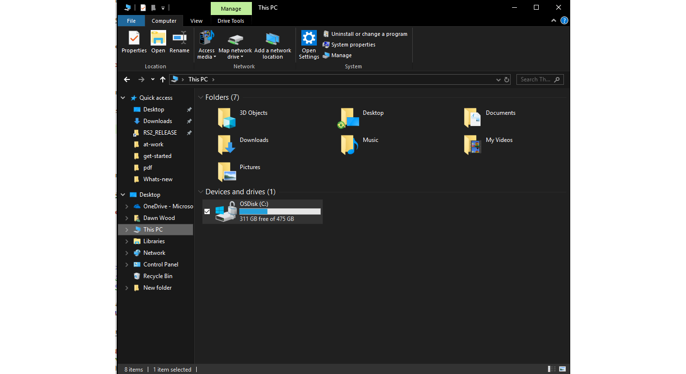

### High Efficiency Image File Format (HEIF)
We are happy to announce that you can now rotate HEIF-format images in File Explorer, and edit metadata, such as “Date taken”.

The new functionality requires the latest version of the HEIF package. The latest version will be installed automatically be the Store. If automatic updates are disabled you can download the HEIF package manually [here](https://aka.ms/HEIFpackage).

HEIF files use the HEVC video codec to compress the image into approximately half the size of JPEG. If your Windows PC does not already have the HEVC video codec, it can be purchased from the Windows Store using [this link](https://aka.ms/HEVCcodec).

You can now rotate HEIF-format images in File Explorer, and edit metadata, such as "Date taken". 
The new functionality requires the latest version of the HEIF package. The latest version will be installed automatically be the Microsoft Store. If automatic updates are disabled you can download the HEIF package manually using [this link](https://aka.ms/HEIFpackage). 

To rotate a HEIF image file, simply right-click on it in File Explorer and select "Rotate right" or "Rotate left" from the menu. "Date taken" and other properties can be edited by clicking on "Properties" and selecting the "Details" tab.

## Wireless projection experience

One of the things we’ve heard from you is that it’s hard to know when you’re wirelessly projecting and how to disconnect your session when started from file explorer or from an app. In Windows 10, version 1809, you’ll see a control banner at the top of your screen when you’re in a session (just like you see when using remote desktop). The banner keeps you informed of the state of your connection, allows you to quickly disconnect or reconnect to the same sink, and allows you to tune the connection based on what you are doing. This tuning is done via **Settings**, which optimizes the screen to screen latency based on one of the three scenarios:
* Game mode minimizes the screen to screen latency to make gaming over a wireless connection possible
* Video mode increases the screen to screen latency to ensure the video on the big screen plays back smoothly
* Productivity modes strikes a good balance between game mode and video mode; the screen to screen latency is responsive enough that typing feels natural, while ensuring videos don’t glitch too often

## SwiftKey intelligence

[SwiftKey](https://www.microsoft.com/en-us/swiftkey) gives you more accurate auto-corrections and predictions by learning your writing style – including the words, phrases, and emoji that matter to you. It’s available for Android and iOS, and SwiftKey powers the typing experience on Windows when using the touch keyboard to write in English (United States), English (United Kingdom), French (France), German (Germany), Italian (Italy), Spanish (Spain), Portuguese (Brazil), or Russian. This is an existing feature that we've improved for Windows 10, version 1809.

## Typing Insights

Windows shows you insights about how artificial intelligence (AI) helps you type with efficiency. If you use the software keyboard on Windows, there are many features built into the typing experience that leverage AI and machine learning(ML) to help you be more efficient. Some examples include autocorrecting your spelling mistakes, predicting next word you would type, suggesting a word as you start typing so you don’t have to type the full word, and displaying the number of words you typed when you swipe over the letters on the software keyboard.

Windows now shows you stats about each of these features. Go to **Settings > Devices > Typing** and click on **View typing insights** to see them.
 
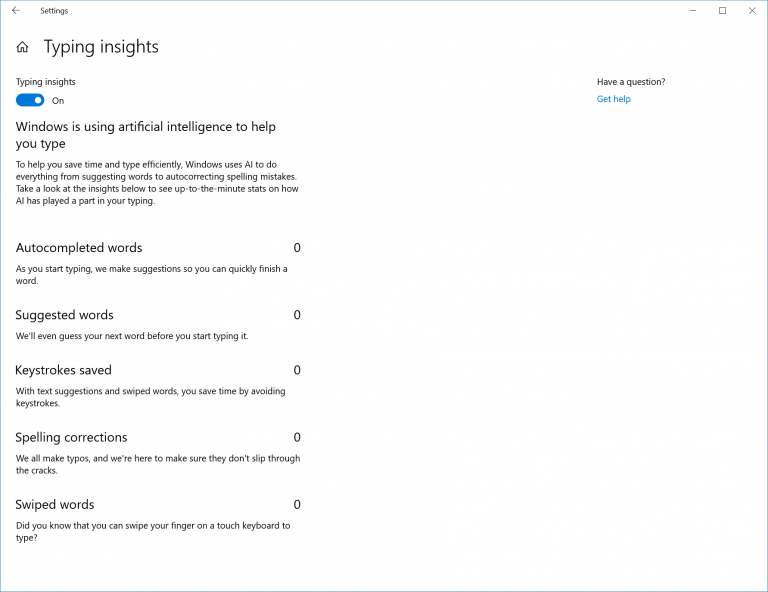

## Emoji 11

[Unicode 11 comes with 157 new emoji](http://blog.unicode.org/2018/06/announcing-unicode-standard-version-110.html). Superheroes, redheads, a softball, a pirate flag, and a llama all made the cut. You can access them using the Emoji Panel **WIN + (Period)** or via the touch keyboard.

We’ve also made tweaks to some of our existing emoji – here are some examples:

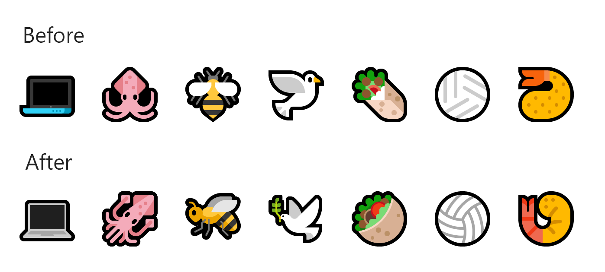

Our ninja cats got a bit of love too – can you spot the difference?

__Emoji search comes to more languages__: You can find an emoji by keyword in over 190 locales, including English (Great Britain), French (France), German (Germany), Spanish (Spain), and more. This will help you get the emoji you want easily and quickly. As a reminder, to bring up the Emoji Panel set focus to a text field and press WIN + (period) or WIN + (semicolon).

*__The IME now uses the same UX for expressive input as other languages__. You can bring it up by clicking the emoji button in the IME toolbar, or use the Emoji Panel hotkeys (WIN + period (.) or WIN + semicolon (;)). You can browse between Emoji, Kaomoji, and Symbol input when Chinese (Simplified) is the active locale.

**Note**: Use the Microsoft Input Method Editor (IME) to type in East Asian languages you’ve installed on your PC. Press and hold (or right-click) the input method indicator to switch input modes, then open the IME pad or open more IME settings.

## Post-upgrade setup

You may see this window showing after you upgrade. Don’t worry – all your stuff is still there! We know some of you bought and setup your devices a long time ago. The features available in Windows have changed since then, so we’re giving you an opportunity to go through the setup questions you may have missed to ensure your device has the best configuration for you. Click **Let’s Go** to go through those setup questions or click **Skip for now** if you want to go straight to your desktop. 

## Microsoft Edge improvements

* **A faster safer internet with HTTP/2 and CUBIC**: The internet is part of our daily lives both at work and at home, in the enterprise and in the cloud. We are committed to making your internet experience faster and safer. For example:

* Microsoft Edge clients will take advantage of connection coalescing for HTTP/2 as supported in Windows Server 2019
* Improved security on Microsoft Edge browsers by guaranteeing HTTP/2 preferred cipher suites
* Improved performance on Windows 10 thanks to Cubic, the new default TCP congestion provider.

For more information, see [A Faster, Safer Internet](https://blogs.technet.microsoft.com/networking/2018/08/01/faster-safer-internet/).

**Control whether media can play automatically** : We added a new setting in Microsoft Edge to allow you to control whether sites can autoplay media. You can find this setting under **Advanced Settings > Media autoplay**, with options to customize the behavior according to your preferences:

* **Allow** is the default and will continue to play videos when a tab is first viewed in the foreground, at the site’s discretion.
* **Limit** restricts autoplay to work only when videos are muted, so you‘re never surprised by a sound. Once you click anywhere on the page, autoplay is re-enabled, and will continue to be allowed within that domain in that tab.
* **Block** will prevent autoplay on all sites until you interact with the media content. Note that this may break some sites due to the strict enforcement – you may need to click multiple times for some video or audio to play correctly. Some sites may not work at all – in those cases, you can enable or block autoplay on a case-by-case bases from the website permissions pane (click the icon next to the address in the Address Bar).

If you encounter sites that do not work as expected in the **Limit** or “Block” settings, please file feedback in the Feedback Hub app and let us know which site you were using, so we can work with developers and continue to refine the feature.
Per-site media autoplay controls: You can now control autoplay permissions on a per-site basis under the “Website permission” section of the Website Identification pane – just click the information icon or lock icon on the left side of the address bar and click “manage permissions” to get started.

**Per-site media autoplay controls:** You can now control autoplay permissions on a per-site basis under the **Website permission** section of the **Website Identification** pane – just click the information icon or lock icon on the left side of the address bar and click **manage permissions** to get started.

**New design improvements:** As we continue to evolve how Microsoft Edge leverages the Fluent Design System for a more natural and usable experience, you may notice some subtle tweaks to the look of the tab bar in Microsoft Edge. In this build, we’re adding a new depth effect to the tab bar to help emphasize the active tab.

**Customize toolbar items for Microsoft Edge:** When you click **…** in the Microsoft Edge toolbar, you’ll find a refined menu that puts common commands like **New window** front and center. We’ve also added the much-requested ability to customize which icons appear in the Microsoft Edge toolbar – you can remove them all for a tidier look or add as many as you like to bring your favorite functionality to your fingertips!
Last (but not least), this release breaks **Settings** out into subpages by category, with better-organized options and less clutter on each page. The new **Settings** experience is designed to match the experience in the Microsoft Edge hub, for a quicker and more familiar experience.

**Redesigned “…” menu and Settings:** We’ve heard your feedback that the Microsoft Edge settings were getting a little complex for a single page. In this release, we’re overhauling the Microsoft Edge settings to make it easier to navigate, put commonly-used actions front and center, and allow more customization than ever.

**New consent box for saving Autofill data:** Microsoft Edge seeks your permission each time to save your passwords and card details for Autofill purposes. We have come up with improved design and string changes to the consent notification pop-up to improve discoverability and provide clarity on the value of saving this information. The changes include introducing password and payment icons, improved messaging, and highlighting of options. One interesting update would be the cool micro-animations for the new password and payment icons.

__See your top sites in the jump list:__ You can now see your top sites in the jump list on the Windows task bar or Start menu. Just right-click the Microsoft Edge icon to see a list of your most visited sites and pin the ones that matter most to you. Right-click on any entry to remove it from the list. 

__Do more from the “Downloads” pane:__ We’ve added options for __Show in folder__ and __Copy link__ to the right-click menu for downloads in the __Downloads__ pane. 

### Microsoft Edge PDF reader improvements

**New PDF icon:** Windows 10 now has a new icon for PDFs in File Explorer when Microsoft Edge is your default PDF handler.

__Improved toolbar options:__ The toolbar available on a PDF document opened in Microsoft Edge will now show text descriptions for the icons to make them easily understandable by users. New options like __Add notes__ are now available in the toolbar so that these tools are handy when you need them.

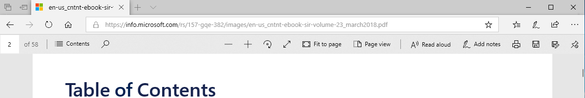

__Pin/unpin PDF toolbar:__ The PDF toolbar can now be pinned at the top of the document, making all the PDF tools easily accessible if you need them. You can also unpin the toolbar for an immersive reading experience. If the toolbar is unpinned, it will hide itself – just hover over the top area to bring it back.

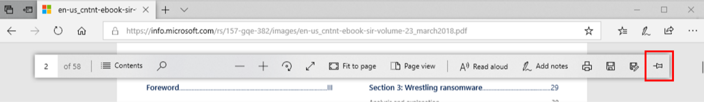

__Rendering improvements:__ We’ve included a bunch of rendering performance fixes so that you will see less white pages when you navigate through PDF files in Microsoft Edge.

**Lookup definitions for words in reading view, books, and PDFs:** We’ve added a new dictionary function, so you can look up definitions for key words when reading a page or document. Simply select a single word to see the definition appear above your selection.

You can choose to have a word read aloud to you to hear the correct pronunciation or expand more details from the definition. You can toggle whether definitions appear and which types of content they work in under the __General__ tab of the Microsoft Edge settings menu.

**Learning tools get richer:** Under learning tools available on Reading View, you can now see additional themes. These let you choose the theme color which is best for your eyes.

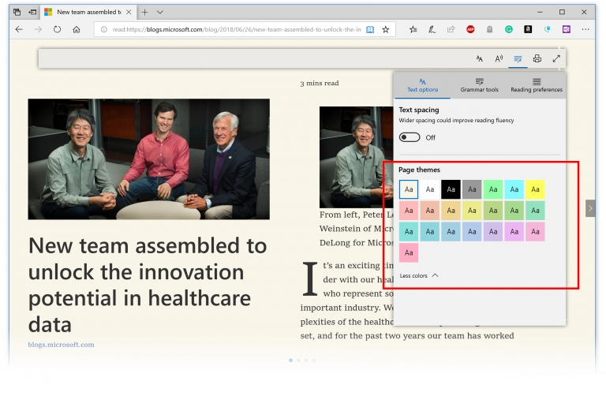

Along with highlighting Parts of speech you can now also change the color in which the part of speech should be highlighted as well as turn on an indicator right over it. Making it much easier to identify the part of speech.

**Line focus:** Helps improve focus while reading an article by highlighting sets of one, three, or five lines.

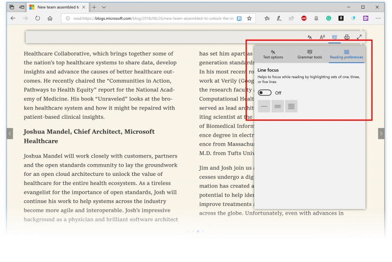

### Improved Kiosk Setup Experience

We have introduced a simplified assigned access configuration page in Settings that allows device administrators to easily set up their PC as a kiosk or digital sign. This new page provides a wizard experience that walks you through the kiosk setup flow including creating a kiosk account that will automatically sign in on device start.

Please go to Settings, search for assigned access, and open the “Set up a kiosk” page to give it a try. 

For Microsoft Edge kiosk mode running in single-app assigned access the two kiosk types are:
1.	Digital / Interactive signage that displays a specific website full-screen InPrivate mode.
2.	Public browsing supports multi-tab browsing and runs InPrivate mode with minimal features available. Users cannot minimize, close, or open a new Microsoft Edge windows or customize it using Microsoft Edge Settings. Users can clear browsing data, clear downloads, and restart Microsoft Edge by clicking **End session.** Administrators can configure Microsoft Edge to restart after a period of inactivity.

For Microsoft Edge kiosk mode running in multi-app assigned access the two kiosk types are (Note the following Microsoft Edge kiosk mode types cannot be setup using the new simplified assigned access configuration page in Windows 10 Settings):

3.	Public browsing supports multi-tab browsing and runs InPrivate mode with minimal features available. In this configuration, Microsoft Edge can be one of many apps available. Users can close and open multiple InPrivate windows.

4.	Normal mode runs a full version of Microsoft Edge, although some features may not work depending on what apps are configured in assigned access. For example, if the Microsoft Store is not set up, users cannot get books.

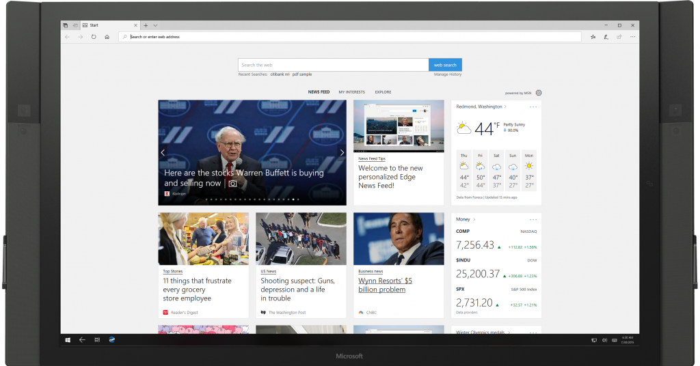

Learn how to setup Microsoft Edge kiosk mode in the [Microsoft Edge kiosk mode deployment guide](https://docs.microsoft.com/en-us/microsoft-edge/deploy/microsoft-edge-kiosk-mode-deploy).

### Microsoft Edge Platform Improvements 

**Microsoft WebDriver is now a Feature on Demand:** We’ve made Microsoft WebDriver a Feature on Demand (FoD) to make it easier to get the right version for your device. You can install WebDriver by turning on Developer Mode, or by going to Settings > Apps > Apps & features > Manage optional features and installing it standalone.

This should address one of the biggest pain points we see from customers around binary mismatches, as FoD’s match the build/branch/flavor automatically. This also means that the standalone download will no longer be made available for insiders or future stable versions of Windows, as installation is now built into Windows.

Microsoft WebDriver now gets installed to C:\Windows\System32\ and will automatically be on the PATH for the machine once installed. We are now shipping 64-bit Microsoft WebDriver to x64 machines. Note, there is a known issue for x64 machines building in Visual Studio with Selenium, where by default Visual Studio builds 32bit and will only check the C:\Windows\SysWOW64\ folder for PATH variables. To work around this issue, target and build 64bit from Visual Studio. In a future build, we plan to publish both 32bit and 64bit binaries in our FoD for 64bit machines, which should address this issue.

To install WebDriver, just turn on __Developer Mode__ in Windows 10 Settings, or install the standalone feature on the __Manage optional features__ Settings page.

We’ve also updated WebDriver to match the latest [W3C Recommendation spec](https://www.w3.org/TR/webdriver/) with major new improvements. You can learn all about these changes on the [Microsoft Edge dev blog](https://www.w3.org/TR/webdriver/).

**Web Authentication preview:** Microsoft Edge now includes unprefixed support for the new Web Authentication API (a.k.a. [WebAuthN](https://www.w3.org/TR/webauthn/)). This evolves our previous support for the WebAuthN specification to enable the updated version of the API by default.
Web Authentication provides an open, scalable, and interoperable solution to facilitate authentication, which replaces passwords with stronger hardware-bound credentials. The implementation in Microsoft Edge allows users to use [Windows Hello](https://www.microsoft.com/en-us/windows/windows-hello) (via PIN or biometrics) and [external authenticators](https://fidoalliance.org/fido2/) like FIDO2 Security Keys or FIDO U2F Security Keys, to securely authenticate to websites. 

**New Microsoft Edge Group Policies:** The Microsoft Edge team introduced new Group Policies and MDM settings for IT administrators to manage Microsoft Edge. The new policies include enabling/disabling full-screen mode, printing, favorites bar, and saving history; prevent certificate error overrides; configuring the Home button and startup options; setting the New Tab page and Home button URL and managing extensions. Learn more about the new Microsoft Edge policies.

__Retired XSS filter:__ We are retiring the XSS filter in Microsoft Edge. Our customers remain protected thanks to modern standards like Content Security Policy, which provide more powerful, better performing, and secure mechanisms to protect against content injection attacks, with high compatibility across modern browsers.

## Remote Desktop with Biometrics

In Windows 10, version 1809, Azure Active Directory and Active Directory users using Windows Hello for Business can use biometrics to authenticate to a remote desktop session!

To get started, bring up Remote Desktop Connection (mstsc.exe), type the name of the computer to which you want to connect and click **Connect**. Because you signed using Windows Hello for Business, Windows remembers how you signed in and automatically selects Windows Hello for Business to authenticate you to your RDP session but, you can click More choices to choose alternate credentials.

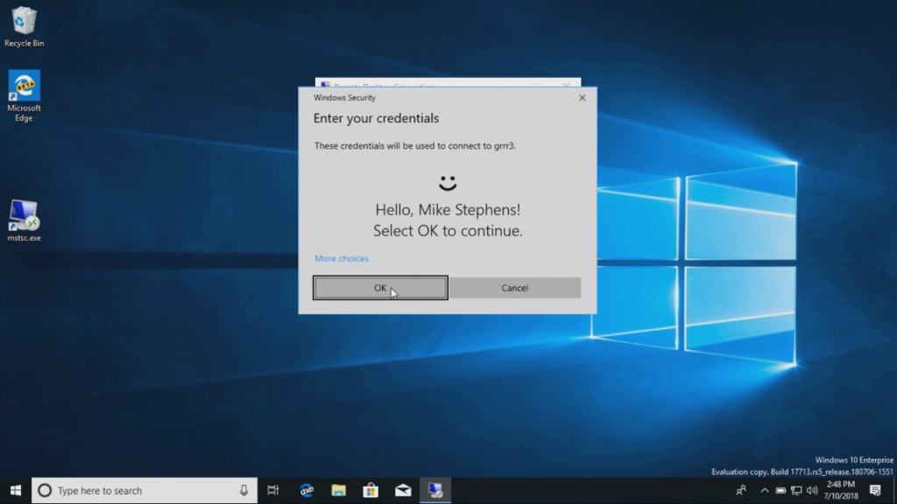

In this example, Windows uses facial recognition to authenticate the RDP session to the Windows Server 2016 Hyper-V server. You can continue to use Windows Hello for Business in the remote session, but you must use your PIN.

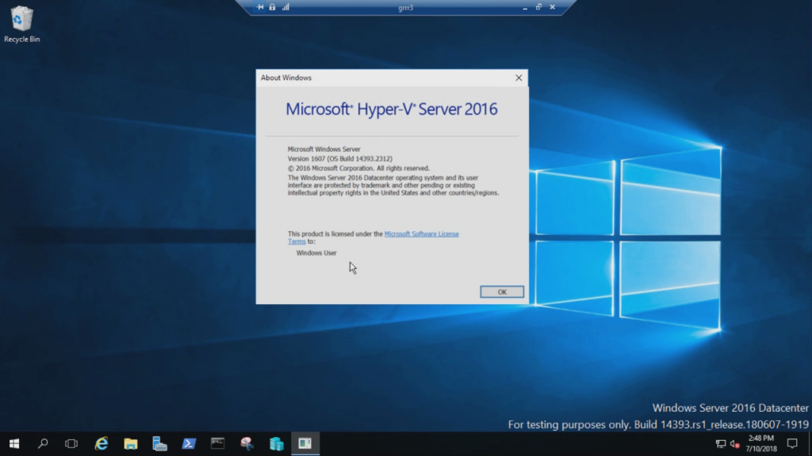

## Web Sign-in to Windows 10
Until now, Windows logon only supported the use of identities federated to ADFS or other providers that support the WS-Fed protocol. We are introducing “Web Sign-in,” a new way of signing into your Windows PC. Web Sign-in enables Windows logon support for  non-ADFS federated providers (e.g. SAML).

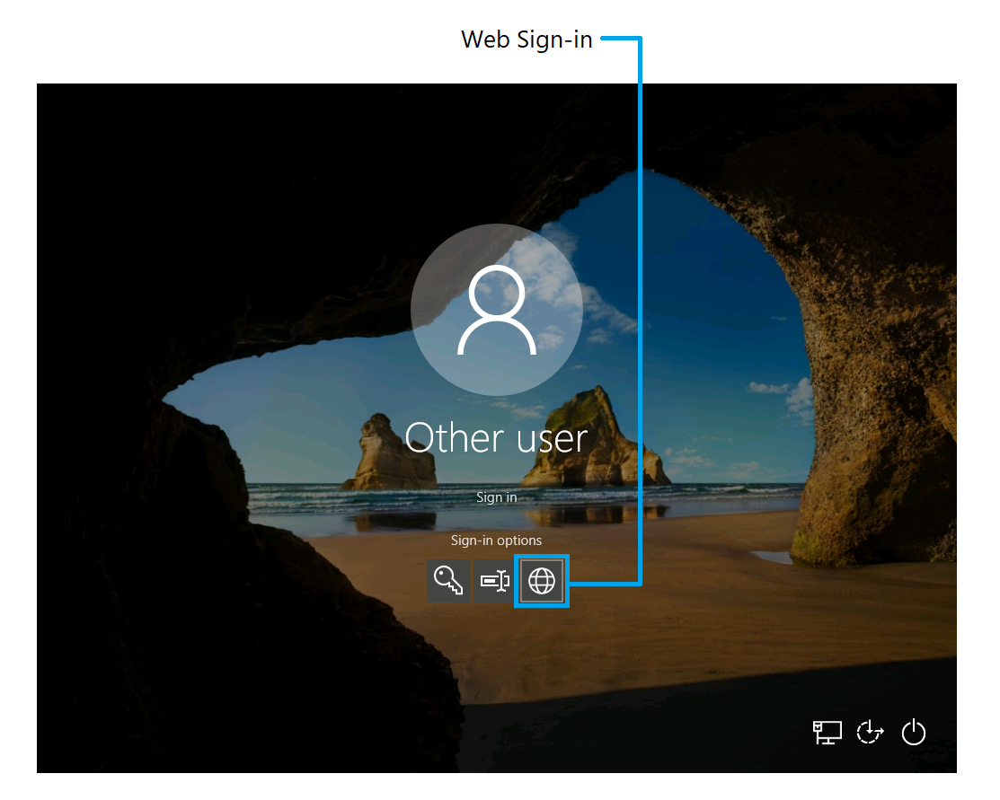

**To try out Web Sign-in:**
1.	Azure AD Join your Windows 10 PC. (Note: Web Sign-in is only supported on Azure AD Joined PCs).

2. Set the following policy to enable Web Sign-in (Policy CSP/Authentication/EnableWebSignIn)
3. On the lock screen, select Web Sign-in under Sign-in options.
4. Click on the **Sign in** button to continue.

## Faster sign-in to a Windows 10 shared PC
Do you have shared PCs deployed in your work place? Do you wish that signing in to a PC with your account was faster? Starting with this build, we are introducing “Fast Sign-in,” which enables users to sign in to a shared Windows 10 PC in a flash!

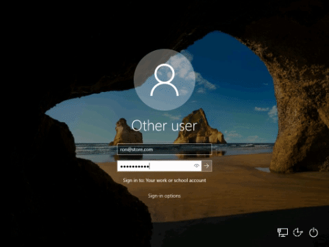

**To enable Fast Sign in:**
1.	Set up a shared or guest PC with Windows 10
2.	Set the following policy to enable Fast Sign in (Policy CSP/Authentication/EnableFastFirstSignIn)
3.	With the policy enabled, sign-in to a shared PC with your account and notice the difference!

## Start tile folder naming 

To create a tile folder in Start, just drag one tile on top of another for a second then release. Continue dropping as many tiles into the folder as you’d like. When you expand the folder, you’ll see a new option to name it. The name will be visible when the folder is medium, wide, or large-sized. 

## Search improvements

### Search in Calendar

Now you can find past or future events by searching for the name, location, people included or words in the event body. Events that match your search will be clearly visible on your calendar, while those that don’t will be greyed-out so you can find what you need quickly.

Search will work for Outlook, Hotmail, Live and Office 365 accounts. 

### Search preview
We have expanded previews to support apps, documents, and more. Search previews are here to help you: 
* Get back to what you were doing, such as a recent Word doc or Remote Desktop session 
* Jump-start your task, be it a new Outlook meeting, a quick comment in OneNote, or changing a setting 
* Disambiguate between files by seeing more info including file location, last modified, or author 
* Access quick answers from the web like “are bananas good for you?” “height of mt everest”  

We made the Search experience wider so you can access information and actions in the preview faster than ever. The preview will be updated and improved over time, as we develop and add more features. 

### Find software downloads faster in Search
Continuing our theme of improving the search preview experience, we’re rolling out an update to make it easier to find official download pages for Windows software you want to install. 

**Note**: search is currently limited to English locales

Other Improvements: 
* Notepad now supports**Ctrl + Backspace** to delete the previous word
* Arrow keys now unselect text first, and then move the cursor
* When saving a file, the line and column number no longer reset to 1
* Notepad now correctly displays lines that don’t fit entirely on the screen

## Windows mixed reality improvements

* You can stream audio to both the headset and the PC speakers simultaneously. To try it out make sure that you can hear sound from your normal PC speakers when not running the Mixed Reality Portal (MRP) and from the headset’s audio jack or built-in headphones when mixed reality is running. Then close all apps, including MRP, and go to Settings > Mixed reality > Audio and speech to turn on “When Mixed Reality Portal is running, mirror headset audio to desktop.” You should now hear audio from both the headset and PC speakers when running mixed reality.
* Windows no longer requires a physical monitor to be connected while running Mixed Reality in cases such as backpack PCs. Setting up WMR for the first time in Mixed Reality Portal and unlocking the PC on the sign in screen still, require a monitor to be connected initially. However, you can configure auto login to prevent needing to sign in for subsequent usage here. Using Windows Mixed Reality while standing requires setting up a room boundary.
* Apps running in Windows Mixed Reality can now make use of the Camera Capture UI API to capture images of the mixed reality world using the system capture experience. Try running Mail in the Cliff House and inserting an image from your camera in a new message to share an image of the scenic view.
* We’ve also made some adjustments to the mixed reality video capture experience in this build to make it easier to stop videos from the Start menu.

### Windows mixed reality flashlight

How many times have you been immersed in a captivating virtual experience and…
* Wanted to take a quick peek at someone nearby?
* Wanted to reach for a drink, your phone or a keyboard?
* Needed to find a surface to set down your controllers?

In the past you probably fumbled about or removed your headset, which can be clumsy if you have controllers in your hands.

We added the ability to peer into your physical environment through Flashlight – without removing your headset! You can open a portal into your real world at any time via the Start menu, a button shortcut, or a voice command. This opens a low-latency pass-through camera feed connected to your controller. It’s comfortable, intuitive, and keeps you immersed.

Flashlight finally allows you to mix your physical and virtual realities.

### Introducing Quick Actions 

While using an Immersive Application, Quick Actions allow users to easily Go Home, view the time, or launch Mixed Reality Capture tools (Photo, Video, and more). To launch Immersive Application Quick Actions, simply press the Windows key or use the Bloom gesture.

### Stream audio to both the headset and the PC speakers simultaneously

To try it out make sure that you can hear sound from your normal PC speakers when not running the Mixed Reality Portal (MRP) and from the headset’s audio jack or built-in headphones when mixed reality is running. Then close all apps, including MRP, and go to Settings > Mixed reality > Audio and speech to turn on “When Mixed Reality Portal is running, mirror headset audio to desktop.” You should now hear audio from both the headset and PC speakers when running mixed reality.
You may also notice some new error codes in Mixed Reality Portal to be more specific to certain failures. The Mixed Reality Portal app will also begin updating through the Store as we make infrastructure changes over the next several releases to support faster updates of mixed reality.

### Other notable improvements for Windows Mixed Reality users

* This build no longer requires a physical monitor to be connected while running Mixed Reality in cases such as backpack PCs. Setting up WMR for the first time in Mixed Reality Portal and unlocking the PC on the sign in screen still, require a monitor to be connected initially. However, you can configure auto login to prevent needing to sign in for subsequent usage here. Using Windows Mixed Reality while standing requires setting up a room boundary.
* Apps running in Windows Mixed Reality can now make use of the Camera Capture UI API to capture images of the mixed reality world using the system capture experience. Try running Mail in the Cliff House and inserting an image from your camera in a new message to share an image of the scenic view.
* We’ve also made some adjustments to the mixed reality video capture experience in this build to make it easier to stop videos from the Start menu.

## PC Gaming Improvements

### Game bar improvements
__Audio controls__: Change your default audio output device and mute or adjust the volume of games and apps running.

### Focus assist improvements when gaming 
Now focus assist will turn on automatically when you’re playing any full screen game. No more interruptions when you’re crushing it. This behavior should be turned on automatically, but you can always check by going to __Settings > System > Focus assist__ and ensuring the __When I’m playing a game__ automatic rule is enabled. For more information, see [Windows 10 Tip: How to enable Focus Assist in the Windows 10 April 2018 Update](https://blogs.windows.com/windowsexperience/2018/05/09/windows-10-tip-how-to-enable-focus-assist-in-the-windows-10-april-2018-update/).

## Inking Updates

We introduced the embedded handwriting panel with the April 2018 Update, and after taking some time to refine the experience based on your feedback, in RS5 the embedded handwriting will now be the default experience for text entry with a pen in modern applications. Just tap a text area, like a search box, and it will expand to give you a comfortable area in which to write.

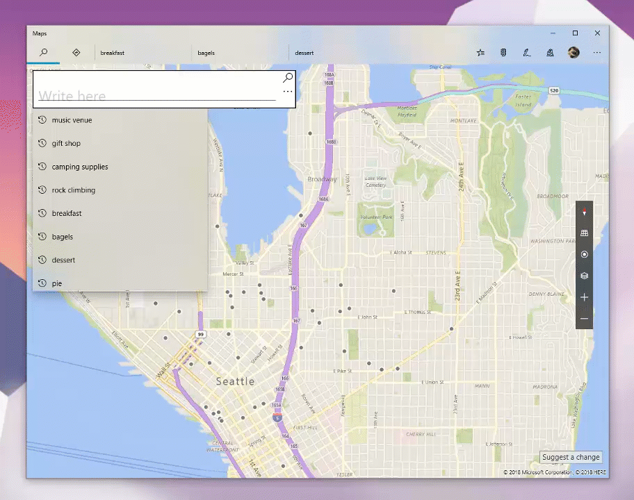

You can even edit what you’ve written with simple, intuitive gestures.
In places where embedded handwriting doesn’t support your language or isn’t supported by the app (e.g. legacy Win32 applications), you can still invoke the floating handwriting panel.

## Windows Security Improvements

### Windows Defender Security Center is now called Windows Security 

You can still get to the app in all the usual ways – simply ask Cortana to open Windows Security or interact with the taskbar icon. Windows Security lets you manage all your security needs, including Windows Defender Antivirus and Windows Defender Firewall.
We’re also bringing some changes to how we present threats and actions that need your attention, and we’re continuing to refine that over the coming months.

### Windows Security Center gets a Fluent Design refresh

We’ve heard your feedback and when you install this build you’ll find we’ve updated Windows Security Center to include the Fluent Design elements you know and love. You’ll also notice we’ve adjusted the spacing and padding around the app and will now dynamically size the categories on the main page if more room is needed for extra info. Last but not least, we’ve also updated the title bar of the app so that it will now use your accent color if you’ve enabled that option in Color Settings.

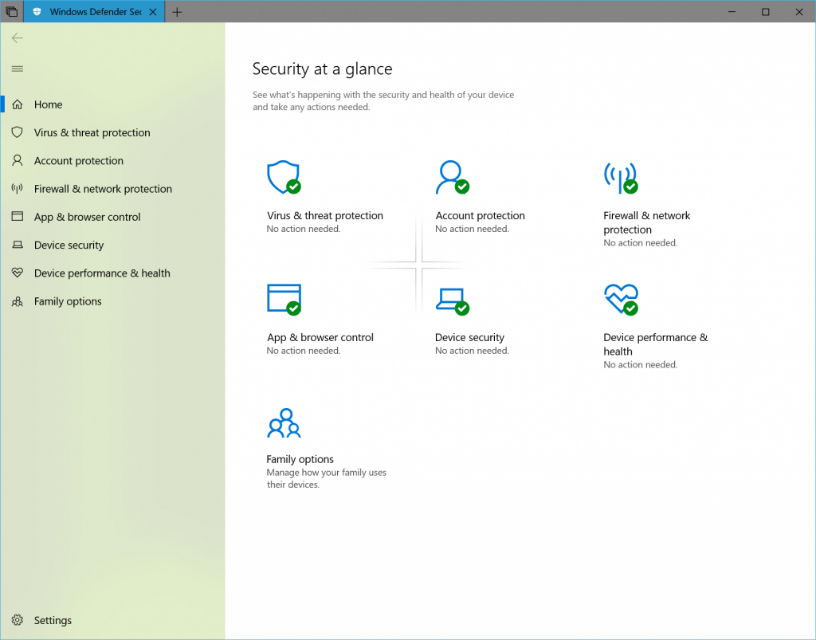

### Windows Defender Firewall now supports Windows Subsystem for Linux (WSL) processes 
You can add specific rules for a WSL process in Windows Defender Firewall, just as you would for any Windows process. Also, Windows Defender Firewall now supports notifications for WSL processes. For example, when a Linux tool wants to allow access to a port from the outside (like SSH or a web server like nginx), the Windows Defender Firewall will prompt to allow access just like it would for a Windows process when the port starts accepting connections. 

### Antivirus products required to run as a protected process
The Windows Security Center (WSC) service now requires antivirus products to run as a protected process to register. Products that have not yet implemented this will not appear in the Windows Security UI, and Windows Defender Antivirus will remain enabled side-by-side with these products.

### Windows Defender Application Guard Improvements
 
Windows Defender Application Guard introduced a new user interface inside Windows Security in this release. Standalone users can now install and configure their Windows Defender Application Guard settings in Windows Security without needing to change Registry key settings.

Additionally, users who are managed by enterprise policies will be able to check their settings to see what their administrators have configured for their machines to better understand the behavior of Windows Defender Application Guard. This new UI aims to improve the overall experience for users to manage and check their Windows Defender Application Guard settings. As long as devices meet the minimum requirements, these settings will appear in Windows Security.

For more information, read [this](https://techcommunity.microsoft.com/t5/Windows-Insider-Program/Windows-Defender-Application-Guard-inside-Windows-Security-App/m-p/214102#M1709) post.

To check this out:
1. Go to **Windows Security** and select **App & browser** control.

2. Select **Install Windows Defender Application Guard** under **Isolated browsing**, install and restart the device (only for standalone users).

3. Select **Change Application Guard settings**.

4. Configure or check **Application Guard Settings**.

__Performance improvements__: The teams at Microsoft are constantly working to improve performance for our users. WDAG is no different. In this feature update, you will notice an improvement in the launch time for WDAG. We have made the start process lighter and faster, which will provide our users with a better experience when accessing Microsoft Edge in WDAG.

__Download files to the host__: One of the items our users voiced was an inability to download files from WDAG to the host. This created an inconsistent experience for Microsoft Edge overall as downloaded files were stuck inside the container. In this release, users can turn on a feature to download files from their WDAG browsing session onto the host file system. This feature is available in the Windows 10 Enterprise edition and is not turned on by default. Once the feature is enabled, users will be able to download files into a folder created in their Downloads folder and open all files on the host.

<i>How to enable and configure the Download to host feature</i>:

__Requirements:__
* Windows 10 Enterprise, version 1809
* Windows Defender Application Guard feature is installed
* Network isolation policies are configured

__Steps:__
1. Navigate to __Local Group Policy Editor > Administrative Templates > Windows Components > Windows Defender Application Guard__.

2. Select __Allow files to download and save to the host operating system from Windows Defender Application Guard__.
3. Select __Enabled and Apply__.

4. After this policy is enabled, you can download files from your Windows Defender Edge session to your Downloads folder. The files from WDAG will be saved in a folder called __Untrusted files__ nested inside the Downloads folder. This folder is created automatically when you first download a file from WDAGafter enabling the policy.

Notes:
* This feature is off by default.
* Users will need to assess the files they downloaded and assume any risks of opening on the host.
* We’ve also made updates to Windows Defender System Guard. With Windows Defender System Guard, we are making a leap forward in platform security with memory integrity by default and bringing a born secure device promise to our user base. To learn more about these changes and talk with product team, see their post in the Windows Insider Technical Community.

### General Windows Security Improvements 
We’ve continued to work on the **Current threats** area on the **Virus & threat protection** section, which now displays all threats that need action. You can quickly act on threats straight from this screen.

You can enable a new protection setting, **Block suspicious behaviors**, which brings our Windows Defender Exploit Guard attack surface reduction technology to all users. To enable this setting, go to the **Virus & threat protection** section and click **Manage settings**, as shown in the following screenshot:

With Controlled folder access you can help prevent ransomware and other destructive malware from changing your personal files. In some cases, apps that you normally use might be blocked from making changes to common folders like Documents and Pictures. We’ve made it easier for you to add apps that were recently blocked so you can keep using your device without turning off the feature altogether.

When an app is blocked, it will appear in a recently blocked apps list, which you can get to by opening the **Virus & threat protection** section, clicking **Manage settings** under the **Ransomware** protection heading. You can then allow apps through Controlled folder access. After the prompt, click the plus button and choose Recently blocked apps. Select any of the apps to add them to the allowed list. You can also browse for an app from this page as well.

In the **Device performance & health** section, we added a new assessment for the Windows time service. If we detect that your device’s time is not properly synced with our time servers and the time-syncing service is disabled, we’ll provide the option for you to turn it back on.

We’re continuing to work on how other security apps you’ve installed show up in the Windows Security app. There’s a new page called **Security providers** that you can find in the **Settings** section of the app. Click **Manage providers** to see a list of all the other security providers (including antivirus, firewall, and web protection) that are running on your device. Here you can easily open the providers’ apps, or get more information on how to resolve any issue that they have reported to you through the Windows Security app.

## Settings Improvements

We’ve heard your feedback that settings can be confusing sometimes, so we’re working with Bing to bubble up some of the most common questions we hear right into the Settings pages themselves. The FAQ’s are contextual in nature and aim to you to quickly get the answer you’re looking for to complete configuration tasks. It may even help you discover something you didn’t know was an option! Clicking on these questions will take you to Bing.com to display the answer.  

**Note**: The faqs are currently available in English locales only.

### Font installation for non-admin users

Have you ever wanted to use your own fonts from your account on a shared school or work PC, but couldn’t because you didn’t have the administrator privileges required to install the fonts? Well, we’ve heard your frustration about this and have made some changes.

In the past, fonts in Windows have always been installed for all users. Because that is a system-wide change, it always required admin privilege. The need for an admin was reflected in the user interface. For example, if you browse in File Explorer to a folder containing a font file and right-clicked on the file to bring up the context menu, then the “Install” option would appear with the security badge, which means that it requires an admin.

If you tried to install a font but didn’t have admin privileges, then you would be presented with a User Account Control dialog, so that an admin could approve the change. If you’re a non-admin user and often need to install (or uninstall) fonts, then that could be a big hassle.

In the Windows 10 1803 feature update, we introduced fonts in the Microsoft Store. To enable that capability, we needed to make changes deep in Windows to allow a font to be installed for a specific user rather than system-wide. That’s why no admin action is needed when fonts acquired in the Store are installed.
Now we’ve extended this further to include font files that you obtain from other sources and want to install. Now when you right-click on a font file in **File Explorer**, you’ll see two options. **Install for all users** provides the past, system-wide install capability and requires an admin. But now there is another option: **Install** allows any user, including non-admin users, to install a font for their own use.

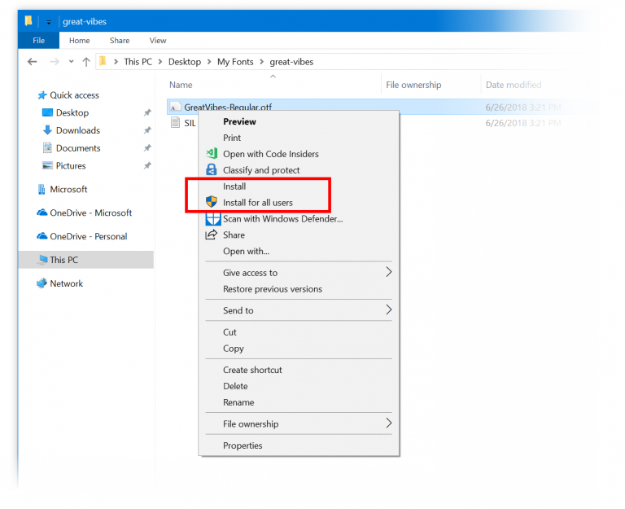

Often font files come within a compressed folder (that is, a .zip file). The “Install” context-menu option isn’t available in File Explorer when you view the contents of a compressed folder, but you can double-click the font file within the compressed folder to open it in the font previewer, and that provides an “Install” button. In the past, the button in the font previewer had the security badge, and it would do a system-wide install, requiring an admin. Now the security badge is gone, and the “Install” button in the font previewer performs a single-user font install, which can be done by non-admins.

### RSAT is now available on demand!
You no longer have to manually download RSAT every time you upgrade! Just go to **Manage optional features** in Settings and click **Add a feature**. You’ll now see all of the RSAT components listed. Pick the ones you want, and the next time you upgrade Windows will automatically ensure that those components remain after the upgrade, just like any of our other on-demand features, like speech resources or OpenSSH. 

### See Your Videos Better Outside

There’s a new viewing mode for you to try out, designed to improve the visibility of your video when you are in a very bright environment. This feature uses the light sensor on your device to detect your ambient light, and automatically adjusts your video accordingly. To turn it on, navigate to **Settings > Apps > Video playback**, and turn on **Adjust video based on lighting**.

We’d love feedback as we work to refine this feature for the next Windows release! Please use the Feedback Hub and file feedback under Category: “Devices and Drivers”, Subcategory: “Video Playback”. Click **Recreate my problem** and start the capture of the video playback you would like to give feedback on!

Note: In order for this feature to work, your device must have a light sensor.

### Display Settings Improvements
A new Windows HD Color page is now available under Display Settings! Windows HD Color-capable devices can show high dynamic range (HDR) content, including photos, videos, games, and apps.  This depends on your display and your PC. The “Windows HD Color Settings” page linked in Display Settings now reports your system’s HD Color capabilities and allows HD Color features to be configured on capable systems. The HD Color settings page is your one-stop shop to understand and configure your device’s settings – if you have an HDR-capable display connected to a recent PC, please give it a try and send us feedback!

### External GPU safe removal experience
We added a safe removal experience for external GPUs connected via Thunderbolt 3. The safe remove experience allows you to know which applications are running on an external GPU so that you can safely remove it and prevent data loss during detach.

To safely remove an external graphics card, go to the __Safely Remove Hardware and Eject Media__ icon and click to eject your GPU. If there are applications running on your external GPU, a dialog will appear with the applications that are currently running on the GPU. Close the applications to safely remove the device. If there are no applications currently running on your GPU then no dialog will appear and you can safely detach your GPU.

### Bluetooth battery percentage in settings
In the __Bluetooth & other devices__ page in Settings, you can check the battery level of your Bluetooth devices for Bluetooth devices that support this feature, in which case the battery percentage will update whenever your PC and the device are connected.

### Roaming Usage (Data Sense) 

Does your device have a SIM? We’ve updated Data Usage Settings to let you know how much data you are using while roaming! The roaming usage info will appear once you start using roaming data. As a reminder, if you’d like to enable or disable roaming altogether, you can find the option under **Cellular Settings**.

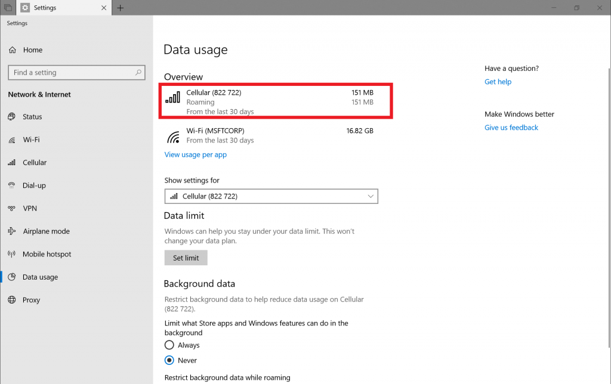

### Mobile broadband (LTE) connectivity on Windows gets a makeover

Windows is transforming the networking stack after 20 years through the __NetAdapter__ framework. This framework introduces a new, more reliable, network driver model that inherits from the Windows driver framework while bringing an accelerated data path. 

The mobile broadband USB net adapter driver, a new and improved USB class driver based on the __NetAdapter__ framework, is the default driver in Windows 10 version 1809.  

If your PC supports mobile broadband, i.e., your PC relies on cellular network for connectivity, and you want to try it out, here is what you need to do:

__Step 1__: Ensure your PC can support SIM cards and USB modems (either over the internal USB bus or using a USB dongle for cellular connectivity). 

__Step 2__: Install Windows 10 RS5, build 17655 or higher) and setup cellular connectivity. 

__Step 3__: Choose the Net Adapter based MBB USB class driver as default driver. 

1. Navigate to __Device Manager__. (You can right-click on the Start button to get there.) 
2. Go to __Network Adapters -> Generic Mobile Broadband Adapter__ or __xxxxx Mobile Broadband Adapter__. 
3. Right click and choose __update driver -> Browse my computer for driver software -> Click on Let me pick from a list of available drivers on my computer -> Choose Generic Mobile Broadband Cx Net Adapter__,then click __Next__. 
4. Once installed reboot for the new driver to take effect. 
5. Ensure the status of the connection remains “Connected”.

__Note__: Follow the instructions in Step 4 to revert to the default driver(xxxxx Mobile Broadband Adapter), in case of issues with Net Adapter driver(Generic Mobile Broadband Cx Net Adapter). 

__Step 4__: For Internet access, try using cellular network primarily by turning off Wi-Fi 
To report issues and give feedback, use Feedback Hub on your PC and set Category and subcategory as Network and Internet -> Connecting to a cellular network. Use [cxwmbclass] in the summary. 

### Continuing our Sound Settings migration

Consolidating our settings experiences is an ongoing priority for us. We started our work moving **Sound settings** to Settings with the Windows 10 April 2018 Update, and we’re happy to announce the next piece of that with this release. Device properties has now been integrated into Settings – just click on the links in **Sound Settings** and you’ll find a new page where you can name your device and select your preferred spatial audio format.

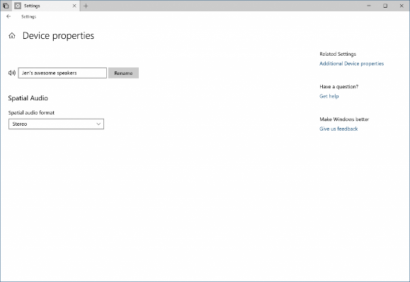

### Improved local experience

We have introduced a new Region page that allows overrides to default regional format settings such as Calendar, First day of the week, Dates, Times, and Currency. Please go to Settings App – Time & Language – Region and give it a try.

Local Experience Packs are Microsoft Store apps that deliver Windows display language quality improvements. You can now access them easily via the Settings App. Please go to Settings App – Time & Language – Language. Once here click on <i>Add a Windows display language with Local Experience Packs</i> link to download a Local Experience Pack from the Microsoft Store and start enjoying Windows in your preferred language.

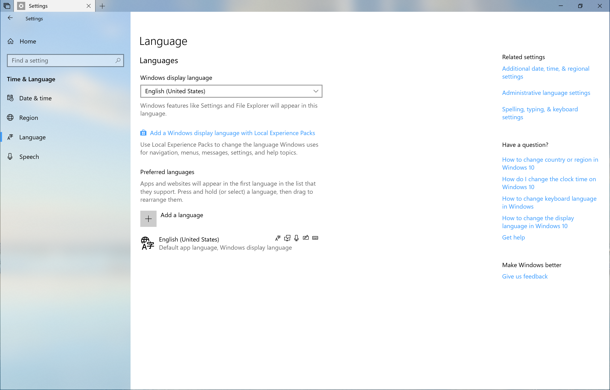

The Settings app provides improved discoverability of features supported for each language.

We have also started utilizing Artificial Intelligence (AI) and neural network-based Machine Learning (ML) for Windows localization. Having the Local Experience Packs in the Microsoft Store allows us to take advantage of ML improvements and user feedback via [Language Community App](https://www.microsoft.com/en-us/store/p/language-community) to release better translations more frequently. This will consistently improve the experience of our international customers with Windows.

We have introduced a new __Region__ page that allows overrides to default regional format settings such as Calendar, First day of the week, Dates, Times, and Currency. 

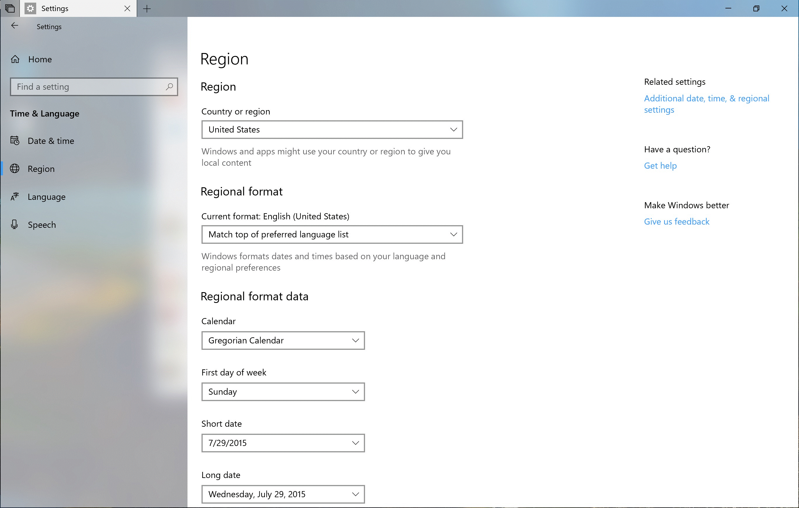

### Storage Sense picks up a new skill
Starting with the [Creators Update](https://blogs.windows.com/windowsexperience/2017/01/19/announcing-windows-10-insider-preview-build-15014-for-pc-and-mobile-hello-windows-insiders-today-we-are-excited-to-be-releasing-windows-10-insider-preview-build-15014-for-pc-and-mobile/) we embarked on a journey to help you automatically clean up storage when low on disk space. We expanded on that with the Fall Creators Update ([here](https://blogs.windows.com/windowsexperience/2017/05/17/announcing-windows-10-insider-preview-build-16199-pc-build-15215-mobile/) and [here](https://blogs.windows.com/windowsexperience/2017/06/21/announcing-windows-10-insider-preview-build-16226-pc/)). We also added the ability to automatically make any downloaded Files On-Demand online-only if you haven’t used them in a certain number of days. Head to __Settings > System > Storage > Storage Sense__ to try out this new feature.

### Windows app permissions 
You have more control so you can now decide which UWP apps can access your full file system. Particular UWP apps will be granted permission to have broad file system access. This capability will be granted on a per app basis by Microsoft. If a UWP app has the broad file system access restricted capability, you will receive a consent dialog prompting you to accept or deny the request. If at any time you change your mind about the decision, you can go to __Settings > Privacy__ where you’ll find a new Settings page for file system access. On this page, you can turn access on or off globally, and if it’s on you can also turn it on or off for each app that has requested the capability. UWPs with broad file system access will not appear in the Photos, Videos, or Documents privacy settings pages. If you grant broad file system access, this includes Photos, Videos and Documents.

### Have a question about Settings?
We’ve heard your feedback that settings can be confusing sometimes, so we’re working with Bing to bubble up some of the most common questions we hear right into the Settings pages themselves. The FAQ’s are contextual in nature and aim to you to quickly get the answer you’re looking for to complete configuration tasks. It may even help you discover something you didn’t know was an option! Clicking on these questions will take you to Bing.com to display the answer.

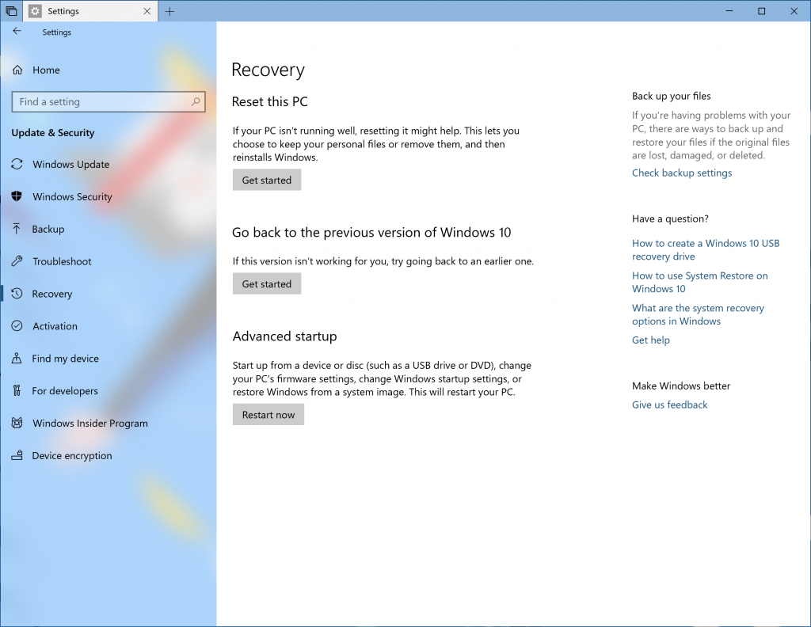

## Ease of access improvements
**Make text bigger**: We’ve heard your feedback and are excited to announce that the ability to increase text size across the system is back and better than ever! When you go to **Settings > Ease of Access > Display**, you’ll find a new setting called “Make text bigger” – this slider will adjust text across the system, win32 apps, and UWP apps.
That means you can now make text bigger in Start, File Explorer, Settings, etc., without having to change the overall scaling of your system.

## Magnifier improvements
We’ve heard your feedback asking us for a way to keep your mouse centered on the screen in Full-Screen mode, in the Windows 10 October 2018 Update we’re making it happen! This new option under **Settings > Ease of Access > Magnifier > Keep the mouse cursor > Centered on the screen** enables easier tracking and use of the mouse, especially helpful at higher magnification levels.  In addition, you now have more control over zoom level increments with the addition of 5% and 10% under the Change zoom level setting.

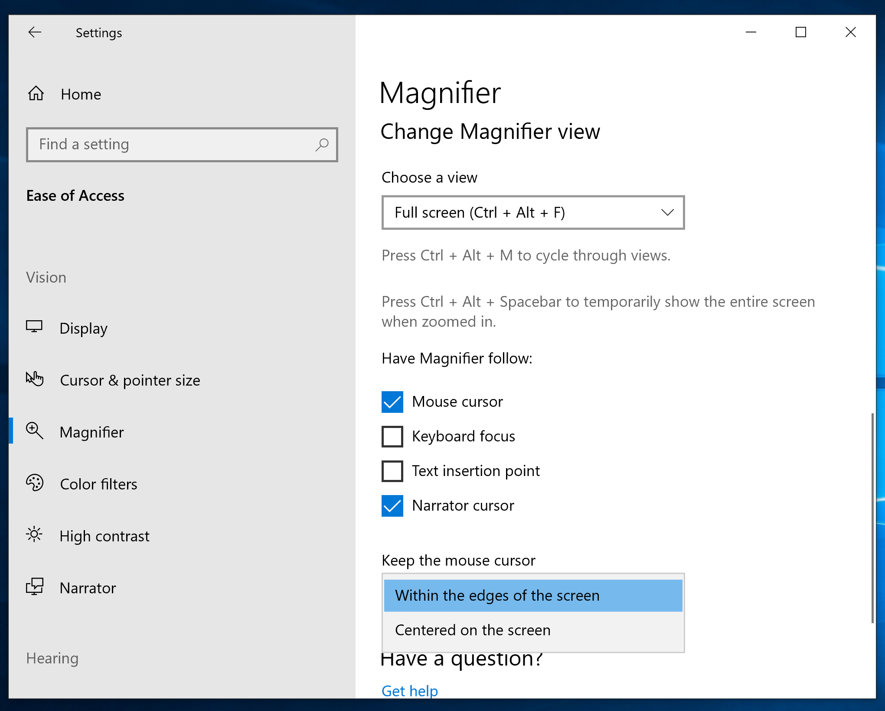

## Narrator improvements 

* **Reliability**: We have made improvements in Narrator reliability. 
* **Narrator standard keyboard layout**: Narrator now ships with a new keyboard layout that is designed to be more familiar to screen reader users.
* **Scan Mode**: Reading and navigating while in Scan Mode has been improved. Selecting text in Scan Mode has also been improved. 
* **Stop on Controls in Scan Mode**: Scan mode is a Narrator feature that lets you use just a few keys to move around your screen. Scan mode is already on by default in Microsoft Edge and you can toggle it on and off by pressing **Caps lock + Spacebar**. While you’re in scan mode, you can press the Up and Down arrow keys to read different parts of the page. The press of a Down arrow in Scan Mode stops on interactive elements, so that they are easier to use. An example of this behavior is reading a paragraph with multiple links. Narrator will stop on these links when you press the Down arrow.
* **Selection commands in scan mode**: Narrator’s scan mode now supports selecting content in Microsoft Edge, Word, Outlook, Mail, and most text surfaces. Standard shift- selection commands can be used as well as **Control + A** for the entire document. **Caps + Shift + Down Arrow** will speak the current selection. For a full list of selection commands, you can refer to Narrator’s **Show Commands List** by pressing **Caps + F1**. Once content is selected you can copy it to the clipboard by pressing Control + C. Formatting information will also be retained. Along with being able to select content in Narrator’s scan mode using Shift-selection commands, you can now also select a block of data by first moving to one end of the block and pressing F9, moving to the other end of the block and pressing F10. Once F10 is pressed the entire contents between the two points will be selected. 
* **Narrator QuickStart**: When Narrator launches, a new QuickStart tutorial experience will be available. The Narrator QuickStart will help you get up and running quickly with Narrator. It teaches the basics of using Narrator, such as learning the keys on your keyboard, navigation, the most used commands etc. At the end of the QuickStart there is a link to the User Guide where you can continue learning about Narrator.
* **Braille**: Improved use of Braille commands when using the Narrator key from the braille display. 
* **Automatic Dialog Reading**: Narrator automatically reads the contents of a dialog box when brought to the foreground. Narrator speaks the title of the dialog, the focused element within the dialog and the static text at the top of the dialog. For example, if you try to close a document in Word with unsaved changes, Narrator will speak the title “Microsoft Word,” the focus “Save button” and the static text within the dialog. 
* **Narrator Find**: You now have the ability to search for text using Narrator’s new Find feature. If the text is found Narrator will move to the found item. 
* **List of Objects**: Narrator can present a list of links, headings or landmarks present in the application or content. You are also able to filter the results by typing in the list or the text field of the window. 
* **Keyboard command changes**: The keystroke to move the caret to the beginning of text is now **Narrator + B** (formerly Narrator + Control + B), to move the caret to end of text is now **Narrator + E** (was Narrator + Control + E). 
* **Move Next, Move Previous, and Change View**: When changing Narrator’s view to characters, words, lines, or paragraphs the **Read Current Item** command will read the text of that specific view type more reliably. 
* **Providing Feedback**: The keystroke to provide feedback has changed. The new keystroke is **Narrator + Alt + F**. This will work both in the standard and legacy layouts. Note: The legacy layout also allows you to use **Narrator + E** to send us feedback. 

For more information about Narrator new keyboard layout and other improvements, refer to the new [Narrator Keyboard Layout doc](http://aka.ms/RS5NarratorKeyboard).

## Time accuracy and traceability improvements

* __Leap second support:__ Windows supports these occasional 1-second adjustments in a traceable and UTC-compliant manner. What’s a leap second? As the earth’s rotation slows, [UTC](https://en.wikipedia.org/wiki/Coordinated_Universal_Time) (an atomic timescale) diverges from [mean solar time](https://en.wikipedia.org/wiki/Solar_time#Mean_solar_time) or astronomical time.  Once UTC has diverged by at most .9 seconds, a [leap second](https://en.wikipedia.org/wiki/Leap_second) is inserted to keep UTC in-sync with mean solar time.  Since the practice of inserting leap seconds began in 1972, a leap second has typically occurred every 18 months.

* __Precision Time Protocol:__ For the highest accuracy environments, you can improve your time accuracy by leveraging a new time protocol that delivers more accurate time samples to the endpoint (Windows Server 2019 or Windows 10, host or virtual machine).

* __Software Timestamping:__ You can now further improve your network time accuracy by eliminating the software delay introduced by the Windows networking stack.

For more details about these new improvements, please see our announcement [here](https://blogs.technet.microsoft.com/networking/2018/07/18/top10-ws2019-hatime/).

## Kernel debugging improvements 
We are adding support for IPv6 to KDNET. To make room for the larger headers required for IPv6, we decreased the payload size of packets. As a result, we’re declaring a new version of the protocol, so that host PCs running the latest version of the debugger can be used to debug target PCs that only support IPv4. There is a version of WinDbg Preview available at [http://aka.ms/windbgpreview](http://aka.ms/windbgpreview). Follow the [Debugging Tools for Windows](http://aka.ms/windbgblog) blog for updates on KDNET IPv6 support and documentation. 

## Privacy Improvements

### New Diagnostic Data Viewer features to improve your Privacy Experience 

At Microsoft, we understand that your data is your data. That’s why we are committed to providing full transparency on what diagnostic data Windows collects, when it is collected, and how you can control what you share. We care about your privacy and helping you build trust and confidence in our products.

We first introduced the **Windows Diagnostic Data Viewer** on Data Privacy Day in 2018. The Windows Diagnostic Data Viewer helps you understand exactly what diagnostic data is received from your Windows device. Available to anyone through the Microsoft Store, the tool provides you full transparency when it comes to diagnostic data.

Through the viewer, you can see the different categories of diagnostic data which includes:
* Device Connectivity and Configuration such as device properties, preferences, settings, and network information
* Product and Service Performance such as device health, performance and reliability, and device file queries (this is not meant to capture user patterns or habits)
* Browsing History such as frequently visited sites
* Product and Service Usage data like applications and services used
* Software Setup and Inventory such as installed apps and device update information.

Each of these categories are important so that we can diagnose performance issues and ensure your device is secure. The viewer provides you full insights into exactly what we collect so that you are aware of what’s happening on your device. Through this tool, you can do things like search by keyword, filter data by category, export the data to a separate file, and provide feedback about the tool or a specific data point.

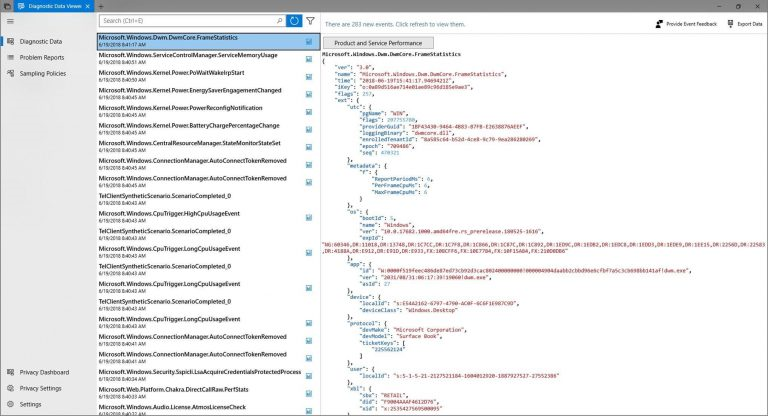

**New to the Diagnostic Data Viewer:** We are excited to say that users can now directly view Problem Reports that have or will be sent to Microsoft. Problem Reports help us identify crashes and other disruptions on your device so that we can improve your Windows experience. On the **Diagnostic Data Viewer**, users can view specific details about each report collected such as when it was sent and what application or component caused the report to be created.

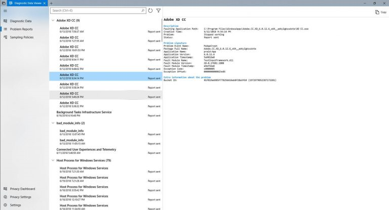

Along with the ability to see Problem Reports, the Diagnostic Data Viewer comes with new changes to the UI as well. For example, the filter feature to view data points by category is now directly to the right of the search bar, and the export data feature now exists at the top right of the tool.

### Microphone access
If access to the microphone has been disabled in your privacy settings, we’ll now pop a notification the first time an attempt to use the microphone is blocked so you can review the settings if desired.

### Privacy settings layout in the set-up experience 

__Changes to the set up experience for privacy settings__ This new design conveys focused information to help our customers make focused choices about their privacy and offers two new settings for inking & typing, and find my device.

## Update experience

Have you ever had to stop what you were doing, or wait for your computer to boot up because the device updated at the wrong time? To alleviate this pain, we’ve updated our reboot logic to use a new system that is more adaptive and proactive. We trained a predictive model that can accurately predict the best time to restart a device. We check to see if you are using your device before we restart and we also try to predict if you just left the device to grab a cup of coffee.

### How accurate is this model?

We use this model on internal devices, and we see promising results upon rollout.  Due to the nature of its architecture, we’re able to update the model based on our insights from its performance. It’s all thanks to our cloud infrastructure.

### How do you give us feedback?

If you find your device restarting at the wrong time, please file a bug in the [feedback hub](https://aka.ms/updatefeedback) with the details on your experience. (i.e. I went to grab a cup of coffee for 5 minutes and it updated!). We would love to hear your stories and take it into account when training our update model.

## Windows Container Improvements
**New Windows Image:** We’re adding a new base image to the Windows Server container collection. In addition to nanoserver and windowsservercore container images, the new windows image is now available. This image carries even more components than its nanoserver and servercore siblings, meaning it can support applications that have additional API dependencies. Go to https://aka.ms/windowscontainer to learn more and get started.

**Group managed service account reliability:** We’ve improved the scalability and reliability of containers that use group managed service accounts (gMSA) to access network resources. You should see fewer authentication errors when using a single gMSA with multiple container instances. Additionally, you no longer need to set the container hostname to be the same as the gMSA. We also fixed a bug that prevented you from using gMSAs with Hyper-V isolated containers.

## For Developers
We have too many new features to list here. Go [here](https://docs.microsoft.com/en-us/windows/uwp/whats-new/windows-10-build-17763) to read all about it.

## Notable App Updates

### Snip & Sketch

The new snipping experience is here to help you capture and annotate what you see on your screen. 

Originally introduced as part of the Windows Ink Workspace, the **Snip & Sketch** app comes with a variety of benefits, including:
1. It can be updated via the Microsoft Store
2. It can be found in the app list when you press Alt + tab
3. You can set the window size to your preference
4. It supports multiple windows

**WIN + Shift + S** will bring up a snipping toolbar – snip a rectangle, something a bit more freeform, or full screen and it will go straight to your clipboard. Immediately after taking a snip you’ll also get a notification that will take you and your snip to the Snip & Sketch app where you can annotate and share away!

We also added additional entry options for different input modalities: 
* __Just click the pen tail button__. If you have a pen, go into __Pen & Windows Ink Settings__ – you’ll find screen snipping is now an option for single click. This will launch you directly into our snipping experience:

* __Press Print Screen__. You’ll see a new option that says __Use the Print Screen key to launch screen snipping__. Opening Settings and searching for __print screen__ will take you to the right page.
 
* __Press the quick action button in Action Center__. Called __Screen snip__ – it should be there as soon as you upgrade, but if not you can always enable it via Notifications & Actions Settings.

### Notepad Improvements

**Extended line endings support**: In addition to Windows line endings (CRLF), Notepad now supports Unix/Linux line endings (LF) and Macintosh line endings (CR).

**Wrap-around find and replace**: We added the option to do wrap-around find and replace to the find dialog. Notepad will remember previously entered values and the state of check boxes, and will automatically populate them the next time you open the find dialog. Additionally, when you have text selected and open the find dialog we will automatically populate the search field with the selected text.

**Text zooming**: We added a new menu option under __View > Zoom__ to change the zoom level, and we display the current zoom level in the status bar. You can also use **Ctrl + Plus**, **Ctrl + Minus** and **Ctrl + MouseWheel** to zoom in and out and use **Ctrl + 0** to restore the zoom level to the default.

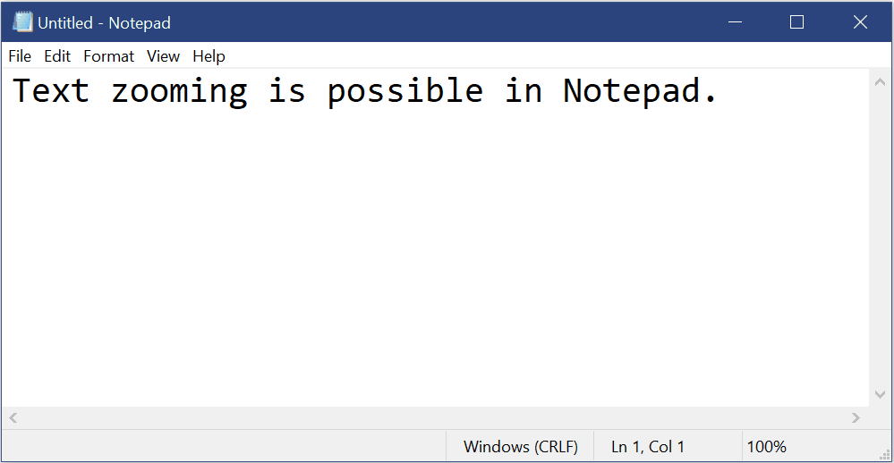

**Line numbers with word-wrap**: Notepad can display line and column numbers when word-wrap is enabled, and we’ve made the status bar visible by default. You can still turn the status bar off in the **View** menu.

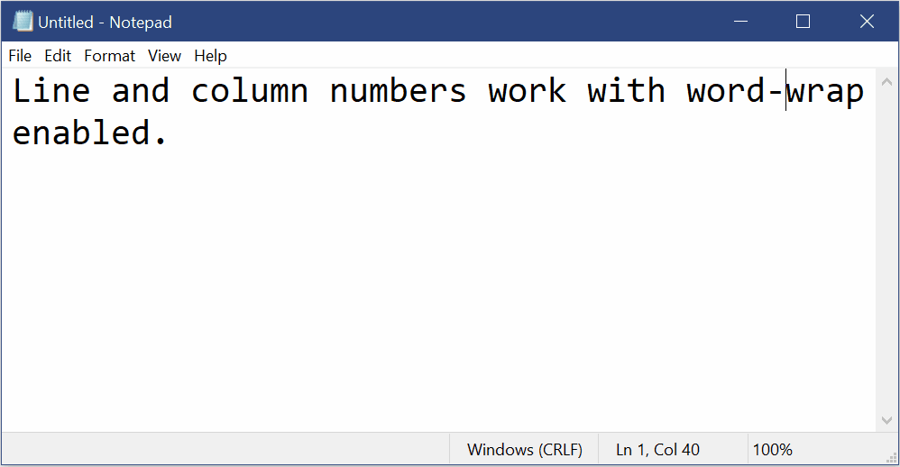

**Search with Bing**:To use, highlight a word or phrase in Notepad and you can search Bing using the following methods:
* Select text and choose **Search with Bing** via the right-click (context) menu.
* Edit menu ->**Search with Bing…**
* **CTRL + B**. 

### Skype for Windows 10 Improvements
This new [Skype for Windows 10 update](https://aka.ms/skypeinsider_windows10) brings all of the latest Skype capabilities to Windows 10 users.

Here’s a sample of what’s new:
* **Best in class calling experience**- We’ve added several new calling features to make Skype’s calling experience even better than before.
* **Flexible group call canvas** – Customize your group call experience and decide who appears in the main call canvas.  Simply drag and drop people between the call canvas and the overflow ribbon to select who you want to focus on.
* **Take snapshots** – Use snapshots to capture images of important moments within a call.  Snapshots makes sure you never forget important memories like your grandkid’s funny antics or crucial information like the content that’s been screenshared during a meeting.
* **Easily start screensharing** – We’ve made sharing your screen during calls even easier.  Look for the ability to share your screen with the top level call controls.
* **New layout** – Based on your feedback, we’ve made your contacts easier to access and view
* **Customizable themes** – Choose a color and theme for your Skype client through your application settings.
* And much more – Improvements to our media gallery, notifications panel, @mentions experience and more!

In addition to all the latest enhancements, with this update you can expect more frequent improvements to your Skype for Windows 10 experiences going forward via updates from the Microsoft Store. 

### Windows Calculator 

Windows Calculator now correctly calculates square roots for perfect squares (integers that are squares of other integers). Because of the [arbitrary precision arithmetic library](https://blogs.msdn.microsoft.com/oldnewthing/20160628-00/?p=93765) used by the Calculator app, the square root calculation is an approximation calculated using the [Exponential Identity](https://en.wikipedia.org/wiki/Methods_of_computing_square_roots%23Exponential_identity) function.

Previously, when you would calculate the square root of 4, the result would be 1.99999999999999999989317180305609 which would be rounded to 2 when displayed, because we calculated enough digits to do the rounding correctly. However, as soon as you subtract 2, you would see the remaining digits.

After this update, the square root calculation now recognizes perfect squares and correctly returns exactly 2 for the square root of 4.

### Microsoft Font Maker app
With the **Microsoft Font Maker** app you can use your pen to create a custom font based on the nuances of your own handwriting – currently available via the [Microsoft Store](https://www.microsoft.com/store/productId/9N9209F8S3VC) and we’d love to hear your feedback! Install the fonts you create to add a personal touch to everything you do!

### Task Manager Improvements

**Task Manager Memory Reporting Improvements:** We are making a small change in how memory used by suspended UWP apps/processes appears in Task Manager. Going forward, the main memory column in Task Manager “Processes” tab will not include memory used by suspended UWP processes. This is to more accurately reflect the OS behavior in which the OS can reclaim memory used by suspended UWP processes if needed. This means that if you have several UWP processes suspended in the background, the OS can take back memory from these suspended UWP processes if needed and use it for something that requires more memory. New and old memory columns will be available in “Details” tab for you to do comparisons if you want.
New Power Usage Columns: Task Manager now includes 2 new columns in the “Processes” tab to show energy impact of the running process on their system. This should help our customers to understand which apps/services are using the maximum power vs. the least power-hungry apps. The metric takes CPU, GPU & Disk into evaluation when calculating power usage.
* Power usage: This column will provide an instantaneous view of apps/services using power.
* Power usage trend: This column provides a power usage trend over 2 mins for each running apps/services. This column will be blank when you start an app but will populate based on the power usage every 2 mins.

### Registry Editor Improvements
Have you ever been typing into the regedit address bar, and the next part of the path is just on the tip of your tongue, but you can’t remember? Starting with today’s build, you’ll now see a dropdown as you type to help complete the next part of the path! Oh, and you can also press Ctrl + Backspace to delete the last “word”, which makes backing up work that much faster (Ctrl + Delete will delete the next word).

 

