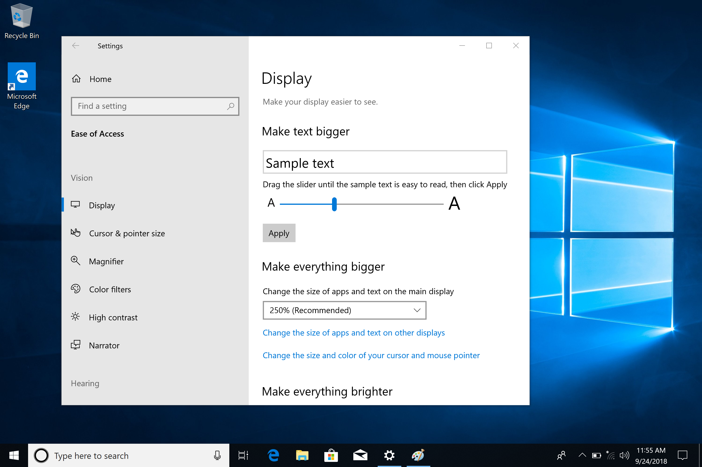

#  What's new in the Windows 10 Insider Preview Builds (RS5)
The [Windows Insider Program](https://insider.windows.com/en-us/) lets you preview builds of the upcoming release of Windows 10. This topic lists all new Windows 10 features for you to try. Unlike the [Windows Insider Program Blog](https://blogs.windows.com/windowsexperience/tag/windows-insider-program), this topic is organized by feature instead of by the build number so that you can see all items about a specific feature listed together. 

## Acrylic Improvements

### Acrylic in Task View 
The entire task View background now has a soft blur effect.

### Acrylic comes to menus and more!
Our Acrylic material is being used by default in light-dismiss XAML controls and on transient XAML surfaces like flyouts. The new Acrylic material is now applied to:
* Context menus
* Flyouts
* Auto-suggest drop down list boxes
* combo box drop down list boxes
* date and time picker flyouts
* media transport control flyouts and overflows

You will notice new acrylic backgrounds in places on the system using these controls – for example when you right-click open apps in Task View. Apps using the SDK for this build or higher will see this change by default as well.

## Bluetooth battery percentage in Settings

In Bluetooth & other devices Settings, you can now check the battery level of your Bluetooth devices. For Bluetooth devices that support this feature, the battery percentage will update whenever your PC and the device are connected.

## Say hello to your new clipboard experience! 
Copy paste - it's something we all do, probably multiple times a day. But what do you do if you need to copy the same few things again and again? How do you copy content across your devices? Today we're addressing that and taking the clipboard to the next level - simply press WIN+V and you'll be presented with our brand-new clipboard experience!  

Not only can you can paste from the clipboard history, but you can also pin the items you find yourself using all the time. This history is roamed using the same technology which powers Timeline and Sets, which means you can access your clipboard across any PC with this build of Windows or higher.  

Our new settings page for enabling this experience is under Settings > System > Clipboard - please try this out and share feedback! [This link](feedback-hub:///) will open the Feedback Hub to where you can tell us about your experience and what you'd like to see next. 

<b>Note:</b> Roamed text on the clipboard is only supported for clipboard content less than 100kb. Currently, the clipboard history supports plain text, HTML and images less than 1MB. 

## Cortana Show Me voice queries

 You can now launch the Cortana Show Me app through voice queries. Simply say to Cortana, “Show me how to change my background,” and you’ll get help content, with a new “Let’s go” button below, which launches the guided help experience. 

 You can download [Cortana Show Me](https://www.microsoft.com/en-us/store/r/cortana-follow-me/9pl1gmkcxm8c) from the Microsoft Store.

 Here are some voice queries to try:

* <b>Update Windows</b>– Try, “Update my Windows device”
* <b>Check if an app is installed</b> – Try, “How to see what apps are installed”
* <b>Uninstall an app</b> – Try “How to uninstall apps”
* <b>Change your desktop background</b>– Try, “Show me how to change my background”
* <b>Use Airplane Mode</b> – Try, “How do I turn on airplane mode”
* <b>Change your display brightness</b> – Try, “Show me how to change my screen brightness”
* <b>Add nearby printers or scanners</b> – Try, “How to add a printer”
* <b>Turn off Windows Defender Security Center</b> – Try, “Show me how to turn off Windows Defender Security Center”
* <b>Change Wi-Fi settings</b> – Try, “Show me how to change Wi-Fi network”
* <b>Change your power settings</b> – Try, “How to change when my computer goes to sleep”
* <b>Discover Bluetooth devices</b> – Try, “Show me how to discover devices”
* <b>Check your version of Windows</b> – Try, “How do I find my current version of Windows”

## Introducing extended line endings support for Notepad 
Announced at Microsoft Build 2018, we’re excited to let you know that in addition to Windows line endings (CRLF), wNotepad now supports Unix/Linux line endings (LF) and Macintosh line endings (CR)! 

For more details, check out [Introducing extended line endings support in Notepad](https://aka.ms/notepadeol). ## Dark theme comes to File Explorer (and more!) 

As many of you know, we added dark theme support to Windows based on your feedback. This setting is available under Settings > Personalization > Colors, and if you switch it any apps and system UI that support it will follow suit. Since releasing this feature, our top feedback request from you has been to update File Explorer to support dark theme. Along the way, we also added dark theme support to the File Explorer context menu, as well as the Common File Dialog (aka the Open and Save dialogs). Thanks again for everyone’s feedback! 

## Microsoft Edge Improvements

<b>New, clearer “Settings and more” (“…”) menu:</b> We’ve redesigned the “Settings and more” menu in Microsoft Edge so it’s easier to find the options you’re looking for. The menu options are now organized into groups, with icons for each entry, and keyboard shortcuts (where applicable). Click the “…” button in the top-right corner of Microsoft Edge to see what’s new! 

<b>See your top sites in the Jump List:</b> You can now see your top sites in the Jump List on the Windows taskbar or Start Menu. Just right-click the Microsoft Edge icon to see a list of your most visited sites and pin the ones that matter most to you. Right-click on any entry to remove it from the list. 

<b>Organize the tabs you’ve set aside:</b> It's easier to organize the groups of tabs you’ve set aside, so you can remember what’s in each group when come back to it later. Once you’ve set a group of tabs aside, choose the “Tabs you’ve set aside” icon (top left corner), and click on the label for any group to rename it.  

<b>Do more from the “Downloads” pane:</b> We’ve added options for “Show in folder” and “Copy link” to the right-click menu for downloads in the “Downloads” pane. 

### WebDriver improvements
It's easier than ever to automate testing in Microsoft Edge using WebDriver. First, we’ve made WebDriver a Windows Feature on Demand, so you no longer need to match the build/branch/flavor manually when installing WebDriver. When you take new Windows 10 updates, your WebDriver binary will be automatically updated to match.

To install WebDriver, just turn on Developer Mode in Windows 10 Settings, or install the standalone feature under the “optional features” Settings page.

We’ve also updated WebDriver to match the latest [W3C Recommendation spec](https://www.w3.org/TR/webdriver/) with major new improvements. You can learn all about these changes on the [Microsoft Edge Dev Blog](https://www.w3.org/TR/webdriver/).

## Ease of access improvements
<b>Make Text Bigger</b>: We’ve heard your feedback and are excited to announce that the ability to increase text size across the system is back and better than ever! When you go to Settings > Ease of Access > Display in today’s build, you’ll find a new setting called “Make everything bigger” – this slider will adjust text across the system, win32 apps, and UWP apps.

That means you can now make text bigger in Start menu, File Explorer, Settings, etc., without having to change the overall scaling of your system. 

## External GPU Safe Removal Experience

We added a safe removal experience for external GPUs connected via Thunderbolt 3. The safe remove experience allows you to know which applications are running on an external GPU so that you can safely remove to prevent data loss during detach.

To safely remove an external graphics card, go to the “Safely Remove Hardware and Eject Media” icon and click to eject your GPU. If there are applications running on your external GPU, then a dialog will appear with the applications that are currently running. Close the applications to safely remove the device. If there are no applications currently running on your external graphics device then no dialog will appear and you can safely detach your external GPU.

## Focus assist improvements when gaming 
Now Focus assist will turn on automatically when you’re playing any full screen game. No more interruptions when you’re crushing it. This behavior should be turned on automatically, but you can always check by going to Settings > System > Focus assist and ensuring the “When I’m playing a game” automatic rule is enabled. For more information, see [Windows 10 Tip: How to enable Focus Assist in the Windows 10 April 2018 Update](https://blogs.windows.com/windowsexperience/2018/05/09/windows-10-tip-how-to-enable-focus-assist-in-the-windows-10-april-2018-update/).

## Game bar improvements
* <b>Audio controls</b>: Change your default audio output device and mute or adjust the volume of games and apps running.
* <b>Performance visualizations</b>: See your game’s framerate (FPS), CPU usage, GPU VRAM usage, and system RAM usage.

## Game mode improvements
New options are now available for Game Mode that are expected to improve the gaming experience on desktop PCs.  Gamers on PCs with many background processes may also see performance improvements when they toggle “Dedicate resources” in Game bar.

## High Efficiency Image File Format (HEIF)
The <b>High Efficiency Image File Format (HEIF)</b> is supported in Windows 10 and the Photos app. [HEIF is an image container](https://en.wikipedia.org/wiki/High_Efficiency_Image_File_Format) that leverages modern codecs like HEVC to improve quality, compression, and capabilities compared to earlier formats like JPEG, GIF, and PNG. In addition to traditional single images, HEIF supports encoding image sequences, image collections, auxiliary images like alpha or depth maps, live images & video, audio, and HDR for greater contrast. We have heard your feedback that these features and the ability to share photos easily with other platforms is important to you. 

In order to try this out, you need to join the Windows App Preview Program for the Photos app and make sure you are running the March release of the Photos app (Version 2018.18022.13740.0 or newer). This version of the [Photos](https://www.microsoft.com/store/productId/9WZDNCRFJBH4) app has been updated to support viewing the primary image inside a HEIF file and to guide the install of dependencies like the HEIF and HEVC media extensions from the Microsoft Store. Once installed, these media extensions enable HEIF viewing in Photos as well as thumbnails and metadata in File Explorer.

Additionally, any application that uses [WIC](https://msdn.microsoft.com/en-us/library/windows/desktop/ee719654(v=vs.85).aspx), [WinRT Imaging APIs](https://docs.microsoft.com/en-us/uwp/api/windows.graphics.imaging), or the [XAML Image control](https://docs.microsoft.com/en-us/uwp/api/windows.ui.xaml.controls.image) can now add similar support for viewing single HEIF images.

[Click here](https://aka.ms/photosfb) to open Feedback Hub and send us feedback on the HEIF experience with the Photos app and Windows 10.

You can now rotate HEIF-format images in File Explorer, and edit metadata, such as "Date taken". 
The new functionality requires the latest version of the HEIF package. The latest version will be installed automatically be the Store. If automatic updates are disabled you can download the HEIF package manually using [this link](https://aka.ms/HEIFpackage). 

HEIF files use the HEVC video codec to compress the image into approximately half the size of JPEG. If your Windows PC does not already have the HEVC video codec, it can be purchased from the Windows Store using [this link](https://aka.ms/HEVCcodec). 

To rotate a HEIF image file, simply right-click on it in File Explorer and select "Rotate right" or "Rotate left" from the menu. "Date taken" and other properties can be edited by clicking on "Properties" and selecting the "Details" tab.

## Kernel Debugging Improvements 

We are adding support for IPv6 to KDNET. To make room for the larger headers required for IPv6, we’re decreasing the payload size of packets. As a result, we’re declaring a new version of the protocol, so that host PCs running the latest version of the debugger can be used to debug target PCs that only support IPv4. An updated SDK and WDK will be released soon with this support. There is a version of WinDbg Preview available at [http://aka.ms/windbgpreview](http://aka.ms/windbgpreview) today. Follow the [Debugging Tools for Windows](http://aka.ms/windbgblog) blog for updates on KDNET IPv6 support and documentation in the future. 

## Narrator Improvements 
* <b>Narrator Standard Keyboard Layout</b>: Narrator now ships with a new keyboard layout that is designed to be more familiar to screen reader users. Please refer to the accompanying documentation for details on these changes (Intro to New Narrator Keyboard Layout doc).
* <b>Selection commands in Narrator Scan Mode</b>: Narrator’s scan mode now supports selecting content in Microsoft Edge, Word, Outlook, Mail and most text surfaces. Standard shift- selection commands can be used as well as Control + A for the entire document. Caps + Shift + Down Arrow will speak the current selection. For a full list of selection commands, you can refer to Narrator’s Show Commands List by pressing Caps+F1. Once content is selected you can copy it to the clipboard by pressing Control + C. Formatting information will also be retained. 
* <b>Automatic Dialog Reading</b>: Narrator automatically reads the contents of a dialog box when brought to the foreground.  The experience is for Narrator to speak the title of the dialog, the focused element within the dialog and the static text, if any, at the top of the dialog. For example, if you try to close a document in Word with unsaved changes, Narrator will speak the title “Microsoft Word,” the focus “Save button” and the static text within the dialog.
* <b>Narrator Find</b>: You now have the ability to search for text using Narrator’s new Find feature. If the text is found Narrator will move to the found item. Please refer to the accompanying keyboard layout documentation for command mapping.
* <b>List of Objects</b>: Narrator can present a list of links, headings or landmarks present in the application or content. You are also able to filter the results by typing in the list or the text field of the window. Please refer to the accompanying keyboard layout documentation for command mapping.
* <b>Selection in Scan Mode</b>: Along with being able to select content in Narrator’s scan mode using Shift-selection commands, you can now also select a block of data by first moving to one end of the block and pressing F9, moving to the other end of the block and pressing F10. Once F10 is pressed the entire contents between the two points will be selected. 
* <b>Stop on Controls in Scan Mode</b>: Scan mode is a feature of Narrator that lets you use just a few keys to move around your screen. Scan mode is already on by default in Edge and you can toggle it on and off by pressing Caps lock + Spacebar. While you’re in scan mode, you can press the Up and Down arrow keys to read different parts of the page. With this update, the press of a Down arrow in Scan Mode will stop on interactive elements, so that they are easier to use. An example of this new behavior is that if you are reading a paragraph with multiple links, Narrator will stop on these links when you press the Down arrow.

We would love to hear what you think as you try out these improvements. This [link](http://aka.ms/narratorfb) will take you to the Narrator section of the Feedback Hub, or you can press Caps + E while Narrator is running.

## Input 

<b>Emoji design updates</b> based on your feedback and to improve consistency, we’ve made adjustments to the design of some of our emoji. Examples of updated emoji include:

<b>Before</b>

<b>After</b>

<b>Emoji search comes to more languages</b>: You can find an emoji by keyword in over 150 locales, including English (Great Britain), French (France), German (Germany), Spanish (Spain), and more. This will help you get the emoji you want easily and quickly. As a reminder, to bring up the Emoji Panel set focus to a text field and press WIN + (period) or WIN + (semicolon).

## Taking the Microsoft Pinyin and Wubi IMEs to the next level

* <b>We updated the Microsoft Pinyin IME</b>. We’ve been focusing on addressing your performance, reliability and compatibility feedback. You'll also notice a number of other improvements, including design improvements, a new logo for the Microsoft Pinyin IME, new IME toolbar, and dark theme support!

    

* <b>We updated the context menu</b>. We’ve added a bunch of options to the IME mode indicator’s context menu in the taskbar, so you can quickly access the things you need.

* <b>The IME now uses the same UX for Expressive Input as other languages</b>. You can bring it up by clicking the emoji button in the IME toolbar, or use the Emoji Panel hotkeys (WIN + period (.) or WIN + semicolon (;)). You can browse between Emoji, Kaomoji, and Symbol input when Chinese (Simplified) is the active locale.

## Windows mixed reality improvements
You can stream audio to both the headset and the PC speakers simultaneously. To try it out make sure that you can hear sound from your normal PC speakers when not running the Mixed Reality Portal (MRP) and from the headset’s audio jack or built-in headphones when mixed reality is running. Then close all apps, including MRP, and go to Settings > Mixed reality > Audio and speech to turn on “When Mixed Reality Portal is running, mirror headset audio to desktop.” You should now hear audio from both the headset and PC speakers when running mixed reality.

## Mobile Broadband (LTE) connectivity on Windows gets a makeover

Windows is transforming the networking stack after 20 years through the NetAdapter framework. This framework introduces a new, more reliable, network driver model that inherits the goodness of the Windows driver framework while bringing an accelerated data path. 

The Mobile Broadband USB NetAdapter driver, a new and improved USB class driver based on the NetAdapter framework, is the default driver in Windows 10 RS5. To try this out – install on a PC that relies on mobile broadband for cellular connectivity and setup cellular connectivity and turn off Wi-fi. 

If your PC supports Mobile Broadband, i.e., your PC relies on cellular network for connectivity, and you want to try it out? Here is what you need to do:

<b>Step 1</b>: Ensure your PC can support SIM cards and USB modems (either over the internal USB bus or using a USB dongle for cellular connectivity). 

<b>Step 2</b>: Install this build (Build 17655 and higher) and setup cellular connectivity. 

<b>Step 3</b>: Choose the Net Adapter based MBB USB class driver as default driver. 

1. Navigate to Device Manager. (You can right-click on the Start button to get there.) 
2. Go to Network Adapters -> Generic Mobile Broadband Adapter or xxxxx Mobile Broadband Adapter 
3. Right click and choose update driver -> Browse my computer for driver software -> Click on Let me pick from a list of available drivers on my computer -> Choose Generic Mobile Broadband Cx Net Adapter -> Click Next. 
4. Once installed reboot for the new driver to take effect. 
5. Ensure the status of the connection remains “Connected”.

<b>Note</b>: Follow the instructions in Step 4 to revert to the default driver(xxxxx Mobile Broadband Adapter), in case of issues with Net Adapter driver(Generic Mobile Broadband Cx Net Adapter). 

<b>Step 4</b>: For Internet access, try using cellular network primarily by turning off Wi-Fi 
To report issues and give feedback, use Feedback Hub on your PC and set Category and subcategory as Network and Internet -> Connecting to a cellular network. Use [cxwmbclass] in the summary.

## Privacy settings layout in the set-up experience 

<b>Changes to the set up experience for privacy settings</b> This new design conveys focused information to help our customers make focused choices about their privacy and offers two new settings for Inking & Typing and Find my device.

## Search improvements

### Search in Calendar

Now you can find past or future events by searching for the name, location, people included or words in the event body. Events that match your search will be clearly visible on your calendar, while those that don’t will be greyed-out so you can find what you need quickly.

Search will work for Outlook, Hotmail, Live and Office 365 accounts. We do not yet support searching Exchange Server, Gmail, Yahoo or other IMAP calendars.

### Search preview
We have expanded previews to support apps, documents, and more. Search previews are here to help you: 
* Get back to what you were doing, such as a recent Word doc or Remote Desktop session 
* Jump-start your task, be it a new Outlook meeting, a quick comment in OneNote, or changing a setting 
* Disambiguate between files by seeing more info including file location, last modified, or author 
* Access quick answers from the web like “are bananas good for you?” “height of mt everest”  

We made the Search experience wider so you can access information and actions in the preview faster than ever. 

<b>Find software downloads faster in Search!</b>: Continuing our theme of improving the search preview experience, we’re rolling out an update to make it easier to find official download pages for Windows software you want to install. The team is continuing to develop this experience and more is coming. 

## Settings

We’ve heard your feedback that settings can be confusing sometimes, so we’re working with Bing to bubble up some of the most common questions we hear right into the Settings pages themselves. The FAQ’s are contextual in nature and aim to you to quickly get the answer you’re looking for to complete configuration tasks. It may even help you discover something you didn’t know was an option! Clicking on these questions will take you to Bing.com to display the answer.  

## Sets
Sets is designed to make sure that everything related to your task: relevant webpages, research documents, necessary files, and applications, is connected and available to you in one click. With Sets, first party experiences like Mail, Calendar, OneNote, MSN News, Windows, and Microsoft Edge become more integrated to create a seamless experience, so you can get back to what’s important and be productive, recapturing that moment, saving time – we believe that’s the true value of Sets. Here are some of the things you can do with sets.

<b>Bring on the acrylic!</b> We love Fluent Design as much as you do – Sets now have an acrylic title bar. We also adjusted the window border so that it’s now grey. 

<b>Recent Microsoft Edge tabs now show in Alt + Tab</b>: Do you use Alt + Tab to quickly switch back and forth between apps? All of your recent Microsoft Edge tabs will now be included, not just the active one. Prefer it the old way? Use the “Pressing Alt + Tab shows the recently used…” setting in Multitasking Settings. 

<b>Should apps and websites open in a new window or a new tab? It’s up to you!</b> The Sets section of Multitasking Settings now lets you set your windowing preference. If you choose “Window”, new windows won’t open into a new tab unless you explicitly click the + or drag with your mouse. Choosing “Tab” opens any new windows invoked from your running apps into tabs. As a reminder, if you would like to exclude any particular app from Sets, you can do this from this same settings page. 

<b>Want to mute one of your web tabs? You can now do that!</b> When a webpage in Sets starts playing audio, you’ll now see a volume icon on the tab. Simply click it and the audio will mute, just like in Microsoft Edge. 

<b>Tabs restore with better performance</b> – they’ll open in the background and use no resources until you go to the tab. This means you can restore a lot of tabs at once with no issues. 

We’ve also made other fixes, changes, and improvements to Sets, including: 
* Task Manager is in the list of apps where Sets are not enabled. 
* We fixed an issue where right clicking a tab in the Sets title bar didn’t bring up a context menu. 
* We fixed an issue where if Microsoft Edge wasn’t already open, clicking the plus button in Sets would open all of your default websites along with the new tab page. 

<b>Drag and drop app tabs within and between Sets windows is now supported</b>: It works just like it sounds! You can now drag an app tab around within the Set or combine tabbed app windows into Sets.  

<i>Note: If you open a Microsoft Edge tab outside of a Set, you can’t drag and drop it into a Sets window. Drag and drop for Microsoft Edge web tabs within Sets isn’t supported yet and you may experience a crash if this is attempted.</i>  

<b>Tabs are now bubbled up in Alt + Tab</b>: Have Photos, Microsoft Edge, and OneNote tabbed together? You can now use Alt + Tab to switch between them. Prefer to only show the primary window in Alt + Tab? 

<i>Note: If you have multiple Microsoft Edge windows in a Set, only the one most recently accessed will be visible in Alt + Tab.</i>

<b>Support for desktop (Win32) apps.</b> Sets now supports File Explorer, Notepad, Command Prompt, and PowerShell. One of the top feature requests by Insiders has been tabs for File Explorer and with Sets you can get a tabbed File Explorer experience.

<b>Launch apps from the new tab page</b> by typing the app name into the search box.

<b>UWP apps are launched in the same window</b> replacing the new tab page.
The tab UI in Sets now shows icons including website favicons and app icons.
Resume your project with more control – When restoring your projects you’ll be prompted to restore related apps and webpages. In Timeline you’ll see when a project has multiple activities associated with it.

<b>Improved Settings for Sets</b>: We’ve updated the Settings for Sets via Settings > System > Multitasking. To start with, Sets now has its own section on this page, and is searchable (try typing “Sets” or “tabs” and it will appear in the dropdown). We’ve also added a setting to control the Alt + Tab behavior mentioned above.

<b>File Explorer & Sets Improvements</b>: We’ve heard your feedback – you’d like it to be easier to get two File Explorer windows grouped together. We  added a new keyboard shortcut to open a new tab when a File Explorer window is in focus: Ctrl + T. Remember, you can use Ctrl + N to open a new window, and Ctrl + W to close the window/tab.

<b>New UI for opening new tabs and windows</b> in the File Menu.

<b>New UI</b> for easily opening new tabs and windows in the File Menu.

<b>New context menu options for tabs in Sets</b>: If you right-click on a Sets tab, you’ll discover several options to leverage, including “close other tabs”, “move to new window”, and “close tabs to the right”.

<b>Improvements to Previous Tabs</b>: We’ve done a few things to improve the experience in this space, including:

* <b>You can choose which Previous Tabs you want to restore</b>, in addition to being able to restore all tabs. 

* <b>You can now restore Previous Tabs from any type of activity</b> – in addition to restoring tabs when the primary window is a document.

* When you open a document that previously had tabs, a prompt will appear offering to restore those tabs, and the Previous Tabs button will be in the filled state. For things that aren’t documents, a prompt will not automatically appear, but you’ll know that there are tabs available to restore because the Previous Tabs button will be in the filled state.

* We added an animation to the experience when there are no Previous Tabs available to be restored.

<b>Keyboard shortcuts</b>

* <b>Ctrl + Win + Tab</b> – switch to next tab.
* <b>Ctrl + Win + Shift + Tab</b> – switch to previous tab.
* <b>Ctrl + Win + T </b>– open a new tab.
* <b>Ctrl + Win + N </b> - open a new window.
* <b>Ctrl + Win + W </b>– close current tab or window.

## A modern snipping experience 
The new modern snipping experience is here to help you effortlessly capture and annotate what you see on your screen. While working on this we’ve been carefully going over all your feedback about taking screenshots in Windows - you’ll find the flow and tools are optimized for sharing and make communicating visually with others quick and easy.

### Screen Sketch is now an app! 

Originally introduced as part of the Windows Ink Workspace, this comes with a variety of benefits, including that it can now be updated via the Microsoft Store, it will now show up in the list when you press Alt + tab, you can set the window size to be your preference if you like multitasking, and it even supports multiple windows (and tabs, thanks to Sets!). 

### Easy snipping is only a single step away. 

One of the loudest things we heard is that you want to be able to quickly snip & share a screenshot, and we’re making it happen! WIN + Shift + S will now bring up a snipping toolbar – snip a rectangle, something a bit more freeform, or full screen and it will go straight to your clipboard. If that’s all you need, you can take it from there. Want more, though? Immediately after taking a snip you’ll now get a notification that will take you and your snip to the Screen Sketch app where you can annotate and share away!

But wait, there’s more! Is the WIN + Shift + S keyboard shortcut too long to remember? Guess what! We’ve added easy entry options for every input modality: 
* <b>Just click the pen tail button</b>. If you have a pen, go into Pen & Windows Ink Settings – you’ll find Screen Snipping is now an option for single click. This will launch you directly into our snipping experience:

* <b>Press Print Screen</b>. You heard it right, just one button! It’s not enabled by default – go to Keyboard Settings – you’ll see a new option that says “Use the Print Screen key to launch screen snipping”. Opening Settings and searching for “print screen” will take you to the right page.

* <b>Press the quick action button in Action Center</b>. Called “Screen snip” – it should be there as soon as you upgrade, but if not you can always enable it via Notifications & Actions Settings.

## Start tile folder naming 
To create a tile folder in Start, just drag one tile on top of another for a second then release. Continue dropping as many tiles into the folder as you’d like. When you expand the folder, you’ll see a new option to name it. The name will be visible when the folder is medium, wide, or large-sized. 

## SwiftKey intelligence comes to Windows
[SwiftKey](https://www.microsoft.com/en-us/swiftkey) gives you more accurate auto-corrections and predictions by learning your writing style – including the words, phrases and emoji that matter to you. It’s available for Android and iOS, and starting with today’s build SwiftKey will now power the typing experience on Windows when using the touch keyboard to write in English (United States), English (United Kingdom), French (France), German (Germany), Italian (Italy), Spanish (Spain), Portuguese (Brazil), or Russian.

## Task Manager Memory Reporting Improvements
In Windows 10 code name RS5, the main memory column in Task Manager “Processes” tab do not include memory used by suspended UWP processes. This more accurately reflects the OS behavior in which the OS can reclaim memory used by suspended UWP processes if needed. This means that if you have several UWP processes suspended in the background, the OS can take back memory from these suspended UWP processes if needed and use it for something that requires more memory. New and old memory columns will be available in “Details” tab for you to do comparisons. 

## Windows App Permissions 
You have more control so you can now decide which UWP apps can access your full file system. Particular UWP apps will be granted permission to have broad file system access. This capability will be granted on a per app basis by Microsoft. If a UWP app has the broad file system access restricted capability, you will receive a consent dialog prompting you to accept or deny the request. If at any time you change your mind about the decision, you can go to Settings > Privacy where you’ll find a new Settings page for File System Access. On this page, you can turn access on or off globally, and if it’s on you can also turn it on or off for each app that has requested the capability. UWPs with broad file system access will not appear in the Photos, Videos, or Documents privacy settings pages. If you grant broad file system access, this includes Photos, Videos and Documents.

## Windows Calculator 

Windows Calculator has been updated (version 10.1803.711.0) to now correctly calculate square roots for perfect squares (integers that are squares of other integers). Because of the [arbitrary precision arithmetic library](https://blogs.msdn.microsoft.com/oldnewthing/20160628-00/?p=93765) used by the Calculator app, the square root calculation is an approximation calculated using the [Exponential Identity](https://en.wikipedia.org/wiki/Methods_of_computing_square_roots%23Exponential_identity) function.
Previously, when you would calculate the square root of 4, the result would be 1.99999999999999999989317180305609 which would be rounded to 2 when displayed, because we calculated enough digits to do the rounding correctly. However, as soon as you subtract 2, you would see the remaining digits.
After this update, the square root calculation now recognizes perfect squares and correctly returns exactly 2 for the square root of 4.

## Windows Defender Application Guard (WDAG) Improvements

The Windows Defender Application Guard (WDAG) Team has introduced new improvements for users to have a better experience with our upcoming release. We have combed through our user feedback and acted to ensure your needs are met. On top of significant performance improvements, we have added an ability to download documents highlighted below.

<b>Performance improvements</b>: The teams at Microsoft are constantly working to improve performance for our users. Windows Defender Application Guard is no different. In this upcoming feature update, you will notice an improvement in the launch time for Application Guard. We have made the start process lighter and faster, which will provide our users with a better experience when accessing Microsoft Edge in Windows Defender Application Guard.

<b>Download files to the host</b>: One of the items our users voiced was an inability to “download files from within WDAG” to the host. This created an inconsistent experience for Edge overall as downloaded files were stuck inside the container. In this release, users can turn on a feature to download files from their WDAG browsing session onto the host file system. This feature is available in the Windows 10 Enterprise edition and must be turned on. Once the feature is enabled, users will be able to download files into a folder created in their Downloads folder and open all files on the host.

<i>How to enable and configure the Download to host feature</i>:

<b>Requirements:</b>
* Latest Windows 10 Enterprise RS4 Builds.
* Windows Defender Application Guard feature is installed.
* Network isolation policies are configured.

<b>Steps:</b>
1. Navigate to Local Group Policy Editor > Administrative Templates > Windows Components > Windows Defender Application Guard.

2. Select Allow files to download and save to the host operating system from Windows Defender Application Guard
3. Select <b>Enabled</b> and <b>Apply<b/>

4. After this policy is enabled, you can download files from your Windows Defender Edge session to your Downloads folder. The files from Application Guard will be saved in a folder called “Untrusted files” nested inside the Downloads folder. This folder is created automatically when you first download a file from Application Guard after enabling the policy.

Notes:
* This feature is off by default.
* Users will need to assess the files they downloaded and assume any risks of opening on the host.
* We encourage you to try our download feature and assess our launch performance. Your feedback and suggestion are important to us as we continue to improve our products. You can click here to open Feedback Hub to give feedback on WDAG.
* We’ve also made updates to Windows Defender System Guard. With Windows Defender System Guard, we are making a leap forward in platform security with memory integrity by default and bringing a born secure device promise to our user base. To learn more about these changes and talk with product team, see their post in the Windows Insider Technical Community.

## Windows Security Center gets a Fluent Design refresh
We’ve heard your feedback and we’ve updated Windows Defender Security Center (WDSC) to include the Fluent Design elements you know and love. You’ll also notice we’ve adjusted the spacing and padding around the app and will now dynamically size the categories on the main page if more room is needed for extra info. Last but not least, we’ve also updated the title bar of the app so that it will now use your accent color if you’ve enabled that option in Color Settings – with Sets enabled, you will see this color in the WDSC tab.

## Windows Defender Security Center is now called Windows Security. 

You can still get to the app in all the usual ways – simply ask Cortana to open Windows Security or interact with the taskbar icon. Windows Security lets you manage all your security needs, including Windows Defender Antivirus and Windows Defender Firewall. 

## Windows Defender Firewall now supports Windows Subsystem for Linux (WSL) processes 
You can add specific rules for a WSL process in Windows Defender Firewall, just as you would for any Windows process. Also, Windows Defender Firewall now supports notifications for WSL processes. For example, when a Linux tool wants to allow access to a port from the outside (like SSH or a web server like nginx), the Windows Defender Firewall will prompt to allow access just like it would for a Windows process when the port starts accepting connections. This was first introduced in [Build 17627](https://docs.microsoft.com/en-us/windows/wsl/release-notes#build-17618-skip-ahead).

## Windows Security Improvements 
The Windows Security Center (WSC) service now requires antivirus products to run as a protected process to register. Products that have not yet implemented this will not appear in the Windows Security UI, and Windows Defender Antivirus will remain enabled side-by-side with these products. 
For testing purposes, you can disable this new behavior in Windows Insider builds by creating the following registry key and rebooting the device.  This key will be removed as we get closer to release. 

<pre>HKLM\SOFTWARE\Microsoft\Security Center\Feature 
DisableAvCheck (DWORD) = 1 </pre>

## Windows 10 Pro for Workstations

<b>A new power scheme – Ultimate Performance</b>: Demanding workloads on workstations always desire more performance. As part of our effort to provide the absolute maximum performance we’re introducing a new power policy called Ultimate Performance. Windows has developed key areas where performance and efficiency tradeoffs are made in the OS. Over time, we’ve amassed a collection of settings which allow the OS to quickly tune the behavior based on user preference, policy, underlying hardware or workload.
This new policy builds on the current High-Performance policy, and it goes a step further to eliminate micro-latencies associated with fine grained power management techniques. The Ultimate Performance Power plan is selectable either by an OEM on new systems or selectable by a user. To do so, you can go to Control Panel and navigate to Power Options under Hardware and Sound (you can also “run” Powercfg.cpl). Just like other power policies in Windows, the contents of the Ultimate Performance policy can be customized.

As the power scheme is geared towards reducing micro-latencies it may directly impact hardware; and consume more power than the default balanced plan. The Ultimate Performance power policy is currently not available on battery powered systems.

<b>Productivity focused out of box applications</b>: The out of box experience for Windows 10 Pro for Workstations display  productivity and enterprise focused applications in place of consumer applications and games. 

