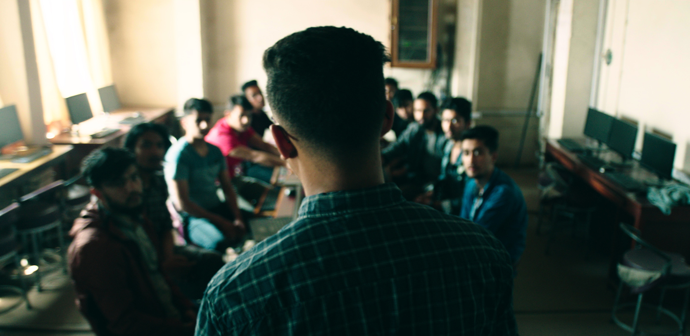

# Digital literacy and #InsiderUp communities

## What is digital literacy?
Digital literacy is the ability to use and understand digital devices and technologies in your daily life and career.

Technology has become a vital part of sustainable development across industries and around the world. Leaders in the tech industry know that advancements like AI could hurt traditional industrial jobs in the future, but there will be even more opportunities within tech. But many people around the world don't have the access, skills, resources, or knowledge to fill these roles, or even to make the most of tech advancements in their daily lives. 

Each year, the world economy is investing billions of dollars in helping people get access to technology and develop digital skills, but their efforts aren't well-coordinated across programs, organizations, and governments. 

The Windows Insider Program is one of many groups that has teamed up with the [Coalition for Digital Intelligence (CDI)](https://www.weforum.org/projects/coalition-for-digital-intelligence) to address these challenges. The CDI is a network of organizations from around the world working to improve global digital intelligence through coordination and collaboration.

## Digital literacy through Insider communities
How can we help everyone learn to code, to make the most of digital tools, and to prepare for a new world of digital jobs and opportunities? Most importantly, how can we empower everyone to use technology to improve their lives, communities, and the world?

We've found that rather than building something for the customer, it’s better to build something **with** the customer. We hope to support Insiders around the world who are building local, educational communities to help others #InsiderUp their digital skills. We don’t want to create a single learning path, but many paths for different tools, technologies, and people. What works for one community won’t work for every community, so it’s our mission to work together with many community leaders to lead the change.

## Starting your own community

If you're interested in starting your own community or even just hosting a meetup, Insider community leaders who have been through this process helped us create this playbook of advice to help you get started. 

If you're an Insider already leading an educational community of your own, tell us your story on [Twitter](https://twitter.com/windowsinsider), [Instagram](https://www.instagram.com/windowsinsider/), or at [an event near you](https://insider.windows.com/en-us/events/) and suggest edits to this playbook to help us make it better for Insiders getting started.

### #InsiderUp Playbook

So, you've decided you're ready to host an #InsiderUp meetup and upskill your local community. Congratulations! It takes a TON of bravery to raise your hand to do this, but you got this. We're right here with you. Remember, there are 7.7 billion people on this earth who can benefit from tech skills, and there is no better day to start upskilling your community than TODAY.  

Below is a playbook that we've put together based on feedback from others setting up #InsiderUp communities all over the world. We would love for you to try out these steps, tell us what worked for you, and what did not so we can continue to refine the process. Our goal is for every country in the world to have at least one #InsiderUp group.  

1.	Figure out who you’d like to upskill and make sure you have a personal connection to this community. 

	- ***Examples:*** Students, military veterans, IT pros wanting to learn dev skills, senior citizens, etc.

2.	Figure out what your community wants to learn and WHY. Be super-specific about what kind of content you’ll use to help them learn. Make sure the "what's in it for them" is loud and clear. WHY are they choosing to come to your meetup and not use their time on something else? How can you phrase it as learning skills to solve local problems, like traffic jams, etc.?

	- ***Examples:***

		- [Entry-level intro to code and logic in one hour](https://hourofcode.com/us/learn)
		- [What is GitHub, and how can you use it?](https://guides.github.com/activities/hello-world/)
		- [What is Azure?](https://docs.microsoft.com/en-us/learn/paths/azure-fundamentals/)
		- [80 billion IOT devices amongst us by 2025? What does that mean for you?](https://iotschool.microsoft.com/en-us/home)
		- Bring a startup business person and a tech person to talk about how they’re using AI, then an AI tutorial: [What is this AI thing?](https://aischool.microsoft.com/en-us/home)

3.	Take inspiration from other successful gatherings — even ones in other countries and cities. Try to figure out which other communities have a similar focus as yours and what they’ve done.  Start by asking about who their audience was, what their goals were, and what kind of content worked for them. This will definitely raise your confidence in your own meetup. This is an area we can also help in since we talk with Insiders all over the world, so let us know what you’re up to, and we can help connect you. 

4.	Even starting from the first meetup, be optimistic about long-term plans. Before you even have your first meetup, create a plan on what the second and third will look like. Plan to share these things with your audience, especially some of the cooler stuff that will be coming as future learning skills. It will help them realize that you’re really committed to this, and so should they. Plus, it will help people realize that they will have an avenue to ask questions in the next meetup if they try things at home. Drill into the examples above for more content beyond the 101. 

	- ***Example:*** Even if you’re not sharing it yet, create a calendar for yourself with the dates for future meetups and topic ideas. Next week? Next month?

5.	What is the format of the event? Lecture style? Guest speaker? Hands-on? Panel? Be clear in your invite. 

	- ***Example:*** Basic structure of 10-15-minute intro, 30-minute guest speaker, then workshop. No more than 2.5 hours total.

6.	Who is going to help you? Remember, you don’t have to do this alone. Is there someone from the local community who would like to partner with you to help organize, send invites, collect surveys, etc.?

7.	Who are you inviting? How will you drive interest for your event?

	- ***Examples:***
		- Invite people in your life who always ask you for tech help or are interested in coding, but are maybe afraid to start. AND ask them to bring a friend.
		- Ask local influencers to tweet or amplify your event.

8.	When is the event? Weekdays after work and school or weekends? Only your community knows what works for them. 

9.	Where is the event?

	- ***Examples:*** Schools and universities after hours. Coffee shops with Wi-Fi. Companies who are willing to host after-hours. 

10.	How are you inviting your community?

	- ***Examples:*** Eventbrite, WhatsApp, Twitter, LinkedIn, Facebook, etc.

11.	What is the guidance you're giving them?

	- ***Example:*** Bring a laptop and pre-install X.

12.	How are you getting feedback on the event?

	- ***Example:*** Have some sort of swag, (like stickers specific to your group, which are super cheap to make,) and people ONLY get it after they complete your survey. [Microsoft Forms](https://forms.office.com/) is an easy way to create a survey.

13.	How are you going to collect phone numbers, email addresses, and contact info into a communication channel so everyone can stay in touch and support each other? 

	- ***Examples:*** WhatsApp groups, WeChat groups, Facebook groups, LinkedIn groups, Teams, etc. 

14.	How are you going to keep your #InsiderUp crew energized and engaged until your next meetup?

	- ***Examples:*** Send them interesting challenges mid-week, like “Use your new skills to build your first website,” etc.

15.	How can you showcase the great stuff that's coming out of your meetup? (Bonus points for you: how can you do this while building up your personal brand?)

	- ***Examples:*** Blogs, YouTube videos, social media, portfolio of projects, etc.

16.	How can we, Microsoft, help you? 

	- ***Examples:*** Send you stickers to give out, amplify your meetup on social media, or if you have success stories, amplify those to other #InsiderUp leaders or as public Insider stories.

## Resources

- [Microsoft Docs](https://docs.microsoft.com/en-us/)
- [Microsoft Learn](https://docs.microsoft.com/en-us/learn/)
- [Hour of Code Activities](https://hourofcode.com/us/learn)
- [GitHub Guides](https://guides.github.com/activities/hello-world/)
- [What is Azure?](https://docs.microsoft.com/en-us/learn/paths/azure-fundamentals/)
- [IOT School](https://iotschool.microsoft.com/en-us/home)
- [AI School](https://aischool.microsoft.com/en-us/home)
