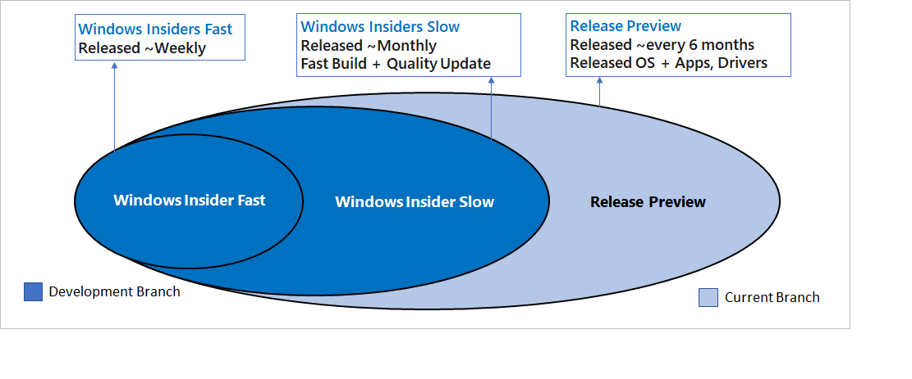

# Working with rings

## Definition of rings
Windows 10 Insider Preview Builds are released in “rings". Each ring is defined by a different release frequency and level of stability. Rings are used to evaluate the quality of our software as they are released to progressively larger audiences. If the build passes automated testing in the lab, we will flight (i.e. release a build) to the next ring. 

## Fast Ring
The benefit of being in the Fast Ring is that you will be among the first to use and provide feedback on new and improved features. Devices in the Fast Ring are typically updated on a weekly basis with a new Insider Preview build through [Windows Update](https://docs.microsoft.com/windows/deployment/update/windows-update-overview). Be prepared for issues that might block key activities or might require workarounds. Because we are also validating a build on a smaller set of devices before releasing, there is a chance that some features might fail in some device configurations. If significantly blocked, report the issue to us in the [Feedback Hub](feedback-hub:///) app or the [Windows Insider forums](https://social.technet.microsoft.com/Forums/en-US/home?forum=WindowsInsiderPreview) and be ready to reinstall Windows using the Media Creation Tool. 

## Slow Ring
The benefit of being in the Slow Ring is that you’ll still receive Insider Preview builds with new preview features and updates, but the builds will be more stable. Devices in the Slow ring are typically updated on a monthly basis with a new Insider Preview build through Windows Update. Builds are sent to the Slow Ring after feedback has been received from Insiders on the Fast ring and analyzed by our Engineering teams. Slow Ring builds include Quality Update service packages to fix key issues and also receive the latest [Microsoft Security Response Center security fixes](https://blogs.technet.microsoft.com/msrc/) shortly after public availability. Note that, because these builds are from the Development Branch, they could have issues that might be addressed in a future flight. For more information, see [Servicing comes to the Slow Ring](https://insider.windows.com/en-us/articles/servicing-comes-to-the-slow-ring/).

## Release Preview Ring
If you want to be on the current public release of Windows 10 but still get early access to updates, applications, and drivers without taking the risk of moving to the Development Branch, the Release Preview Ring is your best option. The Release Preview Ring is only visible when your Windows build version is the same as the current Production Branch. The easiest way to go between the Development Branch to the current Production Branch is to reinstall Windows using the Media Creation Tool. 

## Skip Ahead
This is a unique version of the Fast Ring that allows Insiders to “skip ahead” to Windows 10 Insider Preview builds in the next release of Windows while we are finishing up a current release. Enrollment in Skip Ahead is offered for a limited time to a small subset of Insiders.

## Switching between rings
Changing rings is a simple process. Go to __Settings>Updates & Security__ and click __Windows Insider Program__. Under __What kind of content would you like to receive?__ click “Just fixes, apps and drivers” to select Release Preview. Or click “Active development of Windows” and select “Fast” or “Slow” under What pace do you want to get new builds? 
