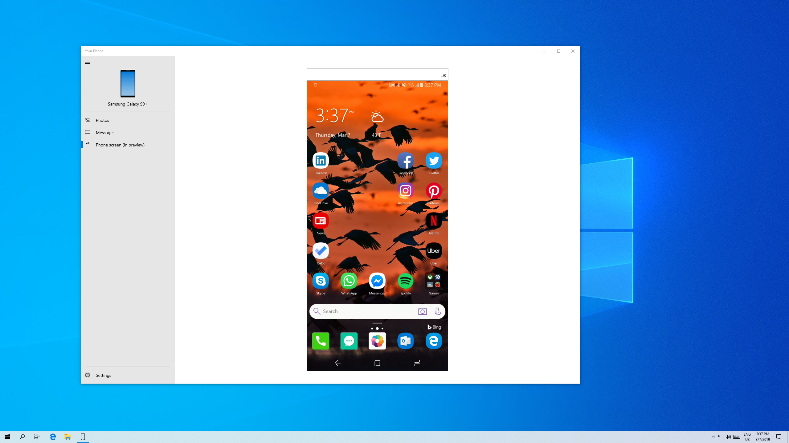
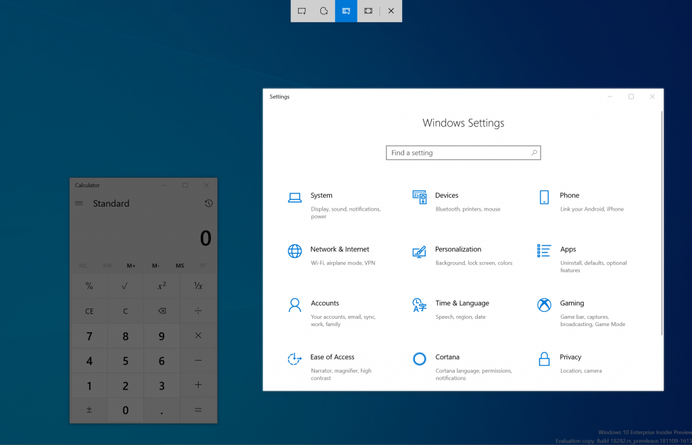
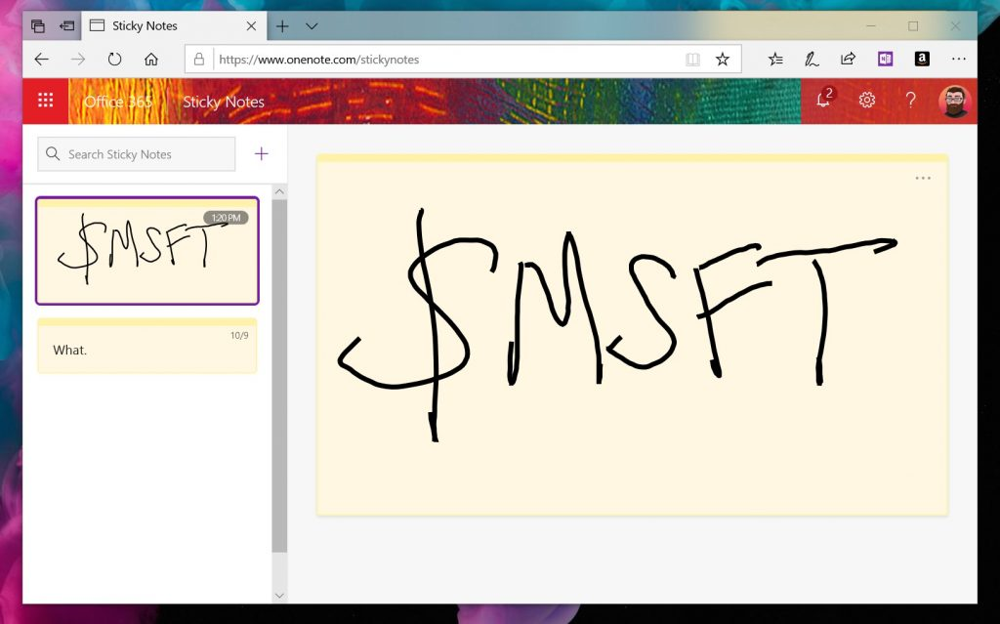

# Windows app updates 
You will find information on the latest major app updates for Windows 10 released here. These updates are currently available using PCs running Windows 10 Version 1903. 

_Note:_ Not all app updates will be listed here. Only app updates that include major changes e.g. new features, etc. will be noted.

## Your Phone 

__10/29/2019__

### Elevating the Phone screen feature by removing its dependency on Bluetooth connection

Windows Insiders, we heard your feedback about the Phone screen feature’s dependency on Bluetooth Low Energy connectivity. To address your feedback, we partnered closely with Samsung to bring you a more streamlined experience across all Windows 10 PCs by removing the peripheral role dependency for Phone screen, which will expand the overall reach of this feature.

Samsung Galaxy Note 10 was the first device to introduce this feature in August. After a positive response, we’ve recently enabled this feature across Samsung Galaxy Fold, S10, S10+, and S10e smartphones. You’ll need to update your supported Samsung devices with the recent software update that enables the ‘Link to Windows’ feature. To continue offering this experience to other smartphones, we’re expanding this feature support to Samsung Galaxy A30s, A50s, and A90 smartphones, and we’ll continue to add additional devices in the coming months.

With the new experience rolling out, we’ll be removing the Bluetooth connectivity option, effective immediately. If you were previously enjoying Phone screen over Bluetooth and you have a phone model that doesn’t yet support Link to Windows, the Phone screen node will disappear automatically within the Your Phone app. We recommend that you unpair your devices by going to the Bluetooth settings on both your PC and your Android phone, so that you don’t have a connection that is no longer in use.

Thank you for helping us refine the Phone screen experience so far!

Phone screen requirements:
* Select Android phones running Android 9.0 or greater
* PC running Windows 10 October 2018 Update (version 1809) or later
* Android phone must be on and connected to the same network as the PC
* You will need a supported device to use this feature: 
    * Samsung Galaxy Fold
    * Samsung Galaxy Note 10/ Note 10+
    * Samsung Galaxy S10/S10+/S10e
    * Samsung Galaxy A30s/A50s/A90
* Refer to the [Your Phone FAQs](https://support.microsoft.com/en-us/help/4459358/windows-10-your-phone-app-help) for additional information.

__10/8/2019__
### Unveiling Calls, now even more ways to stay connected to what matters 
No need to dig for your Android phone to answer your personal or work calls. You can now stay connected by simply answering (or not) your phone calls on your PC. Tap into your PC’s speakers, microphone, and large screen for a richer calling experience.

With the Calls feature you can:
* Answer incoming phone calls on your PC.
* Initiate phone calls from your PC using in-app dialer or contact list.
* Decline incoming phone calls on your PC with custom text or send directly to your phone’s voicemail.
* Access your recent call history on your PC. Clicking on a specific call will auto populate the number within the dialer screen.
* Seamlessly transfer calls between your PC and phone.

Calls requirements:
* Android Phones running Android 7.0 or higher
* Windows 10 PC with Bluetooth radio
* Windows 10 Version 1903 (OS build) 18362.356 or newer

Note: 
* This feature will gradually roll out to Insiders so it may take a few days to be available inside the Your Phone app.
* To enable the Calls feature, sign into the Your Phone app using the Microsoft account that you used to register as a Windows Insider. 
* For set-up instructions and other details, see [Calls Feature for the Your phone app](https://answers.microsoft.com/en-us/insider/forum/all/calls-feature-for-the-your-phone-app/8266e234-ba16-42be-8b11-af2e33ba93ed).

Known issue:
* In certain instances, Calls feature may require you to pair your mobile phone & PC again. If you have previously paired your devices, unpair your devices and go through the Calls setup flow again.

We value your feedback, so give it a try and let us know what you think. You can report any issues under the Your Phone > Settings > Send feedback.

__10/3/2019__

### Link to Windows on more devices. 
We’re pleased to announce that Link to Windows feature, which seamlessly connects your phone to your Windows 10 PC, is rolling out to Samsung Galaxy S10, S10+, S10e, S10 5G, and Fold devices in select global markets. With Link to Windows natively integrated into your device, it’s simple and convenient to send messages, manage notifications, sync photos, and mirror your phone on your PC.

### Phone screen on more devices. 
Phone screen (w)hich allows you to access your Android phone’s apps right from your PC while using your keyboard and mouse or touch screen) is also rolling out to Samsung Galaxy S10, S10+, S10e, S10 5G, and Fold devices in select global markets. You can try out multi-touch gestures such as pinch to zoom, rotate, or swipe from your PC’s touchscreen while using Phone screen. If you have one of these devices, give it a try. This is a gradual rollout, so stay tuned for more to come on additional markets and devices.

### Battery level indicator & phone’s home screen wallpaper.
In addition to Phone screen and Link to Windows expansion, two additional features are rolling out to all users–battery indicator, which will provide quick access to your phone’s battery levels right in the app without needing to check your device, and Your Phone icon within the app, which will show your current static home screen wallpaper for a personal touch.

All of these features are gradually rolling out to users, so they may take a few days to be available inside the Your Phone app. Please make sure you have the latest versions of Your Phone Companion and the Your Phone app.
We value your feedback, so give it a try and let us know what you think. You can report any issues under Your Phone > Settings > Send feedback.

__7/10/2019__

### Phone screen now available on more Surface devices. 
As promised, we’re excited to expand the availability of the phone screen feature to more PCs. With the latest driver update in the Windows insider rings (Marvell 15.68.17013.110), the following Surface devices will preview the phone screen feature – Surface Laptop, Surface Laptop 2, Surface Pro 4, Surface Pro 5, Surface Pro 6, Surface Book, and Surface Book 2. If you have one of these devices, give it a try and let us know what you think!

__7/3/2019__

### Enabling touch functionality
You will now be able to interact with your phone screen using one-touch tap and long press. This handy feature will allow you to conveniently open apps, select items, click on links, and more, directly on your touch-enabled PC.

### Notifications integration with Phone screen
We’re pleased to launch Notifications integration with Phone screen for Insiders with the May 2019 update or newer. If Phone screen is set up, your notifications will open in Phone screen allowing you to interact with your keyboard and mouse. If Phone screen is not supported or set up, clicking on notifications will take you to your notifications feed instead.
Note that your text message notifications (SMS, MMS) will continue to be available within the messaging node.

 
### Your Phone Notifications available to all users
Thank you to everyone who gave us feedback over the last few weeks to help us improve the Notifications feature in the Your Phone app. We’re happy to announce that this feature is now gradually rolling out to all Windows 10 users with the April 2018 update and newer. It may take a few days to show up within Your Phone app, so keep a look out!

### Phone screen requirements
* Select Android phones running Android 7.0 or greater 
* Samsung Galaxy S10e, S10, S10+, S9, S9+, S8, S8+
* Samsung Galaxy A8, A8+
* Samsung Galaxy Note 9, Note 8
* OnePlus 6, 6T
* Windows 10 PCs with Bluetooth radio that support low-energy peripheral role
* Minimum Windows Insiders Build 18338 and above
* Android phone must be on, within Bluetooth range of the PC and connected to the same network as the PC

__5/29/2019__

### Phone screen – Accessibility features, keyboard language and layout, new phone models
We’re pleased to preview two new accessibility features – screen reading and focus tracking – as well as the ability to easily switch your Android phone’s keyboard language or layout while in phone screen.

__Screen reading.__
For users of TalkBack, you can now enable the Your Phone Companion accessibility service, found under your Android phone’s accessibility settings, for smoother cross-device reading. Once both TalkBack and the Your Phone Companion accessibility services are turned on, Narrator will play from your PC, describing what you select and activate on your phone screen as you interact using your PC’s keyboard or mouse.

__Focus tracking.__
You will now be able to interact with your Android phone’s apps at your preferred magnification while in phone screen. Focus tracking will seamlessly follow your keyboard focus and mouse pointer input.
To enable the focus tracking accessibility feature, you must first turn on the Your Phone Companion accessibility service and TalkBack on your Android phone. Once these services are enabled, you can turn on Magnifier on your PC using the shortcut: Windows Key and the Plus sign (+) or open the app from your Windows menu.

__Keyboard language and layout.__ You will notice a new icon on your phone screen toolbar. Selecting this icon will take you to the phone settings page, where you can change your keyboard language or layout. This setting is specific to physical keyboards, so it only applies when you’re typing into your phone from your PC and will not change your phone’s language or keyboard configuration. If you type in different languages or like to switch your keyboard layout, give it a try.

__Phone screen now supports additional Samsung phone models.__
The supported phone model list keeps expanding, we have now enabled support for the Samsung Galaxy A8 and Galaxy A8+. We will continue to expand the list of devices over time.

__Phone screen requirements__

* Certain Android phones running Android 7.0 or greater: Samsung Galaxy S10e, S10, S10+, S9, S9+, S8, S8+; Samsung Galaxy Note 9, Note 8; Samsung Galaxy A8, A8+; OnePlus 6, 6T
* Windows 10 PC with Bluetooth radio that supports low-energy peripheral role
* Minimum Build 18338 and above
* Android phone must be on, within Bluetooth range of the PC, and connected to the same network as the PC

### New messaging features

__Send and receive MMS messages.__ You can now send and receive images and GIFs, including Giphy, right from the Your Phone app.

__Unread message indicator (badge).__ 
* Nav pane – A visual indicator on the Messages node, indicating you have unread messages
* PC Taskbar – A visual indicator on the Your Phone app icon on your PC taskbar, indicating you have unread messages
* Unread conversations – Visual indicator within threads that have unread messages

__Contact images.__ Your Phone app will now sync contact thumbnails for all your contacts that contain profile images, so you can easily identify who you’re messaging with.

__In-line reply.__ You can quickly reply to text messages from toast notifications without having to open the Your Phone app.

__Emoji picker.__ Smileys, people, food, and more. You can easily add emojis to your text messages right from within the app.

### Your Phone can now sync over mobile data

This much-requested feature is now available. You can sync your photos, messages, and notifications over mobile data without having to connect your Android phone to the Wi-Fi network.
Enable “Sync over mobile data” under the Your Phone Companion app settings
When enabled, you should see the ‘Connected to your PC’ toast on your phone. 

### Colorful new icons
We’re also introducing a new look for both Your Phone and Your Phone Companion, to make them truly feel like part of the Windows family. The Your Phone Companion icon has started to hit phones already, and the Your Phone icon will arrive on Windows PCs in the coming days.

__4/26/2019__

### Never miss your Android phone’s notifications

We are excited to provide a preview into the newest feature for the Your Phone app – __Notifications__.
Stop reaching for your phone to check your notifications. Boost your focus and productivity by seeing your phone’s notifications on your PC. You are in control and manage which apps you want to receive notifications from. Dismiss a notification on one device and it goes away on the other.

 
With this preview, you can:
* See incoming phone notifications in real-time
* View all of your phone notifications in one place
* Customize which notifications you want to receive
* Clear notifications individually or all at once

This feature will gradually roll out to Insiders on 19H1 builds. It may take a few days for this feature to show up inside the Your Phone app.

We look forward to your feedback as we continue to test, learn, and improve the overall experience.

__Notifications requirements__ 
* PC: The Notifications feature will gradually roll out to the Your Phone app running on Windows 10 Insider Preview Builds for 19H1 (versions 18204+). Not yet supported on version 18836+ (20H1) builds. 
* Phone: The Notification feature is supported on Android devices version 7.0 and greater with at least 1GB of RAM. Not supported on devices that have Notification Access disabled by work or other policy.

__How set up Your Phone and Notifications__ 
1.	In the Your Phone app on your PC (Start>Your Phone), sign in to your Microsoft account. 
2.	Enter your mobile phone number so we can send you a link to install the Your Phone Companion app for Android on your phone. 
3.	When you receive the text message from Microsoft, tap the link to install the companion app on your phone.
4.	Open the companion app on your phone and follow the setup instructions.
5.	If you're prompted to sign in to the companion app, be sure to use the same Microsoft account that you're using on your PC. 
6.	Accept the notifications on your phone that requests access to your photos and other related permissions.

After you’ve completed the setup process on your Android phone and PC, you’ll be able to use the Your Phone app on your PC to see notifications and photos from your phone and send text messages from your PC. 

For more information on setting up other Your Phone app features, see [Your Phone app help](https://support.microsoft.com/help/4459358/windows-10-your-phone-app-help).

### Phone screen now supports additional Android devices

As promised, we have expanded [phone screen support](https://aka.ms/wip18356) to additional phone models – __OnePlus 6, OnePlus 6T, Samsung Galaxy S10e, S10, S10+, Note 8, Note 9__. Try out phone screen and send us your feedback. We will continue to expand the list of supported devices over time.

__3/12/2019 - Version 1.0.20701.0__
 
### Take your phone’s screen to the big screen  

We are excited to provide an early preview into the newest feature for the Your Phone app – phone screen. You can now mirror your Android phone’s screen directly on your PC without having to dig for your phone.

The new phone screen feature gives you easy access to your phone apps on your PC. Whether scheduling a ride to the airport or checking your social updates, do it with ease from the comfort of your PC without having to take your phone out of your bag or go back and forth between devices. Go ahead, give your thumbs a break, and get things done faster with your keyboard and mouse.

This feature will gradually roll out to Insiders on 19H1 builds. It may take a few days for this feature to show up inside the Your Phone app (version 1.0.20701.0 and above).
You can use the Your Phone app on any Windows 10 PC running Windows builds 1803 (RS4) or newer and any Android phone running Android version 7.0 or newer. But the new phone screen feature is initially only compatible with a limited set of devices. Surface Go will be the first device in the Surface lineup to preview this feature. We will continue to expand the list of devices over time for both the PC and phone.

We look forward to your feedback as we continue to test, learn, and improve the overall experience.

__Phone screen requirements:__
* Select Android phones* running Android 7.0 or greater (*Samsung Galaxy S8/S8+/S9/S9+).
* Windows 10 PC with a Bluetooth radio that supports low energy peripheral role. [How to check if your PC supports this](https://go.microsoft.com/fwlink/?linkid=2066643).
* Latest 19H1 preview build (18342+ recommended).
* Android phone must be on, within Bluetooth range of the PC, and connected to the same network as the PC.

## PowerToys 

PowerToys is a set of utilities for power users to tune and streamline their Windows experience for greater productivity. Inspired by the [Windows 95 era PowerToys](https://en.wikipedia.org/wiki/Microsoft_PowerToys) project, this reboot provides power users with utilities to squeeze more efficiency out of the Windows 10 shell and customize it for individual workflows. Check out this great [overview of the Windows 95 PowerToys](https://socket3.wordpress.com/2016/10/22/using-windows-95-powertoys/).

_10/29/2019__

### PowerToys v0.12 now available!
We’ve just released our 0.12 release of PowerToys on GitHub. We’ve gotten tons of great feedback and suggestions from the community and want to directly say thank you to everyone.

New features include a great new utility called PowerRename, which makes it easy to batch rename a bunch of files, improvements to FancyZones, and support for Dark Mode.

Check out our [latest article](https://insider.windows.com/en-us/articles/powertoys-v012-now-available/) for all the details.

__9/5/2019__

### First Preview Release 

The first preview release of PowerToys contains two utilities: The Windows key shortcut guide and a window manager called FancyZones. All the code for the project is on GitHub. The repo also contains the information and tools you need to understand how the PowerToys’ utilities work together and how to create your own utilities. 

To kick the tires on the first two utilities, [download the installer here](https://github.com/microsoft/PowerToys/releases). The main PowerToys service runs when Windows starts and a user logs in. When the service is running, a PowerToys icon appears in the system tray. Selecting the icon launches the PowerToys settings UI. The settings UI lets you enable and disable individual utilities and provides settings for each utility. There is also a link to the help doc for each utility. You can right click the tray icon to quit the Power Toys service.
 
Note that some PowerToys functionality requires running in an elevated process. Elevation is required to interact with and manipulate windows from processes that have a higher set of rights than the current user. This is why the PowerToys.exe requests elevation when launched.
If you find bugs or have suggestions, please [open an issue in the Power Toys GitHub repo](https://github.com/microsoft/PowerToys/issues/new). The backlog for creating new utilities is here. You can provide feedback on the backlog to suggest new ideas or a different priority order by joining the backlog discussion in this issue.

### Windows key shortcut guide

The Windows key shortcut guide is a full screen overlay utility that provides a dynamic set of Windows key shortcuts that are applicable for the given desktop and currently active window. When the Windows key is held down for one second, (this time can be tuned in settings,) an overlay appears on the desktop showing all available Windows key shortcuts and what action those shortcuts will take given the current state of the desktop and active window. If the Windows key continues to be held down after a shortcut is issued, the overlay will remain up and show the new state of the active window.

Find detailed information on [the Windows key shortcut guide](https://github.com/Microsoft/PowerToys/tree/master/src/modules/shortcut_guide/README.md), the [backlog for this utility](https://github.com/microsoft/PowerToys/blob/master/doc/planning/ShortcutGuideBacklog.md), and the [source code](https://github.com/Microsoft/PowerToys/tree/master/src/modules/shortcut_guide).

### FancyZones windows manager
FancyZones is a window manager that is designed to make it easy to arrange and snap windows into efficient layouts for your workflow, and also to restore these layouts quickly. FancyZones allows the user to define a set of window locations for a desktop that are drag targets for windows. When the user drags a window into a zone, the window is resized and repositioned to fill that zone.
 
To get started with FancyZones, you need to enable the utility in the PowerToys settings, and then invoke the FancyZones setup UI. There’s a button in settings to open this UI, or you can press Win+~ to launch it. When first launched, the UI presents a list of zone layouts that can be quickly adjusted by how many windows are on the monitor. Choosing a layout shows a preview of that layout on the monitor. Pressing the save and close button sets that layout to the monitor.

 
The editor also supports creating and saving custom layouts. This functionality is in the Custom tab in the editor UI. There are two ways to create custom zone layouts, window layout and table layout. These can also be thought of as additive and subtractive models. The additive window layout model starts with a blank layout and supports adding zones that can be dragged and resized, similar to windows.
 
The subtractive table layout model starts with a table layout and allows zones to be created by splitting and merging zones and then resizing the gutter between zones.
 
Find [more information on FancyZones](https://github.com/Microsoft/PowerToys/tree/master/src/modules/fancyzones/README.md), the [backlog for the utility](https://github.com/microsoft/PowerToys/blob/master/doc/planning/FancyZonesBacklog.md), and the [source code](https://github.com/Microsoft/PowerToys/tree/master/src/modules/fancyzones).

## Snip & Sketch 

__7/31/2019 - Version 10.1907__

Thanks everyone who’s shared feedback so far for our updated snipping experience! We really appreciate it and are starting to roll out some more improvements based on what you’ve told us:
* __Single window mode:__ Do you tend to retake snips multiple times in order to get the perfect screenshot? We’re updating the New button to now open new snips in your current app window, so you don’t end up with a ton of open snips (that you then need to close.) If you’d rather keep all snips open in separate windows. the option is now a toggle in settings, so you can decide which mode you prefer.

 
* __Zoom:__ Need we say more? You can now zoom in on your screenshots if they’re a bit too small for you to annotate on (and yes, CTRL+Plus, CTRL+Minus and Ctrl+Mouse wheel are supported!). We’ll also zoom out to make sure the whole snip fits in the Snip & Sketch window. If you want to see the snip at its original size, click the Zoom button and then “Actual Size”.

* __Improving WIN+Shift+S discoverability:__ You mentioned you loved learning about using WIN+Shift+S to take new snips any time and we thought others would too! If you haven’t taken a snip yet, we’ll now use the canvas space in Snip & Sketch to help you learn how to start a snip without needing to open the app first. 

These changes are currently available for a portion of Insiders in the Fast ring as we evaluate the quality before continuing the rollout. Note the rollout for each change mentioned above is being handled separately, with separate random populations in the initial rollout, so seeing one of the changes with app version 10.1907.2064.0 doesn’t necessarily mean you’ll see all three.

__3/6/2019 - Version 10.1901.10521.0__

We’re in the process of rolling out a new app update to Snip & Sketch. It includes a number of fixes based on your feedback, among which are:
* We fixed an issue that could result in snips being a bit blurry after saving or copying to clipboard.
* We fixed an issue where copying to clipboard would fail if you switched out of the app while the copy operation was in progress.
* We fixed an issue where the suggested file name was unexpectedly a GUID for snips opened from Win + Shift + S toast.
* We’ve added Narrator (screen reader) confirmations when a snip is copied to clipboard.
* We’ve updated the default save format to be png. You can still use the dropdown when saving to pick your desired format if it’s not png.
* We fixed an issue where auto-copy changes to clipboard wasn’t working on return from Snip & Sketch settings.
* We fixed an issue where the app might crash if you closed two app windows one after another.
* We fixed an issue where the default save file location was documents rather than pictures. In fixing this we also fixed an issue where when saving the save dialog wouldn’t remember where you last saved a snip.

The rollout of this app is not tied to the upgrade, so you may see it outside the bounds of this flight.

__12/10/2018 - Version 10.1811.3371.0__

### Bring window snip to your modern snipping experience.
 Start your snip via your preferred entry point (WIN + Shift + S, Print Screen (if you’ve enabled it), directly from within Snip & Sketch, etc.), and select the window snip option at the top, and snip away! That selection will be remembered the next time you start a snip.

__10/31/2018 - Version 10.1809.2964.0__

This update brings several improvements, including:
- **Adding some emphasis.** Planning to paste your screenshot somewhere? Does that place have the same color background as the background of your screenshot? When you update to the latest app version you’ll find a new option to add a border to your screenshots – giving them that little bit extra needed to stand out.
- **Printing!** Sometimes you want to keep a physical copy of your screenshots – we hear you that it took too many steps before, and have added a button in the toolbar so you can print directly from the app. (You can also print to PDF!)  

- **Refining our save options:**
   - If you have unsaved changes and go to close a window or open a file that will now pop a confirmation.
   - The default proposed file name will now include a timestamp.
   - Saving now also supports .jpg and .gif file types.
   - New settings page! We’re replacing the old **About** flyout with a full settings page where you’ll find the aforementioned option to add a border, an option for updates made to your snip to copy automatically to your clipboard, and more.
   

__9/6/2018 - Version 10.1807.2286.0__

### Delay Snip 
We flighted version 10.1807.2286.0 of **Snip & Sketch** (née Screen Sketch), which included the highly requested delay snip feature. There was a bug in Build 18219 blocking the New button from working, so please try it out once you upgrade! 

Just click the chevron next to the New button in the app and you’ll now find options to **Snip now**, **Snip in 3 seconds**, and **Snip in 10 seconds**. If you have the app open or pinned to your taskbar, you can also just right click the icon in the taskbar to get these options, since we’ve added them to the jump list – let us know what you’d like to see next!

## Mail & Calendar 

__2/1/2019 - Version 16.0.11231.20082__

Currently rolling out to Insiders in Fast, this app update brings:

### Dark mode now extended to Mail and Calendar items
Building on our previous release of Dark mode in Mail and Calendar, we have extended our dark UI to more parts of our app. With this update, Dark mode now works when composing a new message, updating a calendar item or reading your email. This helps provide a calmer reading experience for people that work in a low light environment or just prefer screens that are less bright, and helps to reduce eye strain.

To turn on Dark mode, go to settings, select “Personalization”, and choose “Dark mode”. For those who already have Dark mode enabled, you will see it expand to cover your email reading and compose experiences after receiving the update.

If you prefer to view a particular email in light mode, look for the sunshine icon in the command bar to “turn on the lights” and view the email with a white background. This can help if a particular email is not formatted well for Dark mode.

### Default Font
We are introducing a top customer requested feature: Default font. Now you can customize how new messages will look. If you create a new mail or reply to an existing mail, the text you type will be in the font face, size, color and emphasis you have selected.  To change your default font, go into settings and select “Default font”. Default font applies per-account and does not roam to other devices. These updates are the latest in a [series of updates](https://support.office.com/article/what-s-new-in-mail-and-calendar-for-windows-10-9822b33c-b9ad-48bc-ac53-c1b6136e405b) we’ve made based on your feedback, and we’re looking forward to hearing what you’d like to see improved next!

## Microsoft To-Do 

__12/18/2018__ 

### Get more done with Cortana and Microsoft To-Do

Want just one to-do list that works twice as hard for you? Save time and stay organized – Cortana helps by adding your reminders and tasks to your lists in [Microsoft To-Do](https://aka.ms/getMicrosoftToDo) with this feature preview, so you can stay on top of what matters most. Use your voice, your PC, your phone – your choice.

Streamline your tasks – your lists and reminders from across Microsoft To-Do, Cortana, and tasks in Outlook can now become one, centrally located in your Microsoft To-Do app. Use Microsoft To-Do anywhere: on your Android or iPhone, with Cortana, or on your Windows 10 PC. You can also access it from the web. It’s automatically synced so you never miss a beat.
When you ask Cortana to add milk to your grocery list, it’ll show up on one of your Microsoft To-Do lists.

Or, ask Cortana to remind you to call a friend and see the reminder appear in your Microsoft To-Do planned list.

With this integration, we are furthering efforts to seamlessly sync your to-do lists across Microsoft To-Do, Cortana, and your tasks in Outlook. 

To start syncing, your Windows 10 PC must be running Build 18267+ and tied to either the Australia, India, US, or UK region. [Learn more about the Microsoft To-Do and Cortana integration](https://insider.windows.com/en-us/articles/microsoft-to-do-and-cortana-integration/). To share feedback, join the cohort or use the Windows Feedback Hub. use the Windows Feedback Hub.

__9/6/2018 - Version 1.39.1808.31001__

### Handwriting support 
We added support for handwritten input to allow you to capture your tasks seamlessly in Microsoft To-Do (Version 1.39.1808.31001 and higher).
Please try it out and let us know what you think by tweeting at [@MicrosoftToDo](https://twitter.com/MicrosoftToDo) on Twitter. With Ink you now can:
1. Capture your tasks naturally by writing directly on the list’s surface.
2. Complete your tasks by striking through them.
3. Use check-marks within the circle to the left of a task to complete it.

## Feedback Hub 

__8/21/2019 - Version 1907__

The Feedback Hub team has been hard at work lately to bring you some app updates based on your feature requests, and we have a few changes and improvements to share about the latest version that’s currently rolling out to Insiders in the Fast ring.

### Feedback Search UI updates
On the Feedback section of the app, you will now be able to more clearly see the differentiation between Problems and Suggestions, with each showing an icon, color, and labels Problem or Suggestion displayed above each feedback entry. We also have updated iconography and displays for Adding similar feedback to problems, upvoting suggestions, and adding comments to feedback.

### Adding similar feedback

In the past, Feedback Hub allowed two kinds of participation on feedback: upvoting and adding more details. The notion of voting on Suggestions makes a lot of sense – engineers at Microsoft want to know which features the community wants us to build next, and voting on feature suggestions is a great way to see where your interest lies.

However, voting on Problems was trickier – problems are not a matter of popularity, and what helps engineers here resolve problems is having clear descriptions of how the issue arose. Feedback is especially helpful if it includes a reproduction of the problem, diagnostics that help our teams pinpoint what went wrong so they can fix issues faster. Voting on the search page often did not provide enough detail as to what was happening, and we saw that few people went into existing feedback to add their personal reproductions of the issues.

With the new Add similar feedback feature, selecting a problem with symptoms that match your own will take you to the feedback form, with the title pre-filled. You edit the title or add your own description to let us know exactly what was happening when you encountered the problem. We’ll already have your category selected to ensure the right feature team sees your feedback, and in our new Similar Feedback section, the feedback you selected will already be selected. As usual, the last step involves optionally adding your own reproduction of the issue or any attachments you like.

### Windows Insiders Achievements

We are excited to announce a refresh of the Windows Insider Achievements page. We’ve made achievements more discoverable by moving them from your profile page to their own landing page, and we added additional features that allow you to categorize and track your progress. Be sure to check it out today and begin unlocking badges. We would love to hear your feedback on social media by using the hashtag #Builds4Badges.

The information previously found in your profile (Device ID and User ID) is now located in the settings section of Feedback Hub.

As always, we appreciate your feedback – if you have any suggestions or problems to report, you can share them in the Feedback Hub under Apps > Feedback Hub.

__12/10/2018 - Version 1811__

This update includes:
- We’ve updated the navigation pane to now use the common control – that means when switching between sections you’ll now see that nice little transition animation!
- We’ve made some improvements to how the UI flows between different window sizes.
- Screenshots and Steps capture images can be now be easily reviewed in the app.
- When creating a new feedback item, that feedback is auto-saved as a draft.  If the app closes unexpectedly in the middle of writing feedback, when you re-open the Feedback Hub you’ll now get notified of the existing draft so you can easily resume.
- You can now check for app updates from the settings page in the Feedback Hub. We’ll also automatically check for app updates on app launch, and you’ll get a notification letting you know one is available.

## Game Bar

__9/24/2019__

### Track Achievements and frame rate 
In case you hadn’t seen, we’ve rolled out an FPS counter in the Performance overlay and added a new Achievement overlay! Use the Achivements overlay to track your progress and see what you've unlocked. View the frame rate of the game you're playing with the FPS counter. Thanks to everyone who shared feedback so far. The update will come via the Microsoft Store. Just set focus to your favorite game and press WIN + G to get started.

NOTE: You’ll find the new achievement overlay and frame rate counter in version V3.33.26001.0 or higher of the Xbox Game Bar. To check that you have the correct version of the Game Bar installed, open your Xbox Game Bar and go to settings (gear icon, upper right). If you do not have the Xbox Game Bar or need to download the latest version, first download the Xbox Insider Hub from the Microsoft Store, then go to Insider Content and click on "Game Bar (Windows Gaming)". 

__12/10/2018__ 

### Check out the new Gallery experience in Game bar! 
Without ever leaving your game, you can now view screenshots and videos taken through Game bar and even share your favorite screenshots directly to Twitter. 

## Sticky Notes 

__10/31/2018 - Version 3.1.32__

Thank you for sharing your feedback on 3.0 release with us. We think you are going to love this update!

- We tested the waters with the Charcoal Note and you all seemed keen to go even darker! Introducing full-on Dark Mode support in Sticky Notes. We support Windows Dark Mode as well as the ability to set your color mode in Sticky Notes to suit your mood independent of your system settings.
- Everyone seemed excited about Sticky Notes syncing, so we spent some time making it even faster! Check it out and let us know how it feels.

Please give it a shot and let us know on Feedback Hub your thoughts on the new update.

Want to get to your notes from anywhere? How about on the web at <https://www.onenote.com/stickynotes>? It will be rolling out worldwide soon – take a look and let us know what you think.

__10/24/2018**- **Sticky Notes 3.1__ (Skip Ahead only) 

This version brings the following: 
* We tested the waters with Charcoal Note and you all seemed keen to go even darker. Introducing full-on Dark Mode!
* Sync is even faster now, including to your phone via iOS and Android OneNote, rolling out now!

__8/28/2018 - Sticky Notes 3.0__

Sticky Notes 3.0 brings the following amazing new features and capabilities:
* Sync (& backup) your notes across your Windows devices.
* If you have a lot of notes, your desktop can get a bit crowded! We are introducing a new home for all your notes. You can choose which notes to stick to your desktop or tuck them away and find them again easily with search.
* We channeled our dark energy into a dark themed note: Charcoal Note.
* Crossing tasks off feel better than deleting them! Now you can style your note with the new formatting bar.
* You may notice that Sticky Notes is performing a lot faster – that is completely on purpose.
* We’ve applied so much polish that the app is starting to look like a shiny pony!
* Drastic improvements on being more inclusive: 
    * Using assistive technologies and Narrator.
    * Keyboard navigation.
    * Using mouse, touch, and pen.
    * High Contrast.

Let us know what you think of **Sticky Notes** by sending us feedback via **Feedback Hub** and choosing **Apps > Sticky Notes** under **Category**.

Read all about the awesomeness in Sticky Notes 3.0 in [this article on our Insider website](https://insider.windows.com/en-us/articles/sticky-notes-3-0-now-available-to-insiders-who-opted-into-skip-ahead/).