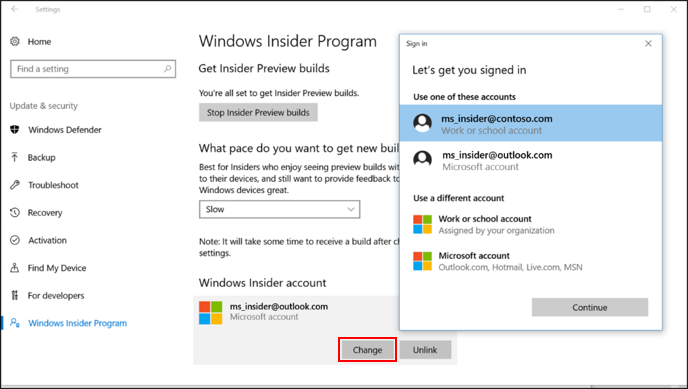
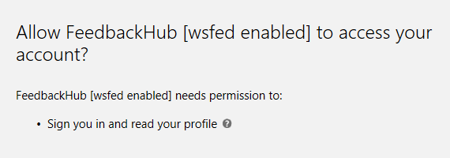

# Windows Insider Program for Business using Azure Active Directory

You can download Windows 10 Insider Preview builds using your corporate credentials in Azure Active Directory (AAD). By enrolling devices in AAD, you increase the visibility of feedback submitted by users in your organization – especially on features that support your specific business needs. 

<b>Note</b>: The Windows Insider Program for Business only supports Azure Active Directory (and not Active Directory on premises) as a corporate authentication method.

If your company is currently not using AAD – but has a paid subscription to Office 365, Microsoft Dynamics CRM Online, Enterprise Mobility Suite, or other Microsoft services – you have a free subscription to Microsoft Azure Active Directory. This subscription can be used to create users for enrollment in the Windows Insider Program for Business.

In order to get the most benefit out of the Windows Insider Program for Business, organizations should not use a test tenant of AAD. There will be no modifications to the AAD tenant to support the Windows Insider Program as it will only be used as an authentication method.

## Register your organization's Azure AD domain to the Windows Insider Program for Business

Rather than have each user in your organization register for Windows 10 Insider Preview builds, you can now simply register your domain – and cover all users with just one registration.

<b>Important</b>You need to be signed in as a Global Administrator of the Azure AD domain in order to be able to register the domain.

1. On the [Windows Insider website](https://insider.windows.com/), go to <b>For Business</b> > <b>Getting Started</b> to [register your organizational Azure AD account](https://insider.windows.com/en-us/insidersigninaad/).
2. [Register your domain](https://insider.windows.com/en-us/for-business-organization-admin/) and control settings centrally.

## Is your device connected to your company’s AAD subscription?

Go to <b>Settings > Accounts > Access work or school</b>. If a corporate account is on Azure Active Directory and it is connected to the device, you will see the account listed as highlighted in the image below.

## Enroll a device with an AAD account

1. Make sure that you have administrator rights to the machine and that it has latest Windows updates.
2. Navigate to the [Getting Started](https://insider.windows.com/en-us/getting-started/) page on [insider.windows.com](https://insider.windows.com/).
3. Go to <b>Register your organization account</b> and follow the instructions.
4. On your Windows 10 device, go to <b>Settings > Updates & Security > Windows Insider Program</b>. 
5. Enter the AAD account that you used to register and follow the on-screen directions. 

## Switch device enrollment from your Microsoft account to your AAD account

1. Visit [insider.windows.com](http://insider.windows.com) to register your AAD account. If you are signed in with your Microsoft account, sign out, then sign back in with your corporate AAD account. 
2. Click <b>Get started</b>, read and accept the privacy statement and program terms and click <b>Submit</b>. 
3. On your Windows 10 PC, go to <b>Settings > Updates & Security > Windows Insider Program</b>. 
4. Under <b>Windows Insider account</b>, click your Microsoft account, then <b>Change</b> to open a Sign In box. 
5. Select your corporate account and click <b>Continue</b> to change your account. 

## User consent for Feedback Hub

With the current version of the Feedback Hub app, we need the user's consent to access their AAD account profile data (We read their name, organizational tenant ID and user ID). When they sign in for the first time with the AAD account, they will see a popup asking for their permission, like this:

Once agreed, everything will work fine, and that user won't be prompted for permission again.

### Something went wrong

The option for users to give consent for apps to access their profile data is controlled through Azure Active Directory. This means the AAD administrators have the ability to allow or block users from giving consent.

In case the administrators blocked this option, when the user signs in with the AAD account, they will see the following error message:

This blocks the user from signing in, which means they won't be able to use the Feedback Hub app with their AAD credentials.

## New to Azure Active Directory? 

 Try these topics.
 1. [Introduction to AAD](https://docs.microsoft.com/azure/active-directory/connect/active-directory-aadconnect)
 2. [Add users](https://docs.microsoft.com/azure/active-directory/active-directory-users-create-azure-portal)
 3. [Device registration](https://docs.microsoft.com/azure/active-directory/active-directory-device-registration-overview) 
 4. [Integrate your on-premises directories with Azure AD](https://docs.microsoft.com/azure/active-directory/connect/active-directory-aadconnect).

 