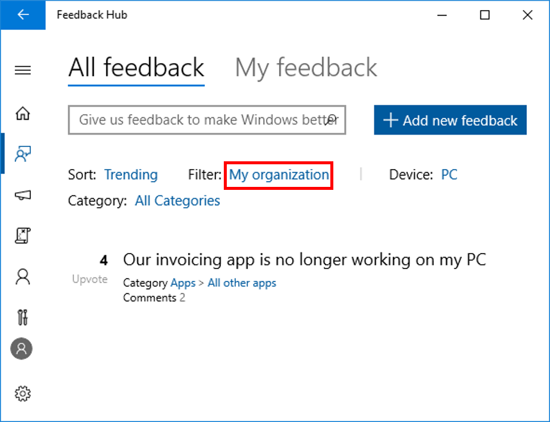

# Share Feedback via the Feedback Hub

Sharing your feedback is quick and easy. You can go directly to the [Feedback Hub](feedback-hub:///), then click the __Add Feedback__ button. Users can sign into the Feedback Hubusing either their Microsoft account or Azure AD work account. Signing in with a work account aloows uers to submit feedback to Microsoft on behalf of their organization. Additionally, this feedback from Azure AD users can be tracked through the Feedback Hub by administrators and othe users in the organization. 

You can track your feedback, and your IT administrator can track feedback provided by all users in the organization through the Feedback Hub by filtering by __My Organization__. 

If you're signed in to the Feedback Hub App using your personal Microsoft Account (MSA), you can switch to your work account by clicking on your account, signing out, and signing back in.

## Submit and track feedback on behalf of your organization
1. Register as a Windows Insider with your work account in Azure Active Directory.
2. Sign into the Feedback Hub using this same work account. On the Welcome page of the Feedback Hub, click on the People icon, lower left and select or add your AAD work account. (If you have already registered using your Microsoft account, you’ll need to sign out first.)

__Note:__ Feedback Hub needs your consent to access your AAD account profile data (we read name, organizational tenant ID, and user ID). When you sign in for the first time with the AAD account, you will see a popup asking for their permission. You must allow Feedback Hub to access your data in order to use it. In an enterprise environment, AAD administrators have the ability to allow or block users from giving consent. If you cannot give consent, Feedback Hub is blocked. Your admin (or you if you're the admin) can unblock in the [Azure portal](https://portal.azure.com/). Go to __Enterprise applications__ section and enable __Users can allow apps to access their data__. 

3. To submit feedback, go to feedback tab to submit feedback. For more information on submitting effective feedback see: [How to provide effective feedback](https://insider.windows.com/en-us/how-to-feedback/) 
4. To track feedback from other users in your organization, go to __Feedback, All Feedback__. Under the __Filter__ drop-down, select __My Organization__ to view feedback from Insiders in your organization. Note: Feedback filtered with this view will only show Feedback from users in your organization who sign into the Feedback Hub using their registered work account in Azure Active Directory. 

. 

## Related topics
[Send feedback to Microsoft with the Feedback Hub app](https://support.microsoft.com/en-us/help/4021566/windows-10-send-feedback-to-microsoft-with-feedback-hub-app)

