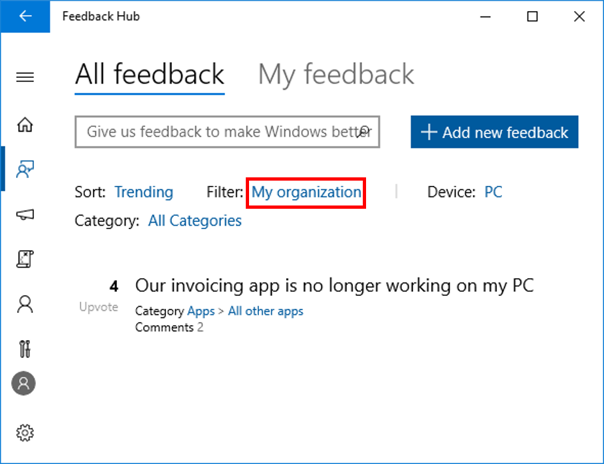

# Submit and track feedback using the Feedback Hub

Once users in your organization have installed an Insider Preview build, they can provide feedback to Microsoft on the build using the Feedback Hub application in Windows. This feedback can help us fix issues your users may encounter and is also an effective way to send suggestions to our engineering teams for new features and improvements. For more information see: [Send feedback to Microsoft with the Feedback Hub app](https://support.microsoft.com/en-us/help/4021566/windows-10-send-feedback-to-microsoft-with-feedback-hub-app).

Users can sign into the Feedback Hub using either their Microsoft account or Azure Active Directory work account. Signing in with a Azure AD work account is recommended for business users as it allows users to submit and track feedback specific to their organization's needs and issues. 

## Submit feedback on behalf of your organization
1. Register as a Windows Insider with your work account in Azure Active Directory.
2. Sign into the [Feedback Hub](insiderhub://home/) using this same work account. On the Welcome page of the Feedback Hub, click on the People icon, lower left and select or add your AAD work account. If you're signed in to the Feedback Hub App using your personal Microsoft Account (MSA), you can switch to your work account by clicking on your account, signing out and signing back in.

NOTE: The Feedback Hub needs a user's consent to access their Azure AD account profile data (we read name, organizational tenant ID, and user ID). When users sign in for the first time with their Azure AD account, they will see a pop-up asking for permission. If a user cannot give consent in the pop-up, access to the Feedback Hub may be blocked. Administrators can unblock in the [Azure portal](https://portal.azure.com/). Go to __Enterprise applications__ section and enable __Users can allow apps to access their data__. 

3. To submit feedback, go to the Feedback Hub and click on the __Feedback tab__ in the upper-left corner off the screen. For more information, see: [How to provide effective feedback](https://insider.windows.com/en-us/how-to-feedback/).  

## Track feedback from users in your organization
To track feedback submitted to the Feedback Hub by other users in your organization, go to __Feedback>All Feedback__. Under the __Filter__ drop-down, select __My Organization__. 
NOTE: You must sign in with your registered Azure AD account to track feedback from users in your organization. Feedback filtered with this view will only show feedback from users in your organization who sign into the Feedback Hub using their registered work account in Azure AD. 

. 

## Related topics
[Send feedback to Microsoft with the Feedback Hub app](https://support.microsoft.com/en-us/help/4021566/windows-10-send-feedback-to-microsoft-with-feedback-hub-app)

