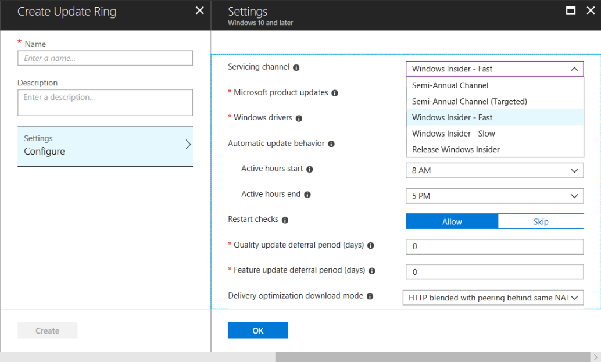

# Manage Windows 10 Insider Preview Builds
Administrators can manage installation of Insider Preview builds across multiple devices in their organization using the following steps: 

## Register your domain with the Windows Insider Program
By registering your organizational domain with the Windows Insider Program, you do not have to register each device or user into the Windows Insider Program to install Insider Preview builds. To register a domain, you must be registered in the Windows Insider Program with your work account in Azure Active Directory and you must be assigned a Global Administrator role on that Azure AD domain. Also requires Windows 10 Version 1703 or later on the machine used for registration. 

> [!div class="nextstepaction"]
> [Register your domain](https://insider.windows.com/en-us/for-business-organization-admin/)

__NOTE:__ 
Note: 
* The Windows Insider Program for Business only supports Azure Active Directory (and not Active Directory on premises) as a corporate authentication method.
* In order to get the most benefit out of the Windows Insider Program for Business, organizations should not use a test tenant of AAD. There will be no modifications to the Azure AD tenant to support the Windows Insider Program as it will only be used as an authentication method.

## Create and manage policies 
Installation of Insider Preview builds can managed across multiple devices on an organizational domain using Group Policies or MDM Polices in Intune or another MDM product. 

### Set using Group policy
Group Policies can be set on devices using the Group Policy Management Console without having to 
1. Set Allow Telemetry. To enable installation of Insider Preview builds on a device, telemetry must be set to 2 or higher. 
Group Policy: __Computer Configuration/Administrative Templates/Windows Components/Windows UpdateData Collection and Preview builds/Allow Telemetry__
MDM: Update/AllowTelemetry

2.	Enable Manage preview builds. This setting enables or prevents installation of Insider Preview builds on a device. You can also decide to stop preview builds once the release is public. 
Group Policy: __Computer Configuration/Administrative Templates/Windows Components/Windows Update/Windows Update for Business/Select when Preview Builds and Feature Updates are received.__
MDM: Update/ManagePreviewBuilds

3.	Enable Branch Readiness Level. This setting allows enables distribution of Insider Preview builds on a PC. It also lets you to choose between preview flight rings, and defer or pause the delivery of updates. 
Group Policy: __Computer Configuration/Administrative Templates/Windows Components/Windows Update/Windows Update for Business?Select when Preview Builds and Feature Updates are received__
MDM: Update/BranchReadinessLevel

To set group policy, use the 
__Computer Configuration/Administrative Templates/Windows Components/Windows Update/Windows Update for Business/Manage preview builds__ setting and the __Computer Configuration/Administrative Templates/Windows Components/Windows Update/ Windows Update for Business__ setting. 

### Set using MDM polices with Intune 
1.	Log into the Intune management portal and go to __Software Update>Windows 10 Update Rings__. Click “+” to create an Update Ring policy.
2.	Under __Servicing Channel__, select Fast or Slow to assign Insider Preview builds from an Insider Preview Ring. See [Windows readiness levels and flight rings](wip-4-biz-flight-levels-and-rings.md) for more information about each choice. 
3.	Adjust __Feature update deferral period__ if you want to defer deployment of Insider Preview builds for a certain number of days after release. 
4.	Click __OK__ and __Create__ to set policy.
5.	Go to __Assignments__ to assign policy to users and devices. Note: you can create groups with one or more users or devices in Intune under __Groups__. 

### Set using MDM policies (non-Intune)
To set policies using third-party MDM products, using the following settings: 

[Update/ManagePreviewBuilds](https://docs.microsoft.com/en-us/windows/client-management/mdm/policy-csp-update#update-managepreviewbuilds) setting. 

[Update/BranchReadinessLevel](https://docs.microsoft.com/en-us/windows/client-management/mdm/policy-csp-update#update-branchreadinesslevel).

> [!NOTE]
> The signed-in user needs to be a Global Administrator of the Azure Active Directory (AAD) domain in order to be able to register the domain. Currently, the Windows Insider Program for Business supports AAD--but not on-premises Active Directory--as a corporate authentication method. 
>If your company has a paid subscription to Office 365, Microsoft Dynamics CRM Online, Enterprise Mobility Suite, or other Microsoft services--you have a free subscription to Microsoft Azure Active Directory. This subscription can be used to create users for enrollment in the Windows Insider Program for Business.
If you do not have an AAD account, install Insider Preview builds on individual devices with a registered Microsoft account.

## Set using MDM polices (non-Intune) 

## Related topics

* [Register for the Windows Insider Program for Business](wip-4-biz-register.md)
* [Share Feedback via the Feedback Hub](wip-4-biz-feedback-hub.md)
