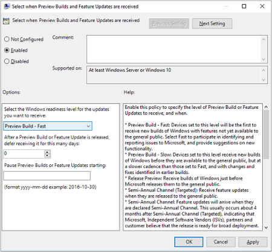
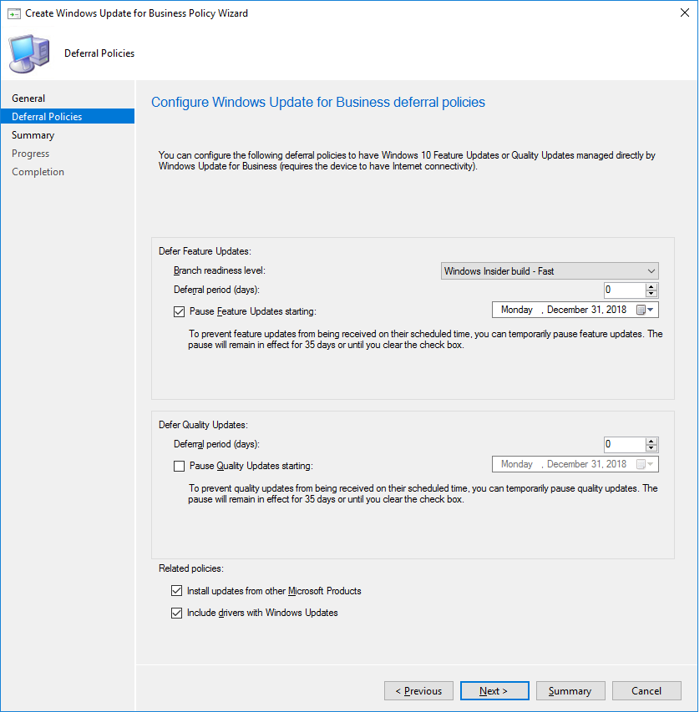
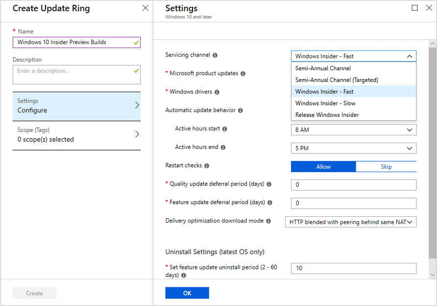
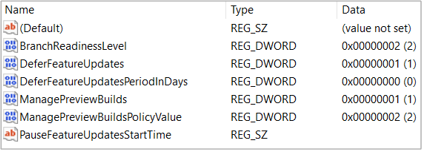

# Manage Windows 10 Insider Preview Builds 
Administrators can manage installation of Windows 10 Insider Preview Builds across multiple devices in their organization using the following steps: 

## Register your domain 
To authenticate multiple devices for Insider Preview builds, register your organization's Azure Active Directory domain with the Windows Insider Program. To register a domain, you must be registered in the Windows Insider Program with your work account in Azure AD (See [Register](wip-4-biz-register.md)) and you must be assigned a Global Administrator role on that Azure AD domain. Also requires Windows 10 Version 1703 or later on the machine used for registration. 

> [!div class="nextstepaction"]
> [Register your domain](https://insider.windows.com/en-us/for-business-organization-admin/)

__NOTE:__ 
* The Windows Insider Program only supports registration of domains in Azure Active Directory (and not Active Directory on premises) as a corporate authentication method.
* Once a domain is registered, administrators do not have to register each individual device or user with the Windows Insider Program in order to apply Insider Preview build installation polices. 
* To get the most benefit out of the Windows Insider Program for Business, organizations should not use a test tenant of Azure AD. There will be no modifications to the Azure AD tenant to support the Windows Insider Program as it will only be used as an authentication method.

## Join devices to Azure Active Directory
In order to receive Insider Preview builds through Windows Update, devices must be joined to the same Azure AD domain that was registered with the Windows Insider Program. For devices on a local Active Directory not already joined to Azure AD, follow these steps: 

### To join individual devices 
1. Open __Settings__, and then select __Accounts__.
2. Select __Access work or school__, and then select __Connect__.
3. On the "Set up a work or school account" screen, select __Join this device to Azure Active Directory__.
4. On the "Let's get you signed in" screen, type your Azure AD email address (for example, alain@contoso.com), and then select __Next__.
5. On the "Enter password" screen, type your password, and then select __Sign in__.
6. On the "Make sure this is your organization" screen, review the information to make sure it's right, and then select __Join__.
 
See also [Join your work device to your organization's network](https://docs.microsoft.com/en-us/azure/active-directory/user-help/user-help-join-device-on-network)

### To join multiple devices 
To join multiple devices on your local Active Directory to your Azure AD domain, use Azure AD Connect. For more details, see: [Integrate your on-premises directories with Azure Active Directory](https://docs.microsoft.com/en-us/azure/active-directory/connect/active-directory-aadconnect)

## Create and manage policies 
You can use Group Policy, System Center Configuration Manager or MDM solutions such as Intune to configure the Windows Update for Business settings that control how and when Windows 10 Insider Preview Builds are installed on devices.  

__NOTE:__ 
* To enable installation of Insider Preview builds, telemetry on a device must be set to level 2 (enhanced) or higher. By default, Windows 10 devices are set to level 3 (full). See [Manage your diagnostic data settings](https://docs.microsoft.com/en-us/windows/privacy/configure-windows-diagnostic-data-in-your-organization).
* Insider Preview builds cannot currently be installed or managed using Windows Server Update Services (WSUS). For devices managed by WSUS, you will need to disable the Windows Update Agent so a device doesn't scan against WSUS. See [Identify clients that use WUfB](https://docs.microsoft.com/en-us/sccm/sum/deploy-use/integrate-windows-update-for-business-windows-10#to-identify-clients-that-use-wufb).

### Set using Group Policy
1. In the Group Policy Management Console (GPMC), go to __Computer Configuration/Administrative Templates/Windows Components/Windows Update/Windows Update for Business__ 
2. Open __Manage preview builds__ to enable installation of Insider Preview builds on a device. This setting can also be used to prevent installation on a device and stop Insider Preview build updates once the release is public.  
3. Open __Select when Preview Builds and Feature Updates are received__ and select the Ring from which you want devices to receive Insider Preview builds (Fast, Slow, Release Preview). See [Windows readiness levels and flight rings](wip-4-biz-flight-levels-and-rings.md). This setting can also be used to defer installation for a set number of days after release or pause installation of Insider Preview builds.  

For more information, see: 
* [Use Group Policy to configure Windows Update for Business](https://docs.microsoft.com/en-us/windows/deployment/update/waas-wufb-group-policy)

### Set using System Center Configuration Manager 
Beginning with Configuration Manager version 1802, you can set deferral policies for Windows 10 Insider Preview Builds. 
1. In the Configuration Manager console, go to __Software Library > Windows 10 Servicing > Windows Update for Business Policies__. 
2.	On the Home tab, in the Create group, select __Create Windows Update for Business Policy__ to open the Create Windows Update for Business Policy Wizard.
3.	On the General page, provide a name and description for the policy.
4.	On the Deferral Policies page, go to __Defer Feature Updates>Branch readiness level__, select the ring from which you want devices to receive Insider Preview builds. You can also defer or pause Insider Preview builds using the __Deferral period__ and __Pause Feature updates__ settings. 
5.	Complete the wizard to create the new deferral policy. 
6.	To deploy your Windows Update for Business deferral policy, on the Home tab, click __Deploy Windows Update for Business Policy__ and assign the policy to a collection of devices or users. 

For more information, see [Configure Windows Update for Business deferral policies](https://docs.microsoft.com/en-us/sccm/sum/deploy-use/integrate-windows-update-for-business-windows-10#configure-windows-update-for-business-deferral-policies).

### Set using Microsoft Intune 
1. Log into the [Azure portal](https://portal.azure.com) and select __Intune__ under __Resources__.
2. Navigate to __Software Updates>Windows 10 Update Rings__. Click “+” to create an Update Ring policy.
6. Under __Servicing Channel__, select the Ring from which you want devices to receive Insider Preview builds. 
7. Adjust __Feature update deferral period__ if you want to defer deployment of Insider Preview builds for a certain number of days after release. 
8. Click __OK__ and __Create__ to set policy.
9. Go to __Assignments__ to assign the policy to users and devices. Note: you can create groups with one or more users or devices in Intune under __Groups__. 

### Set using other MDM service providers 
To set Windows Update for Business policies for Insider Preview builds using non-Microsoft MDM service providers, using the CSP settings below. For guidance on configuring CSPs, see [CSPs in MDM](https://docs.microsoft.com/en-us/windows/configuration/provisioning-packages/how-it-pros-can-use-configuration-service-providers#csps-in-mdm). 

[Update/ManagePreviewBuilds](https://docs.microsoft.com/en-us/windows/client-management/mdm/policy-csp-update#update-managepreviewbuilds) 

[Update/BranchReadinessLevel](https://docs.microsoft.com/en-us/windows/client-management/mdm/policy-csp-update#update-branchreadinesslevel)

## Confirm and track installations  

### Confirm policy 
To confirm that your Windows Update for Business policies have been set correctly, go to __Settings>Update & Security>Windows Update__ on the device and click on "View configured update policies". You can also check the following key in the Registry Editor on the device: __HKEY_LOCAL_MACHINE\SOFTWARE\Policies\Microsoft\Windows\WindowsUpdate__. A device set to receive an Insider Preview build would show the following values: 
* BranchReadinessLevel = 2 (Fast), 4 (Slow) or 8 (Release Preview) 
* ManagePreviewBuilds = 1

__NOTE:__
* Once a policy has been set, the device must be restarted for the policy to be activated. 
* If a device is not receiving Insider Preview builds, see [Troubleshooting](wip-4-biz-troubleshooting.md). 

### Track devices 
You can use Device Health in Windows Analytics to monitor devices running Insider Preview builds. This can be useful for identifying device, device driver and application issues. See [Using Device Health to monitor Insider Preview builds](https://insider.windows.com/en-us/for-business-device-health/). 

## Related Topics
* [Deploy updates using Windows Update for Business](https://docs.microsoft.com/en-us/windows/deployment/update/waas-manage-updates-wufb) 
* [Manage software updates in Intune](https://docs.microsoft.com/en-us/intune/windows-update-for-business-configure)
* [How to use Insider Preview Builds to validate Applications and Infrastructure](https://insider.windows.com/en-us/for-business-getting-started/#validate)
* [Register for the Windows Insider Program for Business](wip-4-biz-register.md)
* [Share Feedback via the Feedback Hub](wip-4-biz-feedback-hub.md)

