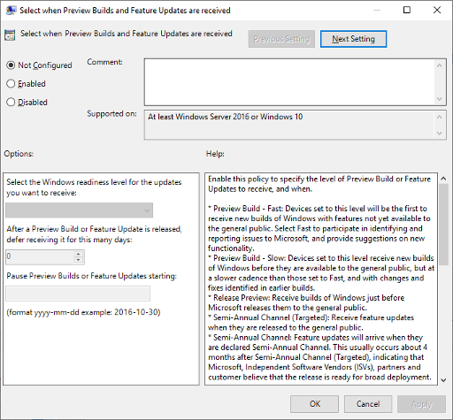

# Manage Windows 10 Insider Preview Builds 
Administrators can manage installation of Windows 10 Insider Preview Builds across multiple devices in their organization using the following steps: 

## Register your domain 
To authenticate multiple devices for Insider Preview builds, register your organization's Azure Active Directory domain with the Windows Insider Program. To register a domain, you must be registered in the Windows Insider Program with your work account in Azure AD (see [Register](wip-4-biz-register.md)) and you must also be assigned a Global Administrator role on that Azure AD domain. Also requires Windows 10 Version 1703 or later on the machine used for registration. 

> [!div class="nextstepaction"]
> [Register your domain](https://insider.windows.com/en-us/for-business-organization-admin/)

__NOTE:__ 
* The Windows Insider Program only supports registration of domains in Azure Active Directory (and not Active Directory on premises) as a corporate authentication method.
* Once a domain is registered, administrators do not have to register each individual device or user with the Windows Insider Program in order to apply Insider Preview build installation polices. 
* To get the most benefit out of the Windows Insider Program for Business, organizations should not use a test tenant of Azure AD. There will be no modifications to the Azure AD tenant to support the Windows Insider Program as it will only be used as an authentication method.

## Join devices to Azure Active Directory
In order to receive Insider Preview builds through Windows Update, devices must be joined to the same Azure AD domain that was registered with the Windows Insider Program. For devices on a local Active Directory not already joined to Azure AD, follow these steps: 

### To join individual devices 
1. Open __Settings__, and then select __Accounts__.
2. Select __Access work or school__, and then select __Connect__.
3. On the "Set up a work or school account" screen, select __Join this device to Azure Active Directory__.
4. On the "Let's get you signed in" screen, type your Azure AD email address (for example, alain@contoso.com), and then select __Next__.
5. On the "Enter password" screen, type your password, and then select __Sign in__.
6. On the "Make sure this is your organization" screen, review the information to make sure it's right, and then select __Join__.
 
See also [Join your work device to your organization's network](https://docs.microsoft.com/azure/active-directory/user-help/user-help-join-device-on-network). 

### To join multiple devices 
To join multiple devices on your local Active Directory to your Azure AD domain, use Azure AD Connect. For more details, see: [Integrate your on-premises directories with Azure Active Directory](https://docs.microsoft.com/azure/active-directory/connect/active-directory-aadconnect)

## Create and manage policies 
You can use Group Policy, Microsoft Endpoint Configuration Manager or MDM solutions such as Intune to configure the Windows Update for Business settings that control how and when Windows 10 Insider Preview Builds are installed on devices.  

__NOTE:__ 
* To enable installation of Insider Preview builds, telemetry on a device must be set to [Enhanced](https://docs.microsoft.com/windows/privacy/enhanced-diagnostic-data-windows-analytics-events-and-fields) (level 2) or [Full](https://docs.microsoft.com/windows/privacy/windows-diagnostic-data) (level 3). By default, Windows 10 devices are set to Full. If your device is currently in the Fast ring, [your settings will be different](https://aka.ms/DDChanges). For more information on diagnostic settings policies, see [Configure Windows diagnostic data in your organization](https://docs.microsoft.com/windows/privacy/configure-windows-diagnostic-data-in-your-organization).
* Windows Update for Business policies used to install Insider Preview Builds that are created with one management tool cannot be changed using another. For example, a policy set using Group Policy can only be changed on a client device using Group Policy and cannot be changed using Configuration Manager or Intune.  

### Set using Group Policy
1. In the Group Policy Management Console (GPMC), go to __Computer Configuration/Administrative Templates/Windows Components/Windows Update/Windows Update for Business__ 
2. Open __Manage preview builds__ to enable installation of Insider Preview builds on a device. This setting can also be used to prevent installation on a device and stop Insider Preview build updates once the release is public.  
3. Open __Select when Preview Builds and Feature Updates are received__ and select the Ring from which you want devices to receive Insider Preview builds (Fast, Slow, Release Preview). This setting can also be used to defer installation for a set number of days after release or pause installation of Insider Preview builds.  

See also:  
[Use Group Policy to configure Windows Update for Business](https://docs.microsoft.com/windows/deployment/update/waas-wufb-group-policy)  
[VIDEO: Installing and managing Preview Builds using Group Policy](https://www.youtube.com/watch?v=x1Lmv8Rl_rk)

### Manage device restarts after updates
You can schedule update installation and set policies for restart, configure active hours for when restarts will not occur, or you can do both.
To read more about how to manage device restarts after updates, see [Manage device restarts after updates](https://docs.microsoft.com/windows/deployment/update/waas-restart).

### Set using Microsoft Intune 
1. Log into the [Azure portal](https://portal.azure.com) and select __Intune__ under __Resources__.
2. Navigate to __Software Updates>Windows 10 Update Rings__. Click “+” to create an Update Ring policy.
6. Under __Servicing Channel__, select the Ring from which you want devices to receive Insider Preview builds. 
7. Adjust __Feature update deferral period__ if you want to defer deployment of Insider Preview builds for a certain number of days after release. 
8. Click __OK__ and __Create__ to set policy.
9. Go to __Assignments__ to assign the policy to users and devices. Note: you can create groups with one or more users or devices in Intune under __Groups__. 

See also:
[Manage software updates in Intune](https://docs.microsoft.com/intune/windows-update-for-business-configure)
[VIDEO: Installing and managing Preview Builds using Intune](https://www.youtube.com/watch?v=ka1lZghlhPM) 

### Set using other MDM service providers 
To set Windows Update for Business policies for Insider Preview builds using non-Microsoft MDM service providers, using the CSP settings below. For guidance on configuring CSPs, see [CSPs in MDM](https://docs.microsoft.com/windows/configuration/provisioning-packages/how-it-pros-can-use-configuration-service-providers#csps-in-mdm). 

[Update/ManagePreviewBuilds](https://docs.microsoft.com/windows/client-management/mdm/policy-csp-update#update-managepreviewbuilds) 

[Update/BranchReadinessLevel](https://docs.microsoft.com/windows/client-management/mdm/policy-csp-update#update-branchreadinesslevel)

### Install builds via Windows Server Update Services
You can manage pre-release builds directly from WSUS. To do this, go check the Windows Insiders Pre-release product and Upgrades category in WSUS Products and Classifications and sync WSUS. Then once the sync completes and shows up on WSUS console, approve it for whatever computer group you want the update deployed to, and deploy as you would any other update.

#### Set using Microsoft Endpoint Configuration Manager

1. In the __Products__ tab of __Software Update Point Component Properties,__ select the box next to __Windows Insider Pre-Release.__ 
__NOTE:__
*While this option will be visible on every version of Configuration Manager, you must be running Configuration Manager, version 1906 or newer to select it.)

2. If you already manage your organization’s deployments using Configuration Manager, use the same procedure you currently use to deploy any other Windows 10 feature update (Software Library > Overview > Windows 10 Servicing > All Windows 10 Updates). Once you reach the list of All Windows 10 Updates, you will see an option for “Windows Insider Pre-release Feature Update to Windows 10 Version 1909” as shown below:

3. Deploy the release the same way as any other feature update. 

### Install preview builds from Azure Marketplace 
Windows Insiders can now create and install a Windows 10 Preview build from the Azure Marketplace. After installing, you can preview the latest version on a virtual machine without any additional configurations or updates. See [Windows 10 Preview](https://azuremarketplace.microsoft.com/marketplace/apps/microsoft-hyperv.windows10preview) to learn more.

## Confirm installations  

### Confirm policy 
To confirm that your Windows Update for Business policies have been set correctly, go to __Settings>Update & Security>Windows Update__ on the device and click on "View configured update policies". You can also check the following key in the Registry Editor on the device: __HKEY_LOCAL_MACHINE\SOFTWARE\Policies\Microsoft\Windows\WindowsUpdate__. A device set to receive an Insider Preview build would show the following values: 
* BranchReadinessLevel = 2 (Fast), 4 (Slow) or 8 (Release Preview) 
* ManagePreviewBuilds = 1

NOTE: Once a policy has been set, the device must be restarted for the policy to be activated. 

## Related Topics
* [Deploy updates using Windows Update for Business](https://docs.microsoft.com/windows/deployment/update/waas-manage-updates-wufb) 
* [Register for the Windows Insider Program for Business](wip-4-biz-register.md)
* [Submit and track feedback using the Feedback Hub](wip-4-biz-feedback.md)

