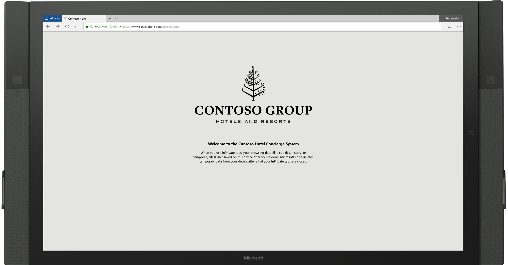
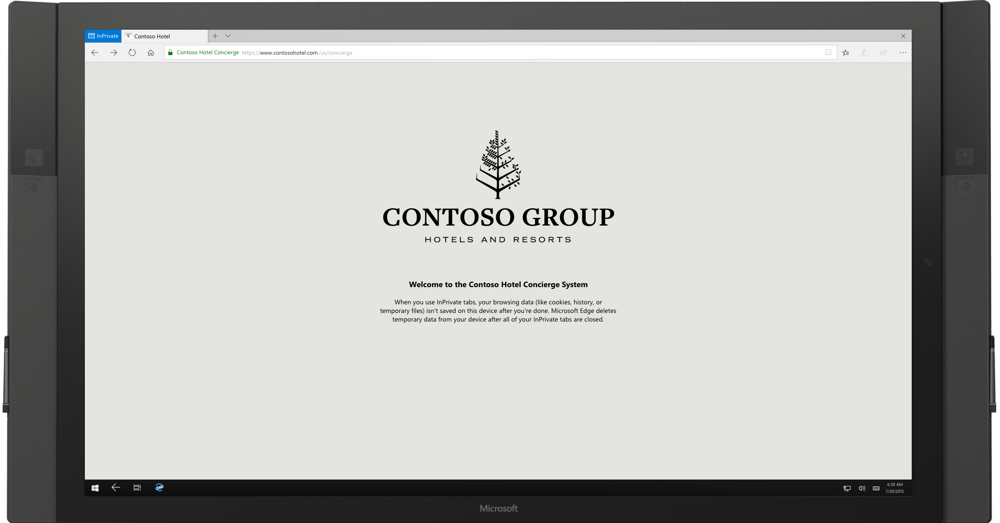
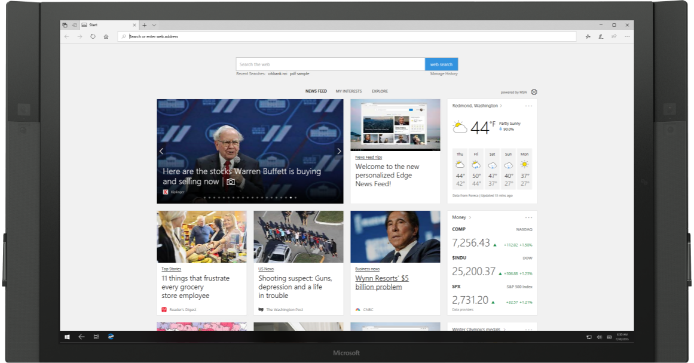

# What’s New in Windows 10 Insider Program for Business Preview Builds 
## Improved Kiosk Setup Experience (Build 17723)

We have introduced a simplified assigned access configuration page in Settings that allows device administrators to easily set up their PC as a kiosk or digital sign. This new page provides a wizard experience that walks you through the kiosk setup flow including creating a kiosk account that will automatically sign in on device start.

Please go to Settings, search for assigned access, and open the “Set up a kiosk” page to give it a try. We would love to hear your feedback! Let us know via the [Feedback Hub](wip-4-biz-feedback-hub.md).   

We are very excited to announce that Microsoft Edge now works with assigned access which allows IT administrators to create a tailored browsing experience designed for kiosk devices. Microsoft Edge kiosk mode supports the following four types.

For Microsoft Edge kiosk mode running in single-app assigned access the two kiosk types are:
1.__Digital / Interactive signage__ that displays a specific website full-screen InPrivate.
2.__Public browsing__ supports multi-tab browsing and runs InPrivate with minimal features available. Users cannot minimize, close, or open a new Microsoft Edge windows or customize it using Microsoft Edge Settings. Users can clear browsing data, downloads and restart Microsoft Edge by clicking “End session.” Administrators can configure Microsoft Edge to restart after a period of inactivity.

For Microsoft Edge kiosk mode running in multi-app assigned access the two kiosk types are (<i>Note the following Microsoft Edge kiosk mode types cannot be setup using the new simplified assigned access configuration page in Windows 10 Settings</i>):

3.__Public browsing__ supports multi-tab browsing and runs InPrivate mode with minimal features available. In this configuration, Microsoft Edge can be one of many apps available. Users can close and open multiple InPrivate windows.

4.__Normal mode__ runs a full version of Microsoft Edge, although some features may not work depending on what apps are configured in assigned access. For example, if the Microsoft Store is not set up, users cannot get books.

## New Microsoft Edge Group Policies (Build 17723)
The Microsoft Edge team introduced new Group Policies and MDM settings for IT administrators to manage Microsoft Edge. The new policies include enabling/disabling full-screen mode, printing, favorites bar, and saving history; prevent certificate error overrides; configuring the Home button and startup options; setting the New Tab page and Home button URL and managing extensions. Learn more about the [new Microsoft Edge policies](https://aka.ms/new-microsoft-edge-group-policies).

## Microsoft Edge kiosk mode (Build 17713)

Microsoft Edge kiosk mode works with assigned access to let IT administrators create a tailored browsing experience designed for kiosk devices. 
When you configure Microsoft Edge kiosk mode in assigned access, you can set it up to show only a single URL in full-screen, in the case of digital/interactive signage on a single-app kiosk device. You can restrict Microsoft Edge for public browsing (on a single and multi-app kiosk device) which runs a multi-tab version of InPrivate with limited functionality. Also, you can configure a multi-app kiosk device to run a full or normal version of Microsoft Edge. 
Learn more about [Microsoft Edge kiosk mode](https://docs.microsoft.com/en-us/microsoft-edge/deploy/microsoft-edge-kiosk-mode-deploy).

## Web sign-in to Windows 10 (Build 17713)
Until now, Windows logon only supported the use of identities federated to ADFS or other providers that support the WS-Fed protocol. We are introducing “web sign-in,” a new way of signing into your Windows PC. Web sign-in enables Windows logon support for non-ADFS federated providers (e.g.SAML).

### To try out web sign-in:
1. Azure AD Join your Windows 10 PC. (Web sign-in is only supported on Azure AD Joined PCs).
2. Set the Policy CSP/Authentication/EnableWebSignIn policy to enable web sign-in. 
3. On the lock screen, select web sign-in under sign-in options.
4. Click the “Sign in” button to continue.

## Faster sign-in to a Windows 10 shared pc (Build 17713)
Do you have shared PCs deployed in your work place? Introducing “fast sign-in,” which enables users to sign in to a shared Windows 10 PC in a flash!

### To enable fast sign-in,
1. Set up a shared or guest PC with Windows 10
2. Set Policy/Authentication/EnableFastFirstSignIn to enable fast sign-in
3. With the policy enabled, sign-in to a shared PC with your account and notice the difference!

## Windows Defender Application Guard Improvements (Build 17713)
Windows Defender Application Guard introduced a new user interface inside Windows Security in this release. Standalone users can now install and configure their Windows Defender Application Guard settings in Windows Security without needing to change Registry key settings. 

Additionally, users who are managed by enterprise policies will be able to check their settings to see what their administrators have configured for their machines to better understand the behavior of Windows Defender Application Guard. This new UI aims to improve the overall experience for users to manage and check their Windows Defender Application Guard settings. As long as devices meet the minimum requirements, these settings will appear in Windows Security.For detailed information, click [here](https://techcommunity.microsoft.com/t5/Windows-Insider-Program/test/m-p/214102#M1709).

To check this out, 
1. go to Windows Security and select App & browser control.

2. Select Install Windows Defender Application Guard under Isolated browsing, install and restart the device (only for standalone users).

3. Select Change Application Guard settings.

4. Configure or check Application Guard Settings.

## Remote Desktop with Biometrics (Build 17713)
We’re happy to share that with this build of Windows 10, Azure Active Directory and Active Directory users using Windows Hello for Business can use biometrics to authenticate to a remote desktop session!

To get started, bring up Remote Desktop Connection (mstsc.exe), type the name of the computer to which you want to connect and tap or click__Connect__.

Because you signed using Windows Hello for Business, Windows remembers how you signed in and automatically selects Windows Hello for Business to authenticate you to your RDP session but, you can click__More choices__ to choose alternate credentials.

In this example, Windows uses facial recognition to authenticate the RDP session to the Windows Server 2016 Hyper-V server. You can continue to use Windows Hello for Business in the remote session, but you must use your PIN.

##Windows 10 Pro S Mode requires a network connection (Build 17712)

Starting with Windows 10 Pro S Mode build 17712, a network connection is now required to set up a new device. As a result, we removed the “skip for now” option in the network setup page in OOBE. 

## Registry editor improvements (Build 17711)

Have you ever been typing into the regedit address bar, and the next part of the path is just on the tip of your tongue, but you can’t remember? Starting with build 17711, you’ll see a dropdown as you type to help complete the next part of the path. You can also press Ctrl + Backspace to delete the last "word," which makes backing up work that much faster (Ctrl + Delete will delete the next word).

## Security updates (Build 17704)

We’ve continued to work on the **Current threats** area in  [Virus & threat protection](https://docs.microsoft.com/windows/security/threat-protection/windows-defender-security-center/wdsc-virus-threat-protection), which now displays all threats that need action. You can quickly take action on threats straight from this screen: 

You can enable a new protection setting, **Block suspicious behaviors**, which brings [Windows Defender Exploit Guard attack surface reduction technology](https://docs.microsoft.com/windows/security/threat-protection/windows-defender-exploit-guard/attack-surface-reduction-exploit-guard) to all users. To enable this setting, go to the Virus & threat protection section and click **Manage settings**, as shown in the following screenshot:

With Controlled folder access you can help prevent ransomware and other destructive malware from changing your personal files. In some cases, apps that you normally use might be blocked from making changes to common folders like Documents and Pictures. We’ve made it easier for you to add apps that were recently blocked so you can keep using your device without turning off the feature altogether.

When an app is blocked, it will appear in a recently blocked apps list, which you can get to by clicking **Manage settings** under the **Ransomware protection** heading, and then **Allow an app through Controlled folder access**. After the prompt, click the plus button and choose **Recently blocked apps**. Select any of the apps to add them to the allowed list. You can also browse for an app from this page as well.

We've added a new assessment for the Windows time service to the **Device performance & health** section. If we detect that your device’s time is not properly synced with our time servers and the time-syncing service is disabled, we’ll provide the option for you to turn it back on.

We’re continuing to work on how other security apps you’ve installed show up in the Windows Security app. There’s a new page called **Security providers** that you can find in the Settings section of the app. Click **Manage providers** to see a list of all the other security providers (including antivirus, firewall, and web protection) that are running on your device. Here you can easily open the providers’ apps, or get more information on how to resolve any issue that they have reported to you through the Windows Security app.

This also means you’ll see more links to other security apps within the Windows Security app. For example, if you open the **Firewall & network protection** section, you’ll see the firewall apps that are running on your device under each firewall type (domain, private, and public networks).
 
The Windows Security Center (WSC) service now requires antivirus products to run as a protected process to register. Products that have not yet implemented this will not appear in the Windows Security UI, and Windows Defender Antivirus will remain enabled side-by-side with these products. 
For testing purposes, you can disable this new behavior in Windows Insider builds by creating the following registry key and rebooting the device.  This key will be removed as we get closer to release. 

<pre>HKLM\SOFTWARE\Microsoft\Security Center\Feature 
DisableAvCheck (DWORD) = 1 </pre>

## Windows Defender Security Center is now called Windows Security (Build 17661)

You can still get to the app in all the usual ways – simply ask Cortana to open Windows Security or interact with the taskbar icon. Windows Security lets you manage all your security needs, including Windows Defender Antivirus and Windows Defender Firewall. 

## Windows Security Center gets a Fluent Design refresh (Build 17650)
We’ve heard your feedback and we’ve updated Windows Security Center (WSC) to include the Fluent Design elements you know and love. You’ll also notice we’ve adjusted the spacing and padding around the app and will now dynamically size the categories on the main page if more room is needed for extra info. Last but not least, we’ve also updated the title bar of the app so that it will now use your accent color if you’ve enabled that option in Color Settings – with Sets enabled, you will see this color in the WDSC tab.

## Windows Defender Firewall now supports Windows Subsystem for Linux (WSL) processes (Build 17627)
You can add specific rules for a WSL process in Windows Defender Firewall, just as you would for any Windows process. Also, Windows Defender Firewall now supports notifications for WSL processes. For example, when a Linux tool wants to allow access to a port from the outside (like SSH or a web server like nginx), the Windows Defender Firewall will prompt to allow access just like it would for a Windows process when the port starts accepting connections. This was first introduced in [Build 17627](https://docs.microsoft.com/en-us/windows/wsl/release-notes#build-17618-skip-ahead).

## Windows Autopilot self-deploying mode (Build 17672)

Windows AutoPilot has a self-deploying mode in RS5 that enables a zero touch device provisioning experience. Simply power on the device, plug it into the Ethernet, and the device is fully configured automatically by Windows Autopilot. 

This self-deploying capability removes the current need to have an end user interact by pressing a “Next” button during the deployment processes. In addition, the activities opt-in page in OOBE has also been removed from all Insider Preview builds. 

Utilize Windows Autopilots self-deploying mode to completely register the device to an AAD tenant, enroll in your organization’s MDM provider, ensure all policies, applications, etc. are correctly provisioned on the device with no user authentication or user interaction required, before the end user even logs in. 

To learn more about the Autopilot Self-Deploying feature and see the step by step instructions to perform such a deployment, [click here](https://docs.microsoft.com/en-us/windows/deployment/windows-autopilot/self-deploying). 

## Windows 10-S Credential Guard is supported by default on 10S devices that are AAD Joined

Credential Guard is a security service in Windows 10 built to protect Active Directory domain (AD) credentials so that they can't be stolen or misused by malware on a users machine. It is designed to protect against well-known threats such as Pass-the-Hash and credential harvesting.

Credential Guard has always been an optional feature, but Windows 10-S turns this functionality on by default when the machine has been AAD joined. This provides an added level of security when connecting to domain resources not normally present on 10-S devices. Please note that Credential Guard is available only to S-Mode devices or Enterprise and Education Editions. 

## BitLocker silent enforcement on fixed drives
Through an MDM policy, BitLocker can silently be enabled for standard AAD Joined users. In RS4 (Windows 10 build 1803) automatic BitLocker encryption was enabled for standard AADJ users, but this still required modern hardware that passed the Hardware Security Test Interface (HSTI). This new feature functionality enables BitLocker via policy even on devices that don’t pass the HSTI. 

This is an update to the [BitLocker CSP](https://docs.microsoft.com/en-us/windows/client-management/mdm/bitlocker-csp), which was introduced in Windows 10 build 1703, and leveraged by Intune and others. 
This feature will soon be enabled on Olympia Corp as an optional feature.

##  Delivering BitLocker policy to AutoPilot devices during OOBE 

As an IT admin you can choose which encryption algorithm to apply to a device on your automatic BitLocker encryption capable devices, rather than automatically having those devices encrypt themselves with the default algorithm. This new functionality allows the encryption algorithm, and other BitLocker policies that must be applied prior to encryption starting, to get delivered before automatic BitLocker encryption begins. 

For example, as an IT admin for your organization you can choose the XTS-AES 256 encryption algorithm, and have it applied even for devices that would normally encrypt themselves automatically with the default XTS-AES 128 algorithm during OOBE.

