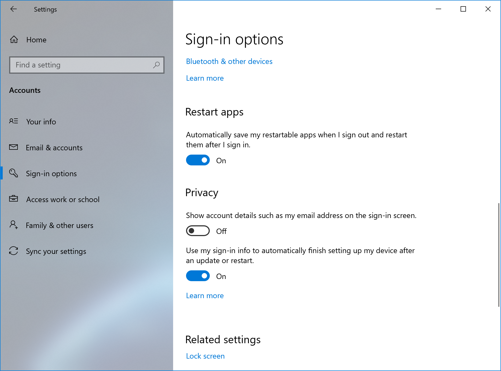
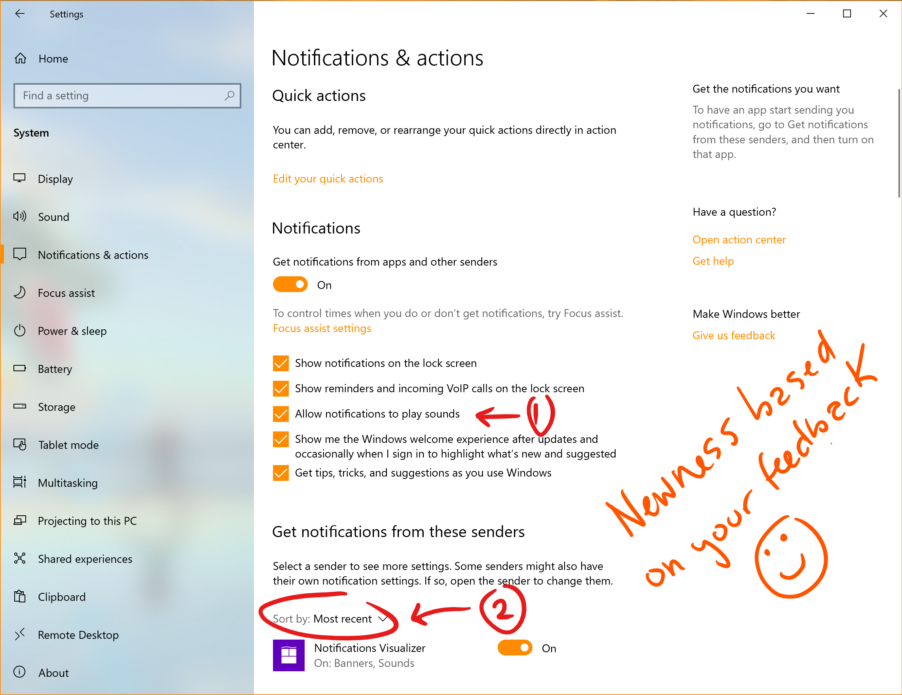

# What’s new for business in Windows 10 Insider Preview Builds

## Windows Subsystem for Linux (WSL) improvements (Build 18980)
In this build, we’ve added WSL2 support for ARM64 devices! We’ve also added the ability to set your distribution’s default user using the /etc/wsl.conf file. This release also contains multiple bug fixes, including a long-standing issue for legacy Windows symlinks (for example those in the user profile directory.)

For the full details of changes in this latest Insider Preview build, please see the WSL release notes.

## Introducing the ability to move the Cortana window (Build 18975)
With the [new conversational Cortana experience](https://blogs.windows.com/windowsexperience/2019/07/26/announcing-windows-10-insider-preview-build-18945/), we understand that you want to keep the chat going sometimes, and the default position of the window isn’t always where you’d prefer to have it docked if you’re going to have a longer back and forth. That’s why we’ve rolled out the option to be able to move the window (by dragging the title bar area), to anywhere you’d like on the screen–just like you can with other windows. You can also resize the window if you’d like.

## Update on Virtual Desktop renaming (Build 18975)
The ability to rename your virtual desktops is now available for all Insiders in the Fast ring! Thanks again everyone who shared feedback requesting this.
To get started:
1. Open Task View by selecting the Task View icon in the taskbar or pressing WIN+Tab.
2. Select New Desktop.
3. Select the desktop name (“Desktop 1”) and it should become editable, or right click the desktop thumbnail and a context menu will appear with a Rename entry.
4. Input whatever name you’d like, and press enter.
5. Done!

## Introducing a new PC reset option (Build 18970)
Reset this PC provides users a new choice to download Windows or use local reinstall. Previously, Reset this PC was only able to do a local reinstall and would build a new Windows installation from existing Windows files. When this feature was introduced in Windows 10 version 1507, it provided the advantage of enabling Windows to be recoverable without requiring extra disk space to store a compressed, backup copy of Windows in a hidden partition. We’ve heard feedback that some of you would prefer to use your high-speed internet connection to speed up this process by just downloading Windows.

>[!NOTE]
>This is a recovery operation and will remove apps you have installed. Additionally, if the “Remove everything” option is selected, user data will also be deleted. For more information on Reset this PC and other recovery options, [visit the link here.](https://support.microsoft.com/en-us/help/12415/windows-10-recovery-options)

The cloud download option will reinstall the same build, version, and edition, that is currently installed on your device. This new cloud download option is available to all Windows 10 devices and is different from the “Recover from the cloud” feature available on some earlier Windows 10 devices.

## New tablet experience for 2-in-1 convertible PCs (Build 18970)

Windows Insiders can take part in the new Beta tablet experience for 2-in-1 convertible PCs.

This new experience allows users entering tablet posture to stay in the familiar desktop experience without interruption, plus a few key touch improvements:
* Increased spacing between Taskbar icons.
* Search box on taskbar collapsed into an icon.
* File Explorer switches to touch-optimized layout.
* Touch keyboard auto invokes when you tap text fields.

As part of this, we’ve also made a few small changes to the tablet section in Settings.
Here are the steps once it becomes available on your PC:
1. Use your convertible PC as a laptop as you usually would–opening apps and interacting with them.
2. When you’re ready to pick it up and go or lean back on the couch, you can fold back the keyboard or remove it altogether, and it should switch to this new model shown above.
3. Now use your device as a tablet with touch.

## Control over restarting apps at sign-in (Build 18965)
Applications can register for restart, which helps in a few situations, including enabling you to get back to what you were doing if you need to restart your PC. Previously this option was tied to the “Use my sign-in info to automatically finish setting up my device” option under Sign-in options in accounts settings. We’ve heard feedback that some of you would prefer more explicit control over when Windows automatically restarts apps that were open when you restart your PC, and with 20H1 we’re bringing that option to you.

Windows puts you in control with a new app restart setting. When turned on, Windows automatically saves your restartable apps when signing out, restarting, or shutting down Windows, and restarts them next time you sign in. This setting is off by default and you can change it any time in Settings > Accounts > Sign-in options, and can find it by searching for “restart apps” in Start or the search box.

## Improving the Optional Features page in Settings (Build 18963)
Based on your feedback, we’ve made a number of usability improvements to the Optional Features page in Settings (Settings > Apps & Features > Optional Features).

* __Multi-select:__ You can select and install multiple optional features at the same time.
Better list management: You can search through lists of optional features and sort them by Name, Size, and Install date.
* __More useful information:__ You can see the install date for each optional feature in your ‘Installed features’ list. We’ve also added feature dependencies to the description of each optional feature in the list of features available for install.
* __Easier page navigation:__ View the status of your latest installs/uninstalls/cancel right on the main page in the ‘Latest actions’ section. You can add optional features and view your history via pop-up dialogues, so you never have to navigate away from the main page

## Making Notepad store-updatable (Build 18963)
Notepad has been a well-loved text editor in Windows for over 30 years. Over the last few releases, we’ve been making a number of small improvements to Notepad based on your feedback (including [expanded line ending support](https://devblogs.microsoft.com/commandline/extended-eol-in-notepad/), [wrap around search](https://blogs.windows.com/windowsexperience/2018/07/11/announcing-windows-10-insider-preview-build-17713/), and [indicating when there’s unsaved content](https://blogs.windows.com/windowsexperience/2018/12/10/announcing-windows-10-insider-preview-build-18298/#5443RXdQaojX3WyZ.97).) Starting with this build, we’re making a change so that future Notepad updates will be automatically available via the store. This will allow us the flexibility to respond to issues and feedback outside the bounds of Windows releases. As always, if you have any feedback for Notepad, we welcome it in the Feedback Hub under [Apps > Notepad](http://aka.ms/notepadfeedback).

## Adding Mouse Cursor speed to Settings (Build 18963)
You can set your mouse cursor speed from within Settings! This is the latest piece of our larger ongoing effort to converge Settings and Control Panel experiences. You can find the setting under Settings > Devices > Mouse.

## GPU temperature comes to Task Manager (Build 18963)
One of the longstanding requests we’ve been tracking for Task Manager is to add temperature monitoring support, and with today’s build we’re making progress on that ask. If you have a dedicated GPU card, we will bubble up the current temperature next to its listing in the Performance Tab.

## A redesigned Network Status page in Settings (Build 18956)
Based on your feedback, we’re revamping the Network & Internet landing page in Settings to provide more information at a glance about your device’s connectivity, combining several pages to give you one clear view of how you are connected to the internet.
* __New view of active connections:__ We show all available connection interfaces on the Status page, so you can quickly see what is connected and view and change properties as needed. If you have multiple connections, only one will be used for internet connectivity at a time, and that one is still shown in the Status diagram at the top of the page.

* __Integrated Data Usage:__ You can see how much data is being used by a network right from the Status page! If it looks like you’re using a lot of data, you can drill into the Data Usage page to create a limit for that network, which will warn you if you get close or go over your limit. You can also see how much data each app is using on that network.

We hope you like the changes! If you have any feedback about these, you can share it via the Feedback Hub under Network and Internet > Networking Experience – Look and Feel.

## Notification settings improvements (Build 18956) 
Thanks everyone who’s tried out our [improvements so far](https://blogs.windows.com/windowsexperience/2019/07/03/announcing-windows-10-insider-preview-build-18932/). To recap what you’ll see when you have the change:
* If you hover your mouse over an incoming notification, you’ll see a settings icon to make it easy to adjust that app’s notification settings.
* We’ve updated the design of the per-app notification settings for visual clarity.
* There’s a direct link to notification settings at the top of the Action Center.
* Notifications & Action Settings has a checkbox for muting the sound of all notifications.
* By default, the senders in Notifications & Action Settings are sorted by “most recently sent a notification.”

## Windows Subsystem for Linux (WSL) Improvements (Build 18945) 
### Added connecting via localhost to WSL 2 Linux apps from Windows and global WSL configuration options

You’ll be able to connect to your WSL 2 Linux networking applications using localhost. For example, the image below shows starting a NodeJS server in a WSL 2 distro, and then connecting to it in the Edge Browser with localhost.

Additionally, we’ve added global configuration options for WSL. These are options that will apply to each of your WSL distros. This also allows you to specify options that relate to the WSL 2 virtual machine (VM), as all your WSL 2 distros run inside of the same VM. The most exciting option that you’ll get access to in this build is able to specify a custom Linux kernel!
For the full details on what’s new in this release, check out [What’s new for WSL in Insiders Preview Build 18945](http://devblogs.microsoft.com/commandline/whats-new-for-wsl-in-insiders-preview-build-18945) on the Windows command line blog.

## Updated File Explorer search (Build 18945)

We heard your feedback asking for increased consistency, and to make it easier to find your files. We are happy to announce that you can now take advantage of the new File Explorer search experience – powered by Windows Search. This change will help integrate your OneDrive content online with the traditional indexed results.

What does that mean for you? Once you have the new experience, as you type in File Explorer’s search box, you’ll now see a dropdown populated with suggested files at your fingertips that you can pick from.

These improved results can be launched directly by clicking the entry in the new suggestions box, or if you want to open the file location, just right-click the entry and there’ll be an option to do so. If you need to use commands or dig deeper into non-indexed locations, you can still press enter and populate the view with the traditional search results.

Showing the new dropdown that appears when you type in File Explorer’s search box.

We’ve also updated the design, so as soon as you click the search box in File Explorer (or press CTRL+E to set focus to it), you’ll see the dropdown list with your search history.

If you encounter any issues, or have any feedback, file them under “Files, Folders, and Online Storage” > “File Explorer” in the Feedback Hub.

>[!NOTE]
>You may notice in the screenshot, we’ve made the File Explorer search box wider so the suggestions dropdown has a bit more room to show results – that’s not a new option, but we figured you might want to know how to do it: just move your mouse to the starting border of the search box, and your mouse should turn into a resizing double arrow cursor. Just click down and drag the search box to be a bit wider.

## New Cortana experience for Windows 10 (Build 18945)
Now available, a new Cortana experience for Windows 10 as a Beta to Windows Insiders in the U.S. This new experience features a brand-new chat-based UI that gives you the ability to type or speak natural language queries.

It supports most of the Cortana features people enjoy using on Windows, such as Bing answers, Assistant conversations, opening apps, managing lists, and setting reminders, alarms, and timers. And we’ve added some new features we think people will enjoy:

* Cortana supports both light and dark themes in Windows.
* We have created a new, less intrusive screen for “Hey Cortana” queries so you can stay in the flow while you work.
* We have updated Cortana with new speech and language models, and significantly improved performance – making it faster and more reliable than ever before.

Not all the features from the previous Cortana experience are available just yet. As a Beta, we plan to add more features over time with updates to Cortana from the Microsoft Store.

To get started, choose the Cortana icon on the taskbar next to the search box. You can also leverage the speed and convenience of voice with improved speech recognition by simply saying “Hey Cortana”*. You may need to sign-in with your account to get started.

>[!NOTE]
>This requires enabling this functionality in Settings > Voice activation privacy settings  – Talk to Cortana. 

Additional markets and languages will become available at a later date. You must be signed in to use Cortana. Historically, there were quite a few skills that could be used unauthenticated (Bing answers, open apps, Assistant conversations) but this is no longer the case.

## Refining your notification settings (Build 18932)
Over the last few releases, based on your feedback, we’ve been working on giving you more control over potential interruptions. [Introducing Focus Assist](https://blogs.windows.com/windowsexperience/2018/05/09/windows-10-tip-how-to-enable-focus-assist-in-the-windows-10-april-2018-update/#6pHjPV1ym9QaGIuO.97) to automatically suppress notifications when you’re trying to stay in the moment and not get distracted, and adding the option to use middle click to dismiss notifications if you want to quickly make a notification toast go away.
One thing we’ve heard from you, though, is that our notification settings aren’t easily discoverable. In addition, once you find the settings, they can be difficult to understand.
In order to address this, we’ve made a few changes, including:
1. When you receive a notification toast, there will be an inline option to turn off notifications for that app, or head to the app’s notification settings.

2. When you dive into an app’s notification settings, you’ll find that we’ve added pictures to help articulate the impact of a certain settings.

3. Prefer to have all your notifications muted? You no longer have to go to the old sound control panel to do that – we’ve added it as a top-level option in Notification & Actions Settings.

4. But wait, there’s more! We’ve also added a new direct link at the top of the Action Center to manage notifications, so it takes one less step to get to Notification & Actions settings. To make room for this we’ve moved the “no notifications” text down to the middle of the Action Center, which also means your eyes don’t have to traverse as far to see it when you launch the Action Center from the bottom of the screen.

5. Finally, ever dismissed a notification you wanted to disable, and went to Notification & Actions Settings only to find the list of notification senders to be really long? You can sort the list by which apps most recently sent notifications.

## Windows Subsystem for Linux 2 (Build 18917)
WSL 2 is a new version of the architecture that powers the Windows Subsystem for Linux to run ELF64 Linux binaries on Windows. This new architecture, which uses a real Linux kernel, changes how these Linux binaries interact with Windows and your computer’s hardware, but still provides the same user experience as in WSL 1 (the current widely available version). WSL 2 delivers a much faster file system performance and full system call compatibility, which lets you run more applications like Docker!
[Read more about the release of WSL 2](https://devblogs.microsoft.com/commandline/wsl-2-is-now-available-in-windows-insiders/).

## New download throttling options for Delivery Optimization (Build 18917)
We’ve heard from our users with very low connection speeds that setting download throttling as a percentage of available bandwidth isn’t providing enough relief in reducing the impact on their network. That’s why we’ve added a new option to throttle the bandwidth used by Delivery Optimization as an absolute value. You can set this separately for Foreground downloads (downloads that you initiate from Windows Store for example) or background downloads. This option already exists for IT Pros who use Group Policies or MDM policies to configure Delivery Optimization. In this build, we’ve made it easier to set via the settings page. You can access this option via Settings > Update & Security > Delivery Optimization > Advanced Options

## Disk type visible in Task Manager Performance tab (Build 18898)
A small, but perhaps convenient change — you’ll be able to see the disk type (e.g. SSD) for each disk listed in Task Manager’s performance tab. This is particularly helpful in cases where you have multiple disks listed, so you can differentiate between them.

## Improved Windows Sandbox accessibility (Build 18855)
We have made several updates to improve Windows Sandbox accessibility scenarios. This includes: 
* Microphone support
* Added functionality to configure the audio input device via the Windows Sandbox config file
* A Shift + Alt + PrintScreen key sequence in Windows Sandbox which activates the ease of access dialog for enabling high contrast mode.
* A ctrl + alt + break key sequence in Windows Sandbox which allows entering/exiting fullscreen mode

## Windows Sandbox configuration file support (Build 18841)
Windows Sandbox supports configuration files! These files allow users to configure some aspects of the sandbox, such as vGPU, networking and shared folders. [Check out the blog post explaining this new feature](https://aka.ms/WindowsSandbox_ConfigFile).
