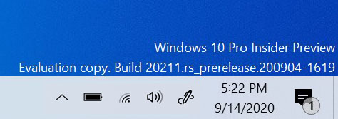
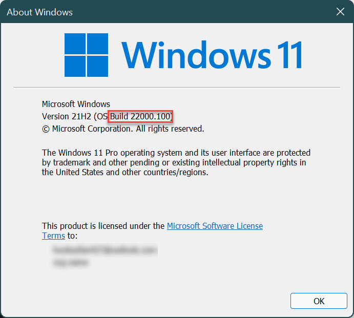
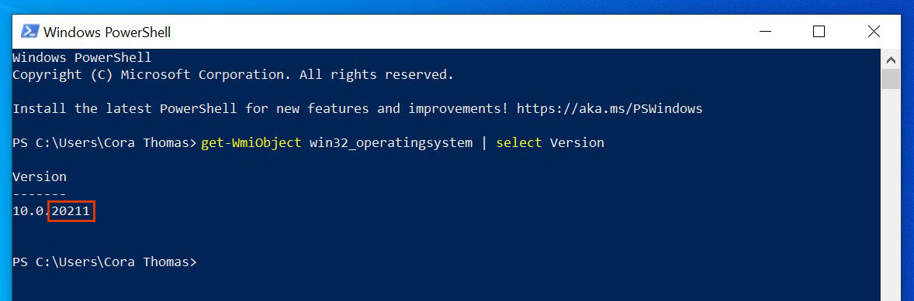
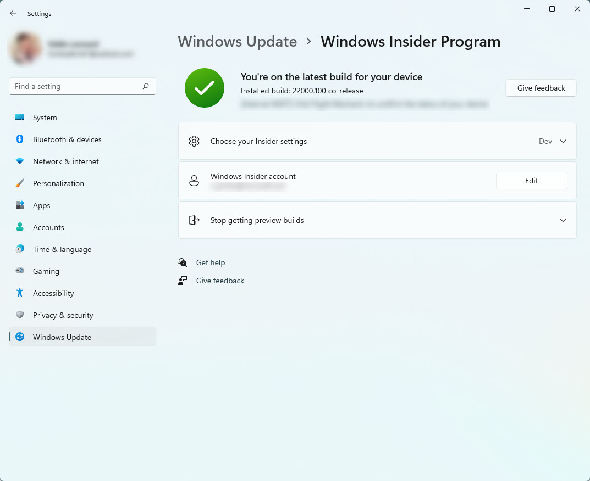

# Checking if you're flighting
Flighting is the process of running Windows 10 Insider Preview Builds on your device. We know that sometimes it can be hard to tell if you’re flighting and successfully receiving updates, but there are some quick and easy ways to know which Insider Preview build your device is on and what your Windows Insider settings are.

To see the latest build number for your channel, [check out Flight Hub](./flight-hub/index.md).

## Check for the watermark

If you’re on an Insider Preview build, you should be able to see a watermark on the bottom right of your desktop, right above the time and date in your taskbar, that tells you exactly which version of Windows you’re running.

Sometimes, as builds in the Beta Channel and Release Preview Channel get close to retail however, this goes away. If you think you’re flighting but aren’t seeing the watermark, double-check which version you’re on with one of the other methods below.

## Look at About in Settings

You can also see which version of Windows your device is on in the About section of Settings. Go to [**Settings** > **System** > **About** > **Windows specifications**](https://aka.ms/AboutSettings) to see which edition, version, and OS build your device is on.

## Run the winver command

Need a quick, easy way to pull up your Windows details? Just type **winver** into the search on your taskbar, then select it to run the command. A window will open telling you which version and Insider Preview build you’re on.

## Check your build with PowerShell

Prefer to use PowerShell to check your build? Open PowerShell on your device, and in the prompt, type in:

* **Get-WmiObject win32_operatingsystem | select Version**

Hit enter, and it will pull up which version your device is on. The last numbers in the set are the Insider Preview build you’re on.

## Double-check your Windows Insider settings

If checking your device information made you realize you’re not on the build that you expected, make sure your Windows Insider Program settings are right. Go to [**Settings** > **Windows Upadate** > **Windows Insider Program**](https://aka.ms/WIPSettings) to check if your registered Insider account is connected and if you’re in the right channel. [Learn more about our channels and what you can expect to see in each.](./flighting.md)

If everything there looks correct, but you still aren’t receiving updates, [check out our troubleshooting section for more help fixing your updates](./troubleshooting.md#not-receiving-updates).

