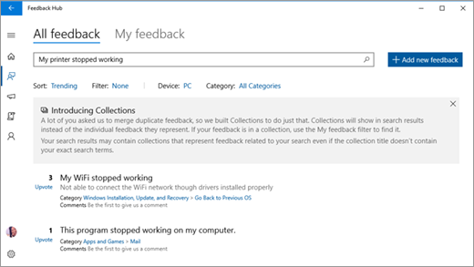
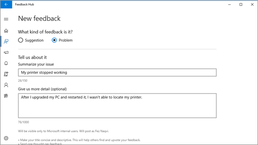

#  Send feedback to Microsoft with the Feedback Hub App
The Feedback Hub app lets you tell Microsoft about any problems you run in to while using Windows 10 and send suggestions to help us improve your Windows experience.

Sending a suggestion or reporting a problem can be as easy as finding feedback similar to yours and upvoting it. However, if there isn’t feedback like yours, then go ahead and create some new feedback for us. You can even attach some screenshots or recreate a problem to help us see what you’re experiencing.

When you open the Feedback Hub app, you’ll see the Home page.

#### Note

When opening the Feedback Hub app, you may see a message to change your Feedback settings from Basic to Full or Enhanced. Select the link in the message to go to Settings. Enhanced lets you send verbatim feedback and Full lets you send diagnostic information so we can help diagnose problems on your device.

Here’s what you’ll find on the Home page:
 - The **All feedback** view showing feedback from other customers and the **My Feedback** view to see feedback you’ve created or upvoted.
- A search box, with the default text **Give us feedback to make Windows better**. This is where you enter text to search existing feedback.
- The  **Add New Feedback button**, which you use after you’ve searched for feedback like yours.
- The following options for displaying feedback on the Home page:

  - **Sort**. Arrange feedback by number of upvotes, most recent, or top trending.
  - **Filter**. Display only problems or suggestions.
  - **Device**. Display feedback for PC, mobile, or HoloLens.
  - **Category**. Display feedback for a specific category, such as Cortana and Search, Apps and Games, or Calling and Messaging.

- Intro to collections. You may find your individual feedback merged into a collection of similar feedback.

- The **Upvote** option next to feedback entries so you can add your voice without needing to file duplicate feedback.

#### Note

If you need to report a problem that requires a more immediate or direct response, use the Get Help app or go to support.microsoft.com.

## Find existing feedback to upvote

1. Select the Start  button, and then open Feedback Hub .
2. In the search box at the top of the home page, type your problem or suggestion and then select the search  icon at the far right of the search box.
3. In the search results, look for feedback similar to yours. The more specific your search query, the better chance you’ll have of displaying feedback like yours. 
    -  If you find similar feedback, select **Upvote**.
    - If you don’t find any feedback or a good match to yours then add your own!

## Add New Feedback

#### Note 

Make sure your description is about one issue. File separate feedback for each problem or suggestion.

1. Select  **Add new feedback** next to the search bar.
2. Tell us whether you’re sending a problem or suggestion.
3. In the **Summarize your issue** box, provide a concise but clear title for your problem or suggestion.
4. In the **Give us more detail (optional)** box, you can give us more specific information, like how you encountered the problem.
5. Select a category that corresponds to your feedback. For example, if your printer stopped working, you’d select **Hardware, Devices, and Drivers**.
6. Select a subcategory—like **Print** for problems with printing.
7. (Optional). If you select **problem** for your feedback - select how the problem impacted your experience, with 1 being a minor problem and 5 being a major problem.
8. (Optional) Step through the problem while capturing the steps so we can see what happened. 
    1. Select **Recreate the problem (recommended)**.
    2. Select the type of problem you’re having, and select **Start capture**.
    3. Do the steps that led to the problem.
    4. When you’ve completed the steps, select **Stop capture**.

#### Notes

- You can close Feedback Hub if you need to and the capture will continue.
- Even though capturing is optional, it’s a good way to help Microsoft determine the cause of the problem and address it for you and others having that problem.

9. (Optional) Send a screenshot to help show the problem. 
 - Go to where the problem happened, press the **Windows logo key + Print screen** to take a picture of your screen.
 - Select **Attach a screenshot**, go to the Pictures/Screenshots folder, select the screenshot you want to send, and then press **Enter**.
10. When you’re satisfied with your feedback, select **Submit**.
