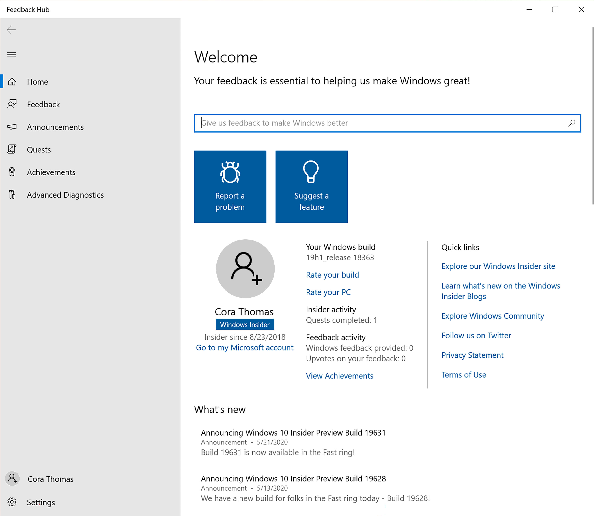

# Explore the Feedback Hub 

The [Feedback Hub](https://aka.ms/WIPFeedbackHub) is an app available on Windows devices. You can search for it, press **Win** + **F** to open it, or find it in your Start menu to get started. Sign in with the account that that you used to register for the Windows Insider Program to get access to all its features.

## Home section

First, the **Home** section is where you land when you open the app, which shows the account you're logged into and some key quick links. 

## Feedback section

The **Feedback** section shows you all the current feedback and has filters to help you look through it. You can also add your own new feedback, upvote suggestions from others, or add comments. You'll also see **Collections**, which group together similar feedback, making it easier to find.

Use the **My feedback** tab to go back and look at all of your past feedback and check its status. If you start feedback but don't submit it, a **Drafts** tab will also show up here. From there, you'll be able to open a feedback draft, continue to edit it, and submit when you're ready.

## Announcements section

In **Announcements**, you'll see quick versions of the latest Windows Insider news. You can also [read full versions of these announcements in our flight blog posts](https://blogs.windows.com/windows-insider/). 

## Quests section

In **Quests**, follow our step-by-step instructions to try out Windows features we're currently working on improving with your feedback. For each Quest you finish, you'll earn points towards badges, which you'll see in the **Achievements** section. 

## Achievements section

In the **Achievements** section, you'll see all the badges you've earned as a Windows Insider from flighting, Quests, and more.

## Advanced Diagnostics section

In the **Advanced Diagnostics** section, you can save a copy of diagnostics to your device. Choose either default or custom diagnostics and the category, subcategories, and type of problem from the dropdowns, then start your recording.

## Your account

At the bottom of the menu, you'll see either your account name and picture, which means you're logged in, or an icon you can select to log in.

## Settings

Finally, you'll see **Settings** at the very bottom of the menu. This lets you choose when you get notifications, adjust your theme or diagnostics settings, and see some of your device information. 

> [!NOTE] 
> Ready to start giving feedback? [Learn more about how to give great feedback.](../feedback.md)

