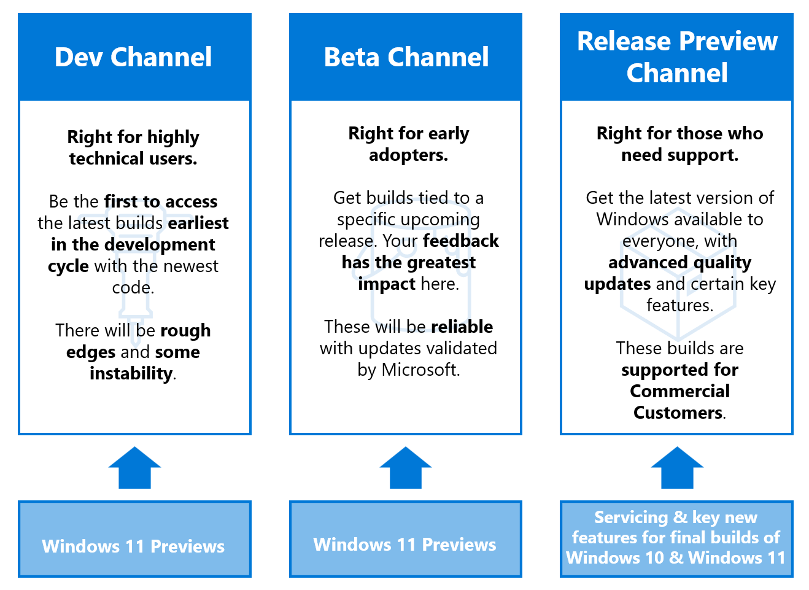

# Deeper look at flighting

## What is flighting?
Flighting is the process of running Windows Insider Preview Builds on your device. When you run these early versions of Windows and give us feedback, you can help us shape the future of Windows. Once you've registered for the program, you can run Insider Preview builds on as many devices as you want, each in the channel of your choice.

## What are channels?
We release Insider Preview builds to you through channels, which are each designed to bring you a different experience based on the quality of Windows you need for your life and your device. When choosing a channel, you should keep in mind:

1. How stable you need your device to be
2. What level of issues you can handle on your device
3. How early in development you'd like to see features and changes
4. Whether or not you need Microsoft support

As we continue to evolve the way we’re building and releasing Windows in the future, we may introduce new channels to bring you new experiences.

### Dev Channel
The Dev Channel is for highly technical users who love to be the first to see the latest features and updates for all things Windows. It will get builds that are earliest in a development cycle with the latest work-in-progress code from our engineers. These aren't always stable builds, and sometimes you will see issues that block key activities or require workarounds while flighting in this channel.

These builds aren't matched to a specific release, which means these may simply be the latest work-in-progress code from our engineers. New features and OS improvements in this channel will show up in future Windows releases when they're ready, and we may deliver them as full OS build updates or servicing releases. Your feedback here will help our engineers with major fixes and changes to the latest code.

### Beta Channel
The Beta Channel is for early adopters and IT professionals who want to see what's next or validate the latest Windows updates and features, but still need reliable updates that are validated by Microsoft.

As a part of the Beta Channel, you'll be seeing builds tied to a specific upcoming release, like Windows 11. Your feedback will be especially important here, since it will help our engineers make sure that key issues are fixed before major releases.

### Release Preview Channel
In the Release Preview Channel, Insiders and IT professionals get the upcoming version of Windows before it's released to the world, with advanced quality updates and certain key features. These builds are also supported by Microsoft if you're in the [Windows Insider Program for Business](./business/index.yml).

## Our move from rings to channels

For Windows Insiders who were already flighting, you were automatically moved to the new channel that corresponded to your old ring. The Fast ring moved to the Dev Channel, the Slow ring moved to the Beta Channel, and the Release Preview ring move to the Release Preview Channel.

IT administrators can still manage builds from the Beta Channel and Release Preview Channel using the same tools you'd used to manage your policies before or through Azure Marketplace virtual machines.

If you want to try out a new experience, go to [**Settings** > **Update & Security** > **Windows Insider Program**](https://aka.ms/WIPSettings) to change your channel. 

## Switching between channels

If you've installed an Insider Preview build in the Beta Channel or Release Preview Channel, switching between channels is easy. But if you've installed a build in the Dev Channel, because it's not tied to a specific release, it will depend on your current build and the current flighting build in the channel you want to switch to, as to what steps you will need to perform.

### Switching from the Beta Channel or Release Preview Channel

1. Go to [**Settings** > **Update & Security** > **Windows Insider Program**](https://aka.ms/WIPSettings).
2. Under **Pick your Insider settings**, select your current channel to open all the channel options. 
3. Choose the radio button beside the channel you'd like to switch to. Your Settings will update to your new channel.
4. The next time you receive an update, it will be for your new channel.

### Switching from the Dev Channel
Occasionally it may become possible to switch a device from the Dev Channel to another channel. To determine which process is needed to switch from the Dev Channel, you first need to find your current build number and compare it to the current build number in the channel you wish to switch to.   

To find your current build, you can [check the watermark in the right bottom of your desktop, look at About in Settings, or run the winver command](./check-flighting-status.md).   

Next determine what is the currently flighting build in the desired channel by checking [Flight Hub](https://aka.ms/FlightHub). 

If your current build number is equal to, or lower than the build number in the channel you want to move to:  
1. Open [**Settings** > **Windows Update** > **Windows Insider Program**](https://aka.ms/WIPSettings). 
2. Select **Choose your Insider settings**.  
3. Select the desired channel, either **Beta Channel (Recommended)**, or **Release Preview Channel**.  
4. The next time you receive an update, it will be for your new channel. 

> [!NOTE] 
> It may take some time before updates are available in the new channel you selected.   

If your current build number is higher than the build number in the channel you want to move to:
1. [Do a clean installation of Windows on your device with these instructions.](./isos.md)
2. Once you've reinstalled Windows, go to [**Settings** > **Update & Security** > **Windows Insider Program**](https://aka.ms/WIPSettings) to set up your device again, making sure you select the channel you'd like to move to. [Learn more about setting up your device.](./get-started.md) 

## Understanding updates

After you've set up your device and installed your first Insider Preview build, you'll start getting updates based on the channel experience you picked. With each new update, you'll see a new build number, and that number can help you understand what you'll see in the build.

### Major builds
Major builds can include new features, updates, bug fixes, application changes, and more. You'll know you received a major build when the build number increased by one or more from your previous build. You will see major builds in the Dev Channel, Beta Channel, and Release Preview Channel.

### Minor builds
Also known as servicing or cumulative updates, minor builds give you small bug fixes, updates, or changes that work with a major build that's already been released. You'll know you received a minor build when the build number increases by decimal points. While there's no set rules about when you'll see minor builds, usually they'll be rare in the Dev Channel, attached to major builds in the Beta Channel, and released between select major builds in the Release Preview Channel.

> [!NOTE] 
>If you're having issues receiving Insider Preview builds, would like to stop receiving preview builds, or would like to leave the program, [learn more in our troubleshooting section](./troubleshooting.md).

